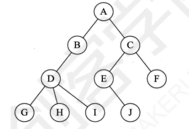

# 树

[TOC]

## 1、树

### 1.1、树概念

定义树是一种递归的方法。树是n(n>=0)个结点的有限集。

- n=0时，称为空树。
- n>0时，有且只有一个根结点(root)，其余结点可分为m个互不相交的有限集T1...Tm，其中每个集合都是一棵子树，称为根的子树。

- **树的结点** 包含一个数据和若干指向其子树的分支。

- **结点的度** 结点所拥有的孩子的数量。

- **叶子结点(leaf)** 所拥有的孩子的数量是零。

- **分支结点(leaf)** 所拥有的孩子的数量不是零。

- **树的度** 树内各结点的度的最大值。

- **孩子(child)** 结点的子树的根。该结点为 **双亲(parents)**。

- 具有相同双亲的结点叫做 **兄弟(sibling)**。类似方法定义 **祖父(grandparent)** 和 **孙子(grandchild)**。

- **祖先(ancestor)** 从根结点到该结点所经分支上的所有结点。反之，以某结点为根的子树的所有的结点都是该结点的 **后裔(descendant)**

- **节点的层级(level)** : 根结点为第一层，根结点的孩子为第二层，....

- **树的深度(depth)** 树中结点的最大层级。

- 对于任意结点ni，ni的 **深度(depth)** 为从根结点到该结点的唯一路径长。（根节点的深度为0）

- 对于任意结点ni，ni的 **高(height)** 为从ni到一片树叶的最长路径的长。（所有树叶的高为0）

- **有序树**：树中结点的各子树从左到右是有次序的（即不能互换），则称为有序树，否则称为无序树。

- **森林**：m(m>0)棵互不相交的树的集合。对树中每个结点而言，其子树的集合即为森林。

### 1.2、树的存储结构

#### 1.2.1、双亲表示法

假设以一组连续空间存储树的结点。结点结构为：

    data：数据域，存储结点的数据信息。
    parent:指针域，存储该结点的双亲在数组中的下标。

由于根节点没有parent，所以设为-1.

   

故，可以根据结点的指针域找到其parent，时间复杂度为 O(1) 。

但，此时要查找结点的孩子结点，需要从根结点开始遍历。所以在此基础上，新增加一个长子域(结点最左边的孩子)。没有孩子结点，就长子域就为-1。如下所示：

   

当结点的孩子超过两个时，还需要综合考虑时间复杂度、运算是狗合适等因素进一步完善。

#### 1.2.2、孩子表示法

当结点的孩子超过两个时，可以使用多重链表，即每个结点有多个指针域，其中每个指针指向一棵子树的根结点。

##### 方案1：指针域的个数等于树的度。

结点结构为：

    data：数据域，存储结点的数据信息。
    child1...childd:指针域，指向该结点的孩子结点。

因为树的度是3，所以指针域有3个。

但，此方法在树的度差别很大时，会很浪费空间。因为指针域固定，导致有很多为空的指针域。

所以基于此问题，为了充分利用空间，设计了方案2.

##### 方案2：每个结点指针域的个数等于该结点的度。

结点结构为：

    data：数据域，存储结点的数据信息。
    degree:度域，存储该结点的孩子结点的个数。
    child1...childd:指针域，指向该结点的孩子结点。

此方法克服了空间浪费的问题，但各结点的链表结构不同，还需维度度域，会带来时间上的损耗。

所以，基于此问题，同时考虑空间和时间的因素，设计了方案3.

##### 方案3：孩子表示法。

把每个结点的孩子结点排列起来，存储在单链表中，则 n 个结点就有 n 个单链表。如果是叶子结点，那么单链表为空。然后每个头指针组成一个线性表，采用顺序结构，存放一个一维数组中。

为此，设计两种结点结构。

(1)孩子链表的结点结构：

    child：数据域，存储某个结点在表头数组的下标。
    next:指针域，存储指向某个结点的下一个孩子结点的指针。

(2)表头数组的表头结构：

    data：数据域，存储结点的数据信息。
    firstchild:头指针域，存储该结点的孩子链表的头指针。

此方案方便查找结点的孩子结点和兄弟节点，但无法查询到结点的parent。

基于此问题，综合下双亲表示法和孩子表示法。

##### 方案4：双亲孩子表示法。

添加一个 parent 域。

#### 1.2.3、孩子兄弟表示法

    data：数据域，存储结点的数据信息。
    firstchild:指针域，存储该结点的第一个孩子结点的存储地址。
    rightsib:指针域，存储该结点的右兄弟结点的存储地址。

此方法最大的好处就是把一棵复杂的树变成了二叉树。如下：

## 2、二叉树

### 2.1、定义

n (n>=0)个结点的有限集合：

- n=0，空二叉树
- n>0，由一个根结点和两个互不相交的左子树、右子树的二叉树组成。

### 2.2、特点

- 每个结点最多有两个子树，可以0，也可以1。
- 左子树、右子树顺序不能颠倒。
- 即使某个结点只有一个子树，也要区分左子树、右子树。

### 2.3、性质

- 第i层至多有2^(i-1)个结点。(i>=1) 
- 深度为k的二叉树至多有(2^k)-1个结点(k>=1)
- 对于任何一棵二叉树，如果其叶子结点数为n0，度为2的结点数为n2,那么n0 = n2 + 1.
- 具有n个结点的完全二叉树的深度为  ， 表示不大于x的最大整数。
- 

### 2.4、特殊二叉树

满二叉树：所有结点都有左子树、右子树，并所有叶子结点都在一层。

完全二叉树：对于深度为K的，有n个结点的二叉树，当且仅当其每一个结点都与深度为K的满二叉树中编号从1至n的结点一一对应时称之为完全二叉树。

### 2.5、存储结构

#### 2.5.1、顺序存储结构

用一维数组存储二叉树的结点，并且结点的存储位置，即数组的下标要体现结点见的逻辑关系。

下图为完全二叉树：

下图为存入数组中，下标对应相应的位置

但，对一般的二叉树不能反映其逻辑关系。只能将其按完全二叉树编号，空的设置"^"。

如下图的一种极端情况，虽只有k个结点，但需要分配(2^k)-1个空间，所以是很大的浪费。

#### 2.5.3、二叉链表

    data:数据域
    lchild\rchild:指针域，分别存储指向左右孩子的指针

### 2.6、遍历

    先序遍历
    1、访问根节点
    2、递归遍历左子树
    3、递归遍历右子树

    实现中序遍历
    1、递归遍历左子树
    2、访问根节点
    3、递归遍历右子树

    实现后序遍历
    1、递归遍历左子树
    2、递归遍历右子树
    3、访问根节点

## 二叉查找树

二叉排序树（Binary Sort Tree），又称二叉查找树（Binary Search Tree）

1，是一颗二叉树，其中每个结点都含有一个Comparable的键（以及相关联的值）且每个结点的键都大于其左子树中的任意结点的键，而小于右子树的任意结点的键。

2，每个结点含有两个链接，可以指向空(null)或其他结点

每个结点只有一个父结点可以指向自己

每个结点都只有左右两个链接，分别指向自己的左右子结点

可以将二叉树定义为一个空链接或是一个有左右两个链接的结点，每个链接都指向一棵子二叉树

在二叉查找树中，每个结点包含一个键和一个值，键之间有顺序之分。

3，一个二叉查找树代表了一组键（及其相关联的值）的集合

将二叉树投影到一条直线上，保证一个结点的左子树中的键在它的左边，右子树的键在右边

4，在符号表中查找一个键，如果含有该键的结点存在表中，查找命中，返回相应的值否则查找未命中，返回null

## 平衡排序二叉树

平衡性，是指每个节点的左子树高度和右子树高度之差不超过1。

https://blog.csdn.net/qq_30322803/article/details/78298424
