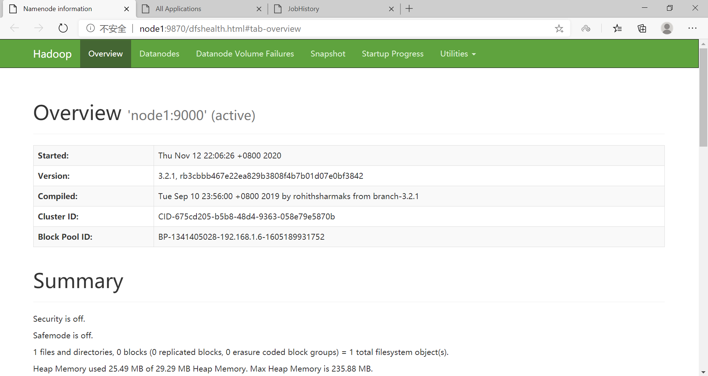
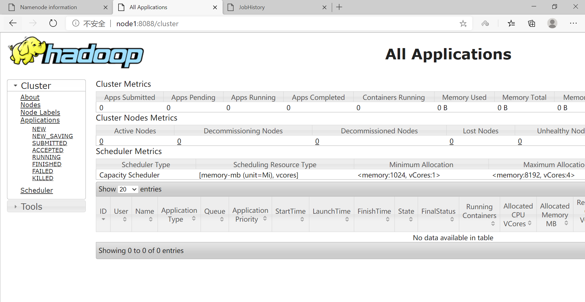

# Hadoop完全分布式环境搭建

[TOC]

## 1、硬件配置

采用3台虚拟机

节点名称 | IP地址      | 内存 | 硬盘   | 节点角色
---|:---|:---|:---|:---
node1   | 192.168.1.6 | 1GB | 10GB   | NameNode
        |             |     |        | ResoucerManager
node2   | 192.168.1.7 | 1GB | 10GB   | DataNode
        |             |     |        | NodeManager
node3   | 192.168.1.8 | 1GB | 10GB   | DataNode
        |             |     |        | NodeManager

## 2、软件版本

软件   |  版本
---|:---
JDK    | jdk-8u271
HADOOP | hadoop-3.2.1

## 3、准备工作

### 3.1、建立虚拟机，网络设置为桥接模式

### 3.2、更改主机名

```sh
[root@node1 ~]# vi /etc/hostname
[root@node1 ~]# reboot
[root@node1 ~]# cat /etc/hostname
node1
[root@node1 ~]# hostname
node1
[root@node2 ~]# hostname   # 其他节点同理
node2
[root@node3 ~]# hostname
node3
```

### 3.3、绑定主机名和IP，建立各主机间的联系

在 node1 上执行如下步骤：

```sh
[root@node1 ~]# vi /etc/hosts # 添加如下三行内容  IP地址 节点名称
[root@node1 ~]# cat /etc/hosts
127.0.0.1   localhost localhost.localdomain localhost4 localhost4.localdomain4
::1         localhost localhost.localdomain localhost6 localhost6.localdomain6

192.168.1.6 node1
192.168.1.7 node2
192.168.1.8 node3

# 将hosts文件复制到node2和node3节点
[root@node1 ~]# scp /etc/hosts node2:/etc/   
The authenticity of host 'node2 (192.168.1.7)' can't be established.
ECDSA key fingerprint is SHA256:8MU51OTPEjoMAEsg3eOMgAJBy3L4nuSMX1RGWN8ew/w.
ECDSA key fingerprint is MD5:00:2a:ce:9a:66:9b:42:af:a6:8e:74:07:a9:01:52:dc.
Are you sure you want to continue connecting (yes/no)? yes
Warning: Permanently added 'node2,192.168.1.7' (ECDSA) to the list of known hosts.
hosts  
```

```sql
[root@node1 ~]# ping node2
PING node2 (192.168.1.7) 56(84) bytes of data.
64 bytes from node2 (192.168.1.7): icmp_seq=1 ttl=64 time=0.404 ms
64 bytes from node2 (192.168.1.7): icmp_seq=2 ttl=64 time=0.617 ms
64 bytes from node2 (192.168.1.7): icmp_seq=3 ttl=64 time=0.828 ms
^C
--- node2 ping statistics ---
3 packets transmitted, 3 received, 0% packet loss, time 2016ms
rtt min/avg/max/mdev = 0.404/0.616/0.828/0.174 ms
[root@node1 ~]# ping node3
PING node3 (192.168.1.8) 56(84) bytes of data.
64 bytes from node3 (192.168.1.8): icmp_seq=1 ttl=64 time=1.59 ms
64 bytes from node3 (192.168.1.8): icmp_seq=2 ttl=64 time=0.496 ms
64 bytes from node3 (192.168.1.8): icmp_seq=3 ttl=64 time=0.443 ms
^C
--- node3 ping statistics ---
3 packets transmitted, 3 received, 0% packet loss, time 2015ms
rtt min/avg/max/mdev = 0.443/0.843/1.592/0.530 ms

[root@node2 ~]# ping node1
PING node1 (192.168.1.6) 56(84) bytes of data.
64 bytes from node1 (192.168.1.6): icmp_seq=1 ttl=64 time=0.325 ms
64 bytes from node1 (192.168.1.6): icmp_seq=2 ttl=64 time=0.864 ms
^C
--- node1 ping statistics ---
2 packets transmitted, 2 received, 0% packet loss, time 999ms
rtt min/avg/max/mdev = 0.325/0.594/0.864/0.270 ms
[root@node2 ~]# ping node3
PING node3 (192.168.1.8) 56(84) bytes of data.
64 bytes from node3 (192.168.1.8): icmp_seq=1 ttl=64 time=1.58 ms
64 bytes from node3 (192.168.1.8): icmp_seq=2 ttl=64 time=0.728 ms
^C
--- node3 ping statistics ---
2 packets transmitted, 2 received, 0% packet loss, time 1012ms
rtt min/avg/max/mdev = 0.728/1.158/1.589/0.431 ms

[root@node3 ~]# ping node1
PING node1 (192.168.1.6) 56(84) bytes of data.
64 bytes from node1 (192.168.1.6): icmp_seq=1 ttl=64 time=0.372 ms
64 bytes from node1 (192.168.1.6): icmp_seq=2 ttl=64 time=0.395 ms
^C
--- node1 ping statistics ---
2 packets transmitted, 2 received, 0% packet loss, time 1003ms
rtt min/avg/max/mdev = 0.372/0.383/0.395/0.022 ms
[root@node3 ~]# ping node2
PING node2 (192.168.1.7) 56(84) bytes of data.
64 bytes from node2 (192.168.1.7): icmp_seq=1 ttl=64 time=0.874 ms
64 bytes from node2 (192.168.1.7): icmp_seq=2 ttl=64 time=1.03 ms
^C
--- node2 ping statistics ---
2 packets transmitted, 2 received, 0% packet loss, time 1006ms
rtt min/avg/max/mdev = 0.874/0.955/1.036/0.081 ms
```

### 3.4、关闭防火墙

```sh
[root@node1 ~]# systemctl stop firewalld.service
[root@node1 ~]# firewall-cmd --state
not running
[root@node1 ~]# systemctl disable firewalld.service  # 禁止firewall开机启动
```

### 3.5、配置宿主机hosts文件

使宿主机和虚拟机系统可以相互ping通

`C:\Windows\System32\drivers\etc\hosts` 目录下，添加如下内容：
    
    192.168.1.6 node1
    192.168.1.7 node2
    192.168.1.8 node3

```sh
C:\Users\zgg>ping node1

正在 Ping node1 [192.168.1.6] 具有 32 字节的数据:
来自 192.168.1.6 的回复: 字节=32 时间<1ms TTL=64
来自 192.168.1.6 的回复: 字节=32 时间<1ms TTL=64

192.168.1.6 的 Ping 统计信息:
    数据包: 已发送 = 2，已接收 = 2，丢失 = 0 (0% 丢失)，
往返行程的估计时间(以毫秒为单位):
    最短 = 0ms，最长 = 0ms，平均 = 0ms
Control-C
^C
C:\Users\zgg>ping node2

正在 Ping node2 [192.168.1.7] 具有 32 字节的数据:
来自 192.168.1.7 的回复: 字节=32 时间<1ms TTL=64
来自 192.168.1.7 的回复: 字节=32 时间<1ms TTL=64

192.168.1.7 的 Ping 统计信息:
    数据包: 已发送 = 2，已接收 = 2，丢失 = 0 (0% 丢失)，
往返行程的估计时间(以毫秒为单位):
    最短 = 0ms，最长 = 0ms，平均 = 0ms
Control-C
^C
C:\Users\zgg>ping node3

正在 Ping node3 [192.168.1.8] 具有 32 字节的数据:
来自 192.168.1.8 的回复: 字节=32 时间<1ms TTL=64
来自 192.168.1.8 的回复: 字节=32 时间<1ms TTL=64

192.168.1.8 的 Ping 统计信息:
    数据包: 已发送 = 2，已接收 = 2，丢失 = 0 (0% 丢失)，
往返行程的估计时间(以毫秒为单位):
    最短 = 0ms，最长 = 0ms，平均 = 0ms
Control-C
^C
```

### 3.6、配置SSH，实现节点间的无密码登录

无密码登陆：在 node1 上，通过 `ssh node2` 或 `ssh node3` 就可以登陆到对方计算机上，而不用输入密码。

分别在三台虚拟机的 `/root` 目录下执行：

    ssh-keygen -t rsa

设置 ssh 的密钥和密钥的存放路径。 路径为`~/.ssh`

进入到 `.ssh` 目录，执行如下命令，将公钥放到 authorized_keys 里：

    cp id_rsa.pub  authorized_keys

将 node1 上的 authorized_keys 放入其他虚拟机的 `~/.ssh` 目录下:

    scp authorized_keys test2:~/.ssh/
    scp authorized_keys test3:~/.ssh/

```sh
[root@node1 ~]# ssh node2
Last login: Thu Nov 12 15:38:28 2020 from node1
[root@node2 ~]# exit
登出
Connection to node2 closed.
```

## 4、安装JDK

在 node1 上，下载，解压，并配置环境变量：

```sh
[root@node1 opt]# tar -zxvf jdk-8u271-linux-x64.tar.gz 
...

[root@node1 opt]# vi  /etc/profile
[root@node1 opt]# source  /etc/profile  
[root@node1 opt]# java -version
java version "1.8.0_271"
Java(TM) SE Runtime Environment (build 1.8.0_271-b09)
Java HotSpot(TM) 64-Bit Server VM (build 25.271-b09, mixed mode)
[root@node1 opt]# cat /etc/profile
# /etc/profile
...

export JAVA_HOME=/opt/jdk1.8.0_271
export PATH=.:$JAVA_HOME/bin:$PATH
...
```

将 jdk1.8.0_271 复制到 node2 和 node3

```sh
[root@node1 opt]# scp -r jdk1.8.0_271/  node2:/opt/
[root@node1 opt]# scp -r jdk1.8.0_271/  node3:/opt/
```

将 /etc/profile 复制到 node2 和 node3

```sh
[root@node1 opt]# scp  /etc/profile  node2:/etc/
profile                                                                                           100% 1890     1.4MB/s   00:00    
[root@node1 opt]# scp  /etc/profile  node3:/etc/
profile                                                                                           100% 1890     1.7MB/s   00:00    
[root@node2 opt]# source /etc/profile 
[root@node3 opt]# source /etc/profile
```

## 5、安装Hadoop

在 node1 上，下载，解压，并配置环境变量：

```sh
[root@node1 opt]# tar -zxvf hadoop-3.2.1.tar.gz 
...
[root@node1 opt]# vi  /etc/profile
[root@node1 opt]# source  /etc/profile 
[root@node1 opt]# cat  /etc/profile      
# /etc/profile
...

export JAVA_HOME=/opt/jdk1.8.0_271
export HADOOP_HOME=/opt/hadoop-3.2.1

export PATH=.:$HADOOP_HOME/bin:$JAVA_HOME/bin:$PATH
```

将 /etc/profile 复制到 node2 和 node3

```sh
[root@node1 opt]# scp  /etc/profile  node2:/etc/
profile                                                                                           100% 1945     1.6MB/s   00:00     
[root@node1 opt]# scp  /etc/profile  node3:/etc/                  
profile                                                                                           100% 1945     1.5MB/s   00:00     
[root@node2 opt]# source /etc/profile 
[root@node3 opt]# source /etc/profile
```

配置配置文件后，将 hadoop-3.2.1 复制到 node2 和 node3

```sh
[root@node1 opt]# scp -r hadoop-3.2.1/  node2:/opt/
[root@node1 opt]# scp -r hadoop-3.2.1/  node3:/opt/
```

## 6、格式化

对 node1 :

```sh
[root@node1 hadoop-3.2.1]# hdfs namenode -format  # 格式化
2020-11-12 21:43:16,999 INFO namenode.NameNode: STARTUP_MSG: 
/************************************************************
STARTUP_MSG: Starting NameNode
STARTUP_MSG:   host = node1/192.168.1.6
STARTUP_MSG:   args = [-format]
STARTUP_MSG:   version = 3.2.1
STARTUP_MSG:   classpath = /opt/hadoop-3.2.1/etc/
...
2020-11-12 21:43:20,696 INFO common.Storage: Storage directory /opt/hadoop-3.2.1/dfs/namenode has been successfully formatted.
2020-11-12 21:43:20,762 INFO namenode.FSImageFormatProtobuf: Saving image file /opt/hadoop-3.2.1/dfs/namenode/current/fsimage.ckpt_0000000000000000000 using no compression
2020-11-12 21:43:20,859 INFO namenode.FSImageFormatProtobuf: Image file /opt/hadoop-3.2.1/dfs/namenode/current/fsimage.ckpt_0000000000000000000 of size 399 bytes saved in 0 seconds .
2020-11-12 21:43:20,866 INFO namenode.NNStorageRetentionManager: Going to retain 1 images with txid >= 0
2020-11-12 21:43:20,874 INFO namenode.FSImage: FSImageSaver clean checkpoint: txid=0 when meet shutdown.
2020-11-12 21:43:20,874 INFO namenode.NameNode: SHUTDOWN_MSG: 
/************************************************************
SHUTDOWN_MSG: Shutting down NameNode at node1/192.168.1.6
************************************************************/
```

如果再次格式化，需要删除 namenode 和 datanode 上的 dfs/namenode 或 dfs/datanode目录。

## 7、启动

可以全部启动，也可以分别启动。

```sh
[root@node1 hadoop-3.2.1]# sbin/start-all.sh
Starting namenodes on [node1]
上一次登录：四 11月 12 22:04:51 CST 2020pts/0 上
Starting datanodes
上一次登录：四 11月 12 22:06:23 CST 2020pts/0 上
Starting secondary namenodes [zgg]
上一次登录：四 11月 12 22:06:26 CST 2020pts/0 上
Starting resourcemanager
上一次登录：四 11月 12 22:06:31 CST 2020pts/0 上
Starting nodemanagers
上一次登录：四 11月 12 22:06:58 CST 2020pts/0 上
[root@node1 hadoop-3.2.1]# mapred --daemon start historyserver
[root@node1 hadoop-3.2.1]# jps
20976 Jps
20322 SecondaryNameNode
20563 ResourceManager
20952 JobHistoryServer
20062 NameNode

[root@node2 hadoop-3.2.1]# jps
17760 DataNode
17981 Jps
17870 NodeManager

[root@node3 hadoop-3.2.1]# jps
17760 DataNode
17981 Jps
17870 NodeManager
```






## 8、注意点

(1)如果某个进程启动失败了，考虑配置文件是不是配置错误了，或者格式化的时候未清理上次集群的id。

(2)如果启动，出现了 `ERROR: but there is no HDFS_NAMENODE_USER defined. Aborting operation.` 错误，说明在 `hadoop-env.sh` 中未配置此项。具体配置内容见下面的配置文件。

(3)在 Hadoop3.x 中，NameNode 的 web 端口改成了 9870

(4)配置文件的配置可以同时参考 [官网集群搭建](https://hadoop.apache.org/docs/stable/hadoop-project-dist/hadoop-common/ClusterSetup.html)、[官网core-site.xml](https://hadoop.apache.org/docs/stable/hadoop-project-dist/hadoop-common/core-default.xml)、[官网hdfs-site.xml](https://hadoop.apache.org/docs/stable/hadoop-project-dist/hadoop-hdfs/hdfs-default.xml)、[官网yarn-site.xml](https://hadoop.apache.org/docs/stable/hadoop-yarn/hadoop-yarn-common/yarn-default.xml)、[官网mapred-site.xml](https://hadoop.apache.org/docs/stable/hadoop-mapreduce-client/hadoop-mapreduce-client-core/mapred-default.xml)

## 9、配置文件

注：添加配置文件的时候，去掉下面的注释。

```sh
[root@node1 hadoop]# pwd
/opt/hadoop-3.2.1/etc/hadoop
[root@node1 hadoop]# ls
capacity-scheduler.xml      hadoop-user-functions.sh.example  kms-log4j.properties        ssl-client.xml.example
configuration.xsl           hdfs-site.xml                     kms-site.xml                ssl-server.xml.example
container-executor.cfg      httpfs-env.sh                     log4j.properties            user_ec_policies.xml.template
core-site.xml               httpfs-log4j.properties           mapred-env.cmd              workers
hadoop-env.cmd              httpfs-signature.secret           mapred-env.sh               yarn-env.cmd
hadoop-env.sh               httpfs-site.xml                   mapred-queues.xml.template  yarn-env.sh
hadoop-metrics2.properties  kms-acls.xml                      mapred-site.xml             yarnservice-log4j.properties
hadoop-policy.xml           kms-env.sh                        shellprofile.d              yarn-site.xml
```

管理员应该通过设置 `etc/hadoop/hadoop-env.sh`，和可选的 `etc/hadoop/mapred-env.sh`、`etc/hadoop/yarn-env.sh` 脚本来对 Hadoop 守护进程环境进行个性化设置，比如，设置 namenode 使用多少堆内存。

至少，你需要在每个远程结点上指定 JAVA_HOME 。

```sh
# 在 node1、node2、node3 节点：
[root@node1 hadoop]# vi hadoop-env.sh
...
###
# Generic settings for HADOOP
###

# Technically, the only required environment variable is JAVA_HOME.
# All others are optional.  However, the defaults are probably not
# preferred.  Many sites configure these options outside of Hadoop,
# such as in /etc/profile.d

# The java implementation to use. ...
# export JAVA_HOME=
export JAVA_HOME=/opt/jdk1.8.0_271

export HDFS_NAMENODE_USER=root
export HDFS_DATANODE_USER=root
export HDFS_SECONDARYNAMENODE_USER=root
export YARN_RESOURCEMANAGER_USER=root
export YARN_NODEMANAGER_USER=root
```

```sh
# 在 node1、node2、node3 节点：
[root@node1 hadoop]# cat core-site.xml 
...
<!-- Put site-specific property overrides in this file. -->

<configuration>
        <property>
            <!-- 指定namenode的hdfs协议的文件系统通信地址 --> 
            <name>fs.defaultFS</name>  
            <value>hdfs://node1:9000</value>  
        </property>
        <property>
             <!-- 文件IO缓冲区的大小，131072KB(64M)，是系统默认值 -->
             <name>io.file.buffer.size</name>
             <value>131072</value>       
        </property>
        <property>
            <!-- hadoop临时目录 -->
            <name>hadoop.tmp.dir</name>
            <value>/opt/hadoop-3.2.1/tmp</value>
        </property> 
</configuration>
```

```sh
# 在 node1 节点：
[root@node1 hadoop]# cat hdfs-site.xml 
...
<!-- Put site-specific property overrides in this file. -->

<configuration>
    <property>
        <!-- NameNode持久存储命名空间和事务日志的本地文件系统上的路径 -->
        <name>dfs.namenode.name.dir</name>  
        <value>/opt/hadoop-3.2.1/dfs/namenode</value>  
    </property>
    <property>
        <!-- List of permitted DataNodes. -->
        <name>dfs.hosts</name>  
        <value>/opt/hadoop-3.2.1/etc/hadoop/workers</value>  
    </property> 
</configuration>
```

```sh
# 在 node2、node3 节点：
[root@node2 hadoop]# cat hdfs-site.xml 
...
<!-- Put site-specific property overrides in this file. -->

<configuration>
    <property>
        <!-- 在本地文件系统存储数据块的DataNode的逗号分隔的列表 -->
        <name>dfs.datanode.data.dir</name>  
        <value>/opt/hadoop-3.2.1/dfs/datanode</value>  
    </property>
</configuration>
```

```sh
# 在 node1、node2、node3 节点： 
[root@node1 hadoop]# cat mapred-site.xml   
...
<!-- Put site-specific property overrides in this file. -->

<configuration>
    <property>
        <!-- 指定mapreduce框架为yarn方式 -->
        <name>mapreduce.framework.name</name>
        <value>yarn</value>
    </property>
    <property>
        <!-- Directory where history files are written by MapReduce jobs -->
        <name>mapreduce.jobhistory.intermediate-done-dir</name>
        <value>/mr-history/tmp</value>
    </property>
    <property>
        <!-- Directory where history files are managed by the MR JobHistory Server -->
        <name>mapreduce.jobhistory.done-dir</name>
        <value>/mr-history/done</value>
    </property> 
</configuration>
```


```sh
# 在 node1、node2、node3 节点：
[root@node1 hadoop]# cat yarn-site.xml 
...
<configuration>
    <property>
        <!-- Configuration to enable or disable log aggregation -->
        <name>yarn.log-aggregation-enable</name>  
        <value>true</value>  
    </property> 

</configuration>
```

```sh
# 在 node1(ResourceManager) 节点：
[root@node1 hadoop]# cat yarn-site.xml 
...
<configuration>
    <property>
        <!-- ResourceManager host:port for clients to submit jobs. -->
        <name>yarn.resourcemanager.address</name>  
        <value>node1:8032</value>  
    </property> 
    <property>
        <!-- ResourceManager host:port for ApplicationMasters to talk to Scheduler to obtain resources. -->
        <name>yarn.resourcemanager.scheduler.address</name>  
        <value>node1:8030</value>  
    </property>
    <property>
        <!-- ResourceManager host:port for NodeManagers. -->   
        <name>yarn.resourcemanager.resource-tracker.address</name>  
        <value>node1:8031</value>  
    </property>
    <property>
         <!-- ResourceManager host:port for administrative commands. -->    
        <name>yarn.resourcemanager.admin.address</name>  
        <value>node1:8033</value>  
    </property> 
    <property>
        <!-- ResourceManager web-ui host:port. -->   
        <name>yarn.resourcemanager.webapp.address</name>  
        <value>node1:8088</value>  
    </property>
    <property>
        <!-- List of permitted NodeManagers. -->   
        <name>yarn.resourcemanager.nodes.include-path</name>  
        <value>/opt/hadoop-3.2.1/etc/hadoop/workers</value>  
    </property> 
</configuration>
```

```sh
# 在 node2、node3(NodeManager) 节点：
[root@node2 hadoop]# cat yarn-site.xml 
...
<configuration>
    <property>
        <!-- Comma-separated list of paths on the local filesystem where intermediate data is written. -->
        <name>yarn.nodemanager.local-dirs</name>  
        <value>/opt/hadoop-3.2.1/tmp</value>  
    </property> 
    <property>
        <!-- Comma-separated list of paths on the local filesystem where logs are written. -->
        <name>yarn.nodemanager.log-dirs</name>  
        <value>/opt/hadoop-3.2.1/logs</value>  
    </property>
    <property>
        <!-- NodeManager上运行的附属服务 -->
        <name>yarn.nodemanager.aux-services</name>  
        <value>mapreduce_shuffle</value>  
    </property>
</configuration>
```

```sh
# 在 node1、node2、node3 节点：
[root@node1 hadoop]# cat workers 
node2
node3
```