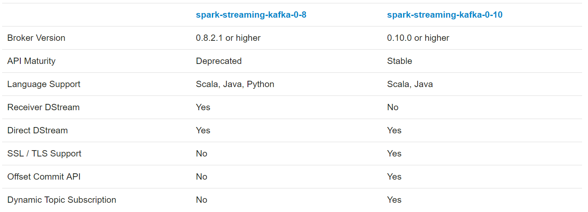

# Spark Streaming 2.4.4 对接 Kafka

*Apache Kafka is publish-subscribe messaging rethought as a distributed, partitioned, replicated commit log service. Please read the Kafka documentation thoroughly before starting an integration using Spark.*

*The Kafka project introduced a new consumer API between versions 0.8 and 0.10, so there are 2 separate corresponding Spark Streaming packages available. Please choose the correct package for your brokers and desired features; note that the 0.8 integration is compatible with later 0.9 and 0.10 brokers, but the 0.10 integration is not compatible with earlier brokers.*

Kafka 在版本 0.8 和 0.10 ，引入了一个新的 consumer API，所以有2个独立的对应的 Spark Streaming 包可用。

注意：

- Kafka 0.8 兼容 0.9 和 0.10。但 0.10 不兼容更早版本的。
- Spark 2.3.0 对 Kafka 0.8 的支持被弃用。

所以在 `spark-streaming-kafka-0-10` 中仅支持 `Direct DStream` ，在 `	spark-streaming-kafka-0-8` 支持 `Direct DStream` 和 `Receiver DStream`

Spark Streaming 2.4.4 兼容 Kafka 0.8 及更高。

## 1、Spark Streaming + Kafka Integration Guide (Kafka broker version 0.8.2.1 or higher)

## 2、Spark Streaming + Kafka Integration Guide (Kafka broker version 0.10.0 or higher)