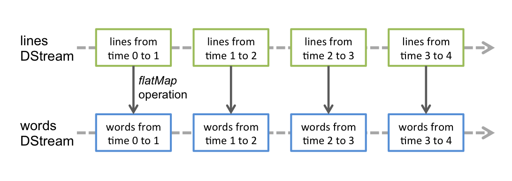

# 官网：Spark Streaming Programming Guide

[TOC]

## 1、Overview

*Spark Streaming is an extension of the core Spark API that enables scalable, high-throughput, fault-tolerant stream processing of live data streams. Data can be ingested from many sources like Kafka, Kinesis, or TCP sockets, and can be processed using complex algorithms expressed with high-level functions like map, reduce, join and window. Finally, processed data can be pushed out to filesystems, databases, and live dashboards. In fact, you can apply Spark’s [machine learning](http://spark.apache.org/docs/latest/ml-guide.html) and [graph processing algorithms](http://spark.apache.org/docs/latest/graphx-programming-guide.html) on data streams.*


Spark Streaming 是 Spark core API 的扩展，具有可扩展性、高吞吐、容错。

- 输入可以是Kafka, Kinesis, or TCP sockets。

- 可以使用 map, reduce, join and window 等高级函数处理数据。

- 处理后的数据可以输出到文件系统、数据库、实时 dashboards


*Internally, it works as follows. Spark Streaming receives live input data streams and divides the data into batches, which are then processed by the Spark engine to generate the final stream of results in batches.*

内部流程是：Spark Streaming接收实时输入数据流，将其划分成多个批次，Spark 引擎处理批次，生成各批次的最终的结果流。


*Spark Streaming provides a high-level abstraction called discretized stream or DStream, which represents a continuous stream of data. DStreams can be created either from input data streams from sources such as Kafka, and Kinesis, or by applying high-level operations on other DStreams. Internally, a DStream is represented as a sequence of RDDs.*

DStream 表示一个持续的数据流。可以从 Kafka或Kinesis等数据源创建，也可以从其他 DStream 创建。 

在内部，一个 DStream 就是一个 [RDD](http://spark.apache.org/docs/latest/api/scala/org/apache/spark/rdd/RDD.html) 序列。

*This guide shows you how to start writing Spark Streaming programs with DStreams. You can write Spark Streaming programs in Scala, Java or Python (introduced in Spark 1.2), all of which are presented in this guide. You will find tabs throughout this guide that let you choose between code snippets of different languages.*

*Note: There are a few APIs that are either different or not available in Python. Throughout this guide, you will find the tag Python API highlighting these differences.*

## 2、A Quick Example

*Before we go into the details of how to write your own Spark Streaming program, let’s take a quick look at what a simple Spark Streaming program looks like. Let’s say we want to count the number of words in text data received from a data server listening on a TCP socket. All you need to do is as follows.*

从 TCP socket 发送数据，再统计文本中单词的数量。

**A：对于python**

*First, we import StreamingContext, which is the main entry point for all streaming functionality. We create a local StreamingContext with two execution threads, and batch interval of 1 second.*

先导入程序主入口 StreamingContext，并创建，两个执行线程，批次为间隔1秒。

```python
from pyspark import SparkContext
from pyspark.streaming import StreamingContext

# Create a local StreamingContext with two working thread and batch interval of 1 second
sc = SparkContext("local[2]", "NetworkWordCount")
ssc = StreamingContext(sc, 1)
```
*Using this context, we can create a DStream that represents streaming data from a TCP source, specified as hostname (e.g. localhost) and port (e.g. 9999).*

创建 DStream

```python
# Create a DStream that will connect to hostname:port, like localhost:9999
lines = ssc.socketTextStream("localhost", 9999)
```
*This lines DStream represents the stream of data that will be received from the data server. Each record in this DStream is a line of text. Next, we want to split the lines by space into words.*

此处使用了 DStream 表示数据已接收。

DStream 的每个记录是文本的一行。

下面的程序就是将行划分成单词。

```python
# Split each line into words
words = lines.flatMap(lambda line: line.split(" "))
```

*flatMap is a one-to-many DStream operation that creates a new DStream by generating multiple new records from each record in the source DStream. In this case, each line will be split into multiple words and the stream of words is represented as the words DStream. Next, we want to count these words.*

flatMap 由原 DStream 中的每条记录生成多条记录，返回一个新的 DStream。

那么 words 流由 words DStream 表示。

```python
# Count each word in each batch
pairs = words.map(lambda word: (word, 1))
wordCounts = pairs.reduceByKey(lambda x, y: x + y)

# Print the first ten elements of each RDD generated in this DStream to the console
wordCounts.pprint()
```
*The words DStream is further mapped (one-to-one transformation) to a DStream of (word, 1) pairs, which is then reduced to get the frequency of words in each batch of data. Finally, wordCounts.pprint() will print a few of the counts generated every second.*

- words DStream 被映射成 (word, 1) pairs DStream。

- 然后 reduceByKey 得到数据的每个批次中单词的数量。

- 最后，wordCounts.print()将打印每秒生成的一些计数。

*Note that when these lines are executed, Spark Streaming only sets up the computation it will perform when it is started, and no real processing has started yet. To start the processing after all the transformations have been setup, we finally call*

请注意，当这些行被执行的时候，Spark Streaming 仅仅设置了计算，并没有开始真正地处理，只有在启动时才会执行。为了在所有的转换都已经设置好之后开始处理，我们在最后调用:

```python
ssc.start()             # Start the computation
ssc.awaitTermination()  # Wait for the computation to terminate
```

*The complete code can be found in the Spark Streaming example [NetworkWordCount](https://github.com/apache/spark/blob/v3.0.0/examples/src/main/python/streaming/network_wordcount.py).*

*If you have already downloaded and built Spark, you can run this example as follows. You will first need to run Netcat (a small utility found in most Unix-like systems) as a data server by using*

```sh
$ nc -lk 9999
```

*Then, in a different terminal, you can start the example by using*

```sh
$ ./bin/spark-submit examples/src/main/python/streaming/network_wordcount.py localhost 9999
```
*Then, any lines typed in the terminal running the netcat server will be counted and printed on screen every second. It will look something like the following.*

终端1：

	# TERMINAL 1:
	# Running Netcat

	$ nc -lk 9999

	hello world


	...

终端2：

	# TERMINAL 2: RUNNING network_wordcount.py

	$ ./bin/spark-submit examples/src/main/python/streaming/network_wordcount.py localhost 9999
	...
	-------------------------------------------
	Time: 2014-10-14 15:25:21
	-------------------------------------------
	(hello,1)
	(world,1)
	...

**B：对于java**

*First, we create a JavaStreamingContext object, which is the main entry point for all streaming functionality. We create a local StreamingContext with two execution threads, and a batch interval of 1 second.*

[JavaStreamingContext](http://spark.apache.org/docs/latest/api/java/index.html?org/apache/spark/streaming/api/java/JavaStreamingContext.html)

```java
import org.apache.spark.*;
import org.apache.spark.api.java.function.*;
import org.apache.spark.streaming.*;
import org.apache.spark.streaming.api.java.*;
import scala.Tuple2;

// Create a local StreamingContext with two working thread and batch interval of 1 second
SparkConf conf = new SparkConf().setMaster("local[2]").setAppName("NetworkWordCount");
JavaStreamingContext jssc = new JavaStreamingContext(conf, Durations.seconds(1));
```
*Using this context, we can create a DStream that represents streaming data from a TCP source, specified as hostname (e.g. localhost) and port (e.g. 9999).*

```java
// Create a DStream that will connect to hostname:port, like localhost:9999
JavaReceiverInputDStream<String> lines = jssc.socketTextStream("localhost", 9999);
```

*This lines DStream represents the stream of data that will be received from the data server. Each record in this stream is a line of text. Then, we want to split the lines by space into words.*

```java
// Split each line into words
JavaDStream<String> words = lines.flatMap(x -> Arrays.asList(x.split(" ")).iterator());
```
*flatMap is a DStream operation that creates a new DStream by generating multiple new records from each record in the source DStream. In this case, each line will be split into multiple words and the stream of words is represented as the words DStream. Note that we defined the transformation using a 'FlatMapFunction](http://spark.apache.org/docs/latest/api/scala/org/apache/spark/api/java/function/FlatMapFunction.html) object. As we will discover along the way, there are a number of such convenience classes in the Java API that help defines DStream transformations.*

*Next, we want to count these words.*

```java
// Count each word in each batch
JavaPairDStream<String, Integer> pairs = words.mapToPair(s -> new Tuple2<>(s, 1));
JavaPairDStream<String, Integer> wordCounts = pairs.reduceByKey((i1, i2) -> i1 + i2);

// Print the first ten elements of each RDD generated in this DStream to the console
wordCounts.print();
```

*The words DStream is further mapped (one-to-one transformation) to a DStream of (word, 1) pairs, using a [PairFunction](http://spark.apache.org/docs/latest/api/scala/org/apache/spark/api/java/function/PairFunction.html) object. Then, it is reduced to get the frequency of words in each batch of data, using a [Function2](http://spark.apache.org/docs/latest/api/scala/org/apache/spark/api/java/function/Function2.html) object. Finally, wordCounts.print() will print a few of the counts generated every second.*

*Note that when these lines are executed, Spark Streaming only sets up the computation it will perform after it is started, and no real processing has started yet. To start the processing after all the transformations have been setup, we finally call start method.*

```java
jssc.start();              // Start the computation
jssc.awaitTermination();   // Wait for the computation to terminate
```

*The complete code can be found in the Spark Streaming example [JavaNetworkWordCount](https://github.com/apache/spark/blob/v3.0.0/examples/src/main/java/org/apache/spark/examples/streaming/JavaNetworkWordCount.java).*

*If you have already downloaded and [built](http://spark.apache.org/docs/latest/index.html#building) Spark, you can run this example as follows. You will first need to run Netcat (a small utility found in most Unix-like systems) as a data server by using*

```sh
$ nc -lk 9999
```

*Then, in a different terminal, you can start the example by using*

```sh
$ ./bin/run-example streaming.JavaNetworkWordCount localhost 9999
```

*Then, any lines typed in the terminal running the netcat server will be counted and printed on screen every second. It will look something like the following.*

	# TERMINAL 1:
	# Running Netcat

	$ nc -lk 9999

	hello world


	...

	# TERMINAL 2: RUNNING JavaNetworkWordCount

	$ ./bin/run-example streaming.JavaNetworkWordCount localhost 9999
	...
	-------------------------------------------
	Time: 1357008430000 ms
	-------------------------------------------
	(hello,1)
	(world,1)
	...

**C：对于scala**

*First, we import the names of the Spark Streaming classes and some implicit conversions from StreamingContext into our environment in order to add useful methods to other classes we need (like DStream). StreamingContext is the main entry point for all streaming functionality. We create a local StreamingContext with two execution threads, and a batch interval of 1 second.*

```scala
import org.apache.spark._
import org.apache.spark.streaming._
import org.apache.spark.streaming.StreamingContext._ // not necessary since Spark 1.3

// Create a local StreamingContext with two working thread and batch interval of 1 second.
// The master requires 2 cores to prevent a starvation scenario.

val conf = new SparkConf().setMaster("local[2]").setAppName("NetworkWordCount")
val ssc = new StreamingContext(conf, Seconds(1))
```
*Using this context, we can create a DStream that represents streaming data from a TCP source, specified as hostname (e.g. localhost) and port (e.g. 9999).*

```scala
// Create a DStream that will connect to hostname:port, like localhost:9999
val lines = ssc.socketTextStream("localhost", 9999)
```
*This lines DStream represents the stream of data that will be received from the data server. Each record in this DStream is a line of text. Next, we want to split the lines by space characters into words.*

```scala
// Split each line into words
val words = lines.flatMap(_.split(" "))
```
*flatMap is a one-to-many DStream operation that creates a new DStream by generating multiple new records from each record in the source DStream. In this case, each line will be split into multiple words and the stream of words is represented as the words DStream. Next, we want to count these words.*

```scala
import org.apache.spark.streaming.StreamingContext._ // not necessary since Spark 1.3
// Count each word in each batch
val pairs = words.map(word => (word, 1))
val wordCounts = pairs.reduceByKey(_ + _)

// Print the first ten elements of each RDD generated in this DStream to the console
wordCounts.print()
```

*The words DStream is further mapped (one-to-one transformation) to a DStream of (word, 1) pairs, which is then reduced to get the frequency of words in each batch of data. Finally, wordCounts.print() will print a few of the counts generated every second.*

*Note that when these lines are executed, Spark Streaming only sets up the computation it will perform when it is started, and no real processing has started yet. To start the processing after all the transformations have been setup, we finally call*

```scala
ssc.start()             // Start the computation
ssc.awaitTermination()  // Wait for the computation to terminate
```
*The complete code can be found in the Spark Streaming example NetworkWordCount. *

*If you have already downloaded and built Spark, you can run this example as follows. You will first need to run Netcat (a small utility found in most Unix-like systems) as a data server by using*

```sh
$ nc -lk 9999
```

*Then, in a different terminal, you can start the example by using*

```sh
$ ./bin/run-example streaming.NetworkWordCount localhost 9999
```
*Then, any lines typed in the terminal running the netcat server will be counted and printed on screen every second. It will look something like the following.*

	# TERMINAL 1:
	# Running Netcat

	$ nc -lk 9999

	hello world


	...

	# TERMINAL 2: RUNNING NetworkWordCount

	$ ./bin/run-example streaming.NetworkWordCount localhost 9999
	...
	-------------------------------------------
	Time: 1357008430000 ms
	-------------------------------------------
	(hello,1)
	(world,1)
	...

## 3、Basic Concepts

### 3.1、Linking

*Similar to Spark, Spark Streaming is available through Maven Central. To write your own Spark Streaming program, you will have to add the following dependency to your SBT or Maven project.*

需要先添加依赖。

```xml
<dependency>
    <groupId>org.apache.spark</groupId>
    <artifactId>spark-streaming_2.12</artifactId>
    <version>3.0.0</version>
    <scope>provided</scope>
</dependency>
```

```sbt
libraryDependencies += "org.apache.spark" % "spark-streaming_2.12" % "3.0.0" % "provided"
```

*For ingesting data from sources like Kafka and Kinesis that are not present in the Spark Streaming core API, you will have to add the corresponding artifact spark-streaming-xyz_2.12 to the dependencies. For example, some of the common ones are as follows.*

还需要添加像Kafka and Kinesis的依赖。

Source | Artifact
---|:---
Kafka | spark-streaming-kafka-0-10_2.12
Kinesis | spark-streaming-kinesis-asl_2.12 [Amazon Software License]

*For an up-to-date list, please refer to the [Maven repository](https://search.maven.org/search?q=g:org.apache.spark%20AND%20v:3.0.0) for the full list of supported sources and artifacts.*

### 3.2、Initializing StreamingContext

*To initialize a Spark Streaming program, a StreamingContext object has to be created which is the main entry point of all Spark Streaming functionality.*

初始化一个 Spark Streaming 程序，首先要创建一个 StreamingContext 对象，作为整个功能的入口。

**A：对于python**

*A [StreamingContext](http://spark.apache.org/docs/latest/api/python/pyspark.streaming.html#pyspark.streaming.StreamingContext) object can be created from a [SparkContext](http://spark.apache.org/docs/latest/api/python/pyspark.html#pyspark.SparkContext) object.*

基于 SparkContext 创建 StreamingContext。
 
```python
from pyspark import SparkContext
from pyspark.streaming import StreamingContext

sc = SparkContext(master, appName)
ssc = StreamingContext(sc, 1)
```
*The appName parameter is a name for your application to show on the cluster UI. master is a [Spark, Mesos or YARN cluster URL](http://spark.apache.org/docs/latest/submitting-applications.html#master-urls), or a special “local[*]” string to run in local mode. In practice, when running on a cluster, you will not want to hardcode master in the program, but rather [launch the application](http://spark.apache.org/docs/latest/submitting-applications.html) with spark-submit and receive it there. However, for local testing and unit tests, you can pass “local[*]” to run Spark Streaming in-process (detects the number of cores in the local system).*

appName：应用程序在集群 UI 上的名字。

master：Spark, Mesos or YARN cluster URL，或是 `local[*]`

集群模式下，使用 `spark-submit` 提交程序。 测试模式下，直接在本地运行。

*The batch interval must be set based on the latency requirements of your application and available cluster resources. See the Performance [Tuning section](http://spark.apache.org/docs/latest/streaming-programming-guide.html#setting-the-right-batch-interval) for more details.*

批次的间隔依据 程序的延迟要求 和 集群可用资源 设置。

*After a context is defined, you have to do the following.*

*1.Define the input sources by creating input DStreams.
2.Define the streaming computations by applying transformation and output operations to DStreams.
3.Start receiving data and processing it using streamingContext.start().
4.Wait for the processing to be stopped (manually or due to any error) using streamingContext.awaitTermination().
5.The processing can be manually stopped using streamingContext.stop().*

context 创建后，做如下几件事：

- 1. 从输入源创建输入 DStreams

- 2. 使用 转换 和 输出操作 定义流计算模型

- 3. `streamingContext.start()` 启动接收数据，并处理

- 4. `streamingContext.awaitTermination()`  等待处理完成(手动，或遇到错误)

- 5. `streamingContext.stop()` 手动停止


*Points to remember:
1.Once a context has been started, no new streaming computations can be set up or added to it.
2.Once a context has been stopped, it cannot be restarted.
3.Only one StreamingContext can be active in a JVM at the same time.
4.stop() on StreamingContext also stops the SparkContext. To stop only the StreamingContext, set the optional parameter of stop() called stopSparkContext to false.
5.A SparkContext can be re-used to create multiple StreamingContexts, as long as the previous StreamingContext is stopped (without stopping the SparkContext) before the next StreamingContext is created.*

以下几点要注意：

- 1. context 启动后，不能再设置、添加流计算模型。

- 2. context 停止后，不能再重启。

- 3. 在 JVM 中，只能有一个 StreamingContext 活跃。

- 4. `streamingContext.stop()` 也会导致 SparkContext 停止。要避免，需要填参数 `stopSparkContext = false`

- 5. 一个 SparkContext 可用用来创建多个 StreamingContext 。前提是，在 StreamingContext2 创建前，停止了 StreamingContext1.

**B：对于java**


*A [JavaStreamingContext](http://spark.apache.org/docs/latest/api/java/index.html?org/apache/spark/streaming/api/java/JavaStreamingContext.html) object can be created from a [SparkConf](http://spark.apache.org/docs/latest/api/java/index.html?org/apache/spark/SparkConf.html) object.*

```java
import org.apache.spark.*;
import org.apache.spark.streaming.api.java.*;

SparkConf conf = new SparkConf().setAppName(appName).setMaster(master);
JavaStreamingContext ssc = new JavaStreamingContext(conf, new Duration(1000));
```
*The appName parameter is a name for your application to show on the cluster UI. master is a [Spark, Mesos or YARN cluster URL](http://spark.apache.org/docs/latest/submitting-applications.html#master-urls), or a special “local[*]” string to run in local mode. In practice, when running on a cluster, you will not want to hardcode master in the program, but rather [launch the application](http://spark.apache.org/docs/latest/submitting-applications.html) with spark-submit and receive it there. However, for local testing and unit tests, you can pass “local[*]” to run Spark Streaming in-process. Note that this internally creates a JavaSparkContext (starting point of all Spark functionality) which can be accessed as ssc.sparkContext.*

*The batch interval must be set based on the latency requirements of your application and available cluster resources. See the Performance [Tuning section](http://spark.apache.org/docs/latest/streaming-programming-guide.html#setting-the-right-batch-interval) for more details.*

*A JavaStreamingContext object can also be created from an existing [JavaSparkContext](http://spark.apache.org/docs/latest/api/java/index.html?org/apache/spark/api/java/JavaSparkContext.html).*
```java
import org.apache.spark.streaming.api.java.*;

JavaSparkContext sc = ...   //existing JavaSparkContext
JavaStreamingContext ssc = new JavaStreamingContext(sc, Durations.seconds(1));
```
*After a context is defined, you have to do the following.*

*Define the input sources by creating input DStreams.
Define the streaming computations by applying transformation and output operations to DStreams.
Start receiving data and processing it using streamingContext.start().
Wait for the processing to be stopped (manually or due to any error) using streamingContext.awaitTermination().
The processing can be manually stopped using streamingContext.stop().
Points to remember:
Once a context has been started, no new streaming computations can be set up or added to it.
Once a context has been stopped, it cannot be restarted.
Only one StreamingContext can be active in a JVM at the same time.
stop() on StreamingContext also stops the SparkContext. To stop only the StreamingContext, set the optional parameter of stop() called stopSparkContext to false.
A SparkContext can be re-used to create multiple StreamingContexts, as long as the previous StreamingContext is stopped (without stopping the SparkContext) before the next StreamingContext is created.*

**C：对于scala**

*A StreamingContext object can be created from a SparkConf object.*

```scala
import org.apache.spark._
import org.apache.spark.streaming._

val conf = new SparkConf().setAppName(appName).setMaster(master)
val ssc = new StreamingContext(conf, Seconds(1))
```
*The appName parameter is a name for your application to show on the cluster UI. master is a Spark, Mesos, Kubernetes or YARN cluster URL, or a special “local[*]” string to run in local mode. In practice, when running on a cluster, you will not want to hardcode master in the program, but rather launch the application with spark-submit and receive it there. However, for local testing and unit tests, you can pass “local[*]” to run Spark Streaming in-process (detects the number of cores in the local system). Note that this internally creates a SparkContext (starting point of all Spark functionality) which can be accessed as ssc.sparkContext.*

*The batch interval must be set based on the latency requirements of your application and available cluster resources. See the Performance Tuning section for more details.*

*A StreamingContext object can also be created from an existing SparkContext object.*
```scala
import org.apache.spark.streaming._

val sc = ...                // existing SparkContext
val ssc = new StreamingContext(sc, Seconds(1))
```
*After a context is defined, you have to do the following：*

*Define the input sources by creating input DStreams.*

*Define the streaming computations by applying transformation and output operations to DStreams.*

*Start receiving data and processing it using streamingContext.start().*

*Wait for the processing to be stopped (manually or due to any error) using streamingContext.awaitTermination().*

*The processing can be manually stopped using streamingContext.stop().*

*Points to remember:*

*Once a context has been started, no new streaming computations can be set up or added to it.*

*Once a context has been stopped, it cannot be restarted.*

*Only one StreamingContext can be active in a JVM at the same time.*

*stop() on StreamingContext also stops the SparkContext. To stop only the StreamingContext, set the optional parameter of stop() called stopSparkContext to false.*

*A SparkContext can be re-used to create multiple StreamingContexts, as long as the previous StreamingContext is stopped (without stopping the SparkContext) before the next StreamingContext is created.*

### 3.3、Discretized Streams (DStreams)

*Discretized Stream or DStream is the basic abstraction provided by Spark Streaming. It represents a continuous stream of data, either the input data stream received from source, or the processed data stream generated by transforming the input stream. Internally, a DStream is represented by a continuous series of RDDs, which is Spark’s abstraction of an immutable, distributed dataset (see Spark Programming Guide for more details). Each RDD in a DStream contains data from a certain interval, as shown in the following figure.*

DStreams 表示一个持续的数据流，可用来自数据源、也可以转换输入流。

实际上，它是一个持续的 RDDs 序列。 DStreams 中的每个 RDD 是特定时间间隔的一批数据。


*Any operation applied on a DStream translates to operations on the underlying RDDs. For example, in the earlier example of converting a stream of lines to words, the flatMap operation is applied on each RDD in the lines DStream to generate the RDDs of the words DStream. This is shown in the following figure.*

对 DStream 的任何操作都会转换成对底层 RDDs 的操作。回顾上面统计的例子



*These underlying RDD transformations are computed by the Spark engine. The DStream operations hide most of these details and provide the developer with a higher-level API for convenience. These operations are discussed in detail in later sections.*

底层 RDD 的转换操作是由 Spark engine 驱动。 对 DStream 的操作隐藏了大部分细节。

### 3.4、Input DStreams and Receivers

*Input DStreams are DStreams representing the stream of input data received from streaming sources. In the quick example, lines was an input DStream as it represented the stream of data received from the netcat server. Every input DStream (except file stream, discussed later in this section) is associated with a Receiver ([Scala doc](http://spark.apache.org/docs/latest/api/scala/org/apache/spark/streaming/receiver/Receiver.html), [Java doc](http://spark.apache.org/docs/latest/api/java/org/apache/spark/streaming/receiver/Receiver.html)) object which receives the data from a source and stores it in Spark’s memory for processing.*

每个输入流(如上例中的 lines) 都和 Receiver 相关连。它从数据源中接收数据，存储在 Spark 内存中。

*Spark Streaming provides two categories of built-in streaming sources.*

*Basic sources: Sources directly available in the StreamingContext API. Examples: file systems, and socket connections.*

*Advanced sources: Sources like Kafka, Kinesis, etc. are available through extra utility classes. These require linking against extra dependencies as discussed in the linking section.
We are going to discuss some of the sources present in each category later in this section.*

Spark Streaming有两种内置的流的源：

- 1. 基本源：直接可用 StreamingContext API 使用的，如：文件系统，socket 连接。

- 2. 高级源：像 Kafka, Kinesis 等需要添加额外的依赖。

*Note that, if you want to receive multiple streams of data in parallel in your streaming application, you can create multiple input DStreams (discussed further in the Performance Tuning section). This will create multiple receivers which will simultaneously receive multiple data streams. But note that a Spark worker/executor is a long-running task, hence it occupies one of the cores allocated to the Spark Streaming application. Therefore, it is important to remember that a Spark Streaming application needs to be allocated enough cores (or threads, if running locally) to process the received data, as well as to run the receiver(s).*

如果想要并行接收多个数据流，可以创建多个输入 DStreams (性能调优部分会讲)，然后回创建多个 receivers，同时接收多个数据流。

注意：Spark worker/executor 是一个长时间运行的任务，因为他会占用分配给 Spark 程序的 核 。因此，需要确保分配给 Spark Streaming 程序足够的核(或线程，本地模式)，去处理接收的数据、运行 receiver。

*Points to remember*

*When running a Spark Streaming program locally, do not use “local” or “local[1]” as the master URL. Either of these means that only one thread will be used for running tasks locally. If you are using an input DStream based on a receiver (e.g. sockets, Kafka, etc.), then the single thread will be used to run the receiver, leaving no thread for processing the received data. Hence, when running locally, always use “local[n]” as the master URL, where n > number of receivers to run (see [Spark Properties](http://spark.apache.org/docs/latest/configuration.html#spark-properties) for information on how to set the master).*

*Extending the logic to running on a cluster, the number of cores allocated to the Spark Streaming application must be more than the number of receivers. Otherwise the system will receive data, but not be able to process it.*

注意：

- 本地模式下，不要设置 master URL 为 local or local[1] 。因为它只创建一个线程，如果使用这个线程接收数据，那么就没有线程去处理数据了。所以最好设置为 local[n] ，n的数值大于 receivers 的数量。

- 集群模式下，分配给 Spark Streaming 程序的核的数量要超过 receivers 的数量。否则系统将只接收数据，而不处理它。

#### 3.4.1、Basic Sources

*We have already taken a look at the ssc.socketTextStream(...) in the quick example which creates a DStream from text data received over a TCP socket connection. Besides sockets, the StreamingContext API provides methods for creating DStreams from files as input sources.*

##### 3.4.1.1、File Streams

*For reading data from files on any file system compatible with the HDFS API (that is, HDFS, S3, NFS, etc.), a DStream can be created as via StreamingContext.fileStream[KeyClass, ValueClass, InputFormatClass].*

从核 HDFS API 兼容的文件系统读取文件中的数据，如：HDFS、 S3、 NFS等。

`StreamingContext.fileStream[KeyClass, ValueClass, InputFormatClass]`：创建DStream

*File streams do not require running a receiver so there is no need to allocate any cores for receiving file data.*

File streams 不需要运行 receiver ，所以就不需要分配为其分配核。

*For simple text files, the easiest method is StreamingContext.textFileStream(dataDirectory).*

对于文本文件，其方法是 `StreamingContext.textFileStream(dataDirectory)`

**A：对于python**

*fileStream is not available in the Python API; only textFileStream is available.*

```python
streamingContext.textFileStream(dataDirectory)
```
**B：对于java**
```java
streamingContext.fileStream<KeyClass, ValueClass, InputFormatClass>(dataDirectory);
```
*For text files*
```java
streamingContext.textFileStream(dataDirectory);
```
**C：对于scala**
```scala
streamingContext.fileStream[KeyClass, ValueClass, InputFormatClass](dataDirectory)
```
*For text files*
```scala
streamingContext.textFileStream(dataDirectory)
```

**How Directories are Monitored  如何监控目录**

*Spark Streaming will monitor the directory dataDirectory and process any files created in that directory.*

Spark Streaming 会监控数据所在目录，并处理其中的文件：

*A simple directory can be monitored, such as "hdfs://namenode:8040/logs/". All files directly under such a path will be processed as they are discovered.*

例如：监控"hdfs://namenode:8040/logs/" 目录，那么该目录下的文件都会被处理。

*A [POSIX glob pattern](https://pubs.opengroup.org/onlinepubs/009695399/utilities/xcu_chap02.html#tag_02_13_02) can be supplied, such as "hdfs://namenode:8040/logs/2017/*". Here, the DStream will consist of all files in the directories matching the pattern. That is: it is a pattern of directories, not of files in directories.*

使用 POSIX glob pattern 匹配一批目录，而不是目录下的文件。

*All files must be in the same data format.*

所有文件必须具有相同的数据格式。

*A file is considered part of a time period based on its modification time, not its creation time.*

文件的时间描述是修改时间，而不是创建时间。

*Once processed, changes to a file within the current window will not cause the file to be reread. That is: updates are ignored.*

文件一旦被处理，在当前窗口下，不会读取修改后的文件，仍旧读修改前的文件。

*The more files under a directory, the longer it will take to scan for changes — even if no files have been modified.*

目录下的文件越多，就会为检查文件是否有过修改而扫描整个目录的时间越久，即使文件没有被修改。

*If a wildcard is used to identify directories, such as "hdfs://namenode:8040/logs/2016-*", renaming an entire directory to match the path will add the directory to the list of monitored directories. Only the files in the directory whose modification time is within the current window will be included in the stream.*

如果使用通配符来标识目录，比如`hdfs://namenode:8040/logs/2016-*`，重命名整个目录以匹配路径会将该目录添加到监视目录列表中。只有目录中修改时间在当前窗口内的文件才会包含在流中。

*Calling [FileSystem.setTimes()](https://hadoop.apache.org/docs/current/api/org/apache/hadoop/fs/FileSystem.html#setTimes-org.apache.hadoop.fs.Path-long-long-) to fix the timestamp is a way to have the file picked up in a later window, even if its contents have not changed.*

调用 `filesysystem.settimes()` 设置时间戳，可用在以后的窗口中再次使用文件，即使文件的内容没有改变。

**Using Object Stores as a source of data**

*“Full” Filesystems such as HDFS tend to set the modification time on their files as soon as the output stream is created. When a file is opened, even before data has been completely written, it may be included in the DStream - after which updates to the file within the same window will be ignored. That is: changes may be missed, and data omitted from the stream.*

像 HDFS 的文件系统会在输出流创建后，立马设置它们文件的修改时间。当一个文件被打开，甚至在数据被完全写入之前，它可能被包含在 DStream 中，完全写入之后，在同一个窗口内再对该文件的更新将被忽略。即：更改可能被错过，流中修改的数据被删除。

*To guarantee that changes are picked up in a window, write the file to an unmonitored directory, then, immediately after the output stream is closed, rename it into the destination directory. Provided the renamed file appears in the scanned destination directory during the window of its creation, the new data will be picked up.*

要保证在窗口中获取修改后的数据，将该文件写入一个不受监控的目录，然后在关闭输出流之后，立即将文件重命名，放入目标目录。如果重命名的文件在创建时出现在扫描的目标目录中，那么新数据将被拾取。

*In contrast, Object Stores such as Amazon S3 and Azure Storage usually have slow rename operations, as the data is actually copied. Furthermore, renamed object may have the time of the rename() operation as its modification time, so may not be considered part of the window which the original create time implied they were.*

相反，像Amazon S3和Azure这样的对象存储通常有很慢的重命名操作，因为数据真的在复制。此外，重命名的对象可以将rename()操作的时间作为其修改时间，因此可能不会被认为是窗口的一部分，而是将原始创建时间认定是窗口的一部分。

*Careful testing is needed against the target object store to verify that the timestamp behavior of the store is consistent with that expected by Spark Streaming. It may be that writing directly into a destination directory is the appropriate strategy for streaming data via the chosen object store.*

需要对目标对象存储进行仔细测试，以验证存储的时间戳行为是否与Spark流的预期一致。对于通过选择的对象存储流数据来说，直接写入目标目录可能是合适的策略。

*For more details on this topic, consult the [Hadoop Filesystem Specification](https://hadoop.apache.org/docs/stable2/hadoop-project-dist/hadoop-common/filesystem/introduction.html).*

##### 3.4.1.2、Streams based on Custom Receivers  自定义Receivers

*DStreams can be created with data streams received through custom receivers. See the [Custom Receiver Guide](http://spark.apache.org/docs/latest/streaming-custom-receivers.html) for more details.*

##### 3.4.1.3、Queue of RDDs as a Stream

*For testing a Spark Streaming application with test data, one can also create a DStream based on a queue of RDDs, using streamingContext.queueStream(queueOfRDDs). Each RDD pushed into the queue will be treated as a batch of data in the DStream, and processed like a stream.*

使用 `streamingContext.queueStream(queueOfRDDs)`，从一个 RDDs 的队列创建 DStream。

压入的 RDD 就像是 DStream 里的一批批数据。

*For more details on streams from sockets and files, see the API documentations of the relevant functions in [StreamingContext](http://spark.apache.org/docs/latest/api/scala/org/apache/spark/streaming/StreamingContext.html) for Scala, [JavaStreamingContext](http://spark.apache.org/docs/latest/api/java/index.html?org/apache/spark/streaming/api/java/JavaStreamingContext.html) for Java, and [StreamingContext](http://spark.apache.org/docs/latest/api/python/pyspark.streaming.html#pyspark.streaming.StreamingContext) for Python.*

#### 3.4.2、Advanced Sources

*【Python API】 As of Spark 3.0.0, out of these sources, Kafka and Kinesis are available in the Python API.*

Spark 3.0.0中，python 可以使用 Kafka and Kinesis

*This category of sources requires interfacing with external non-Spark libraries, some of them with complex dependencies (e.g., Kafka). Hence, to minimize issues related to version conflicts of dependencies, the functionality to create DStreams from these sources has been moved to separate libraries that can be linked to explicitly when necessary.*

*Note that these advanced sources are not available in the Spark shell, hence applications based on these advanced sources cannot be tested in the shell. If you really want to use them in the Spark shell you will have to download the corresponding Maven artifact’s JAR along with its dependencies and add it to the classpath.*

注意：这些高级源在 Spark shell 中不可用。如果要在 Spark shell 中使用，需要下载对应的 Maven artifact’s JAR ，放到 classpath 中。

*Some of these advanced sources are as follows:*  

高级源有：

*Kafka: Spark Streaming 3.0.0 is compatible with Kafka broker versions 0.10 or higher. See the [Kafka Integration Guide](http://spark.apache.org/docs/latest/streaming-kafka-0-10-integration.html) for more details.*

Spark Streaming 3.0.0 要求 Kafka 0.10 or higher

*Kinesis: Spark Streaming 3.0.0 is compatible with Kinesis Client Library 1.2.1. See the [Kinesis Integration Guide](http://spark.apache.org/docs/latest/streaming-kinesis-integration.html) for more details.*

Spark Streaming 3.0.0 要求 Kinesis 1.2.1

#### 3.4.3、Custom Sources

*【Python API】 This is not yet supported in Python.*

*Input DStreams can also be created out of custom data sources. All you have to do is implement a user-defined receiver (see next section to understand what that is) that can receive data from the custom sources and push it into Spark. See the [Custom Receiver Guide](http://spark.apache.org/docs/latest/streaming-custom-receivers.html) for details.*

python 不支持此特性。

可以从 custom data sources 中创建输入 DStreams，只需要实现一个用户定义的 receiver。

#### 3.4.4、Receiver Reliability

*There can be two kinds of data sources based on their reliability. Sources (like Kafka) allow the transferred data to be acknowledged. If the system receiving data from these reliable sources acknowledges the received data correctly, it can be ensured that no data will be lost due to any kind of failure. This leads to two kinds of receivers:*

有两种基于可靠性的数据源。数据源（如 Kafka）允许确认传输的数据。 如果系统确认了接收的数据，就表明没有数据丢失。这样就出现了 2 种接收器：

*Reliable Receiver - A reliable receiver correctly sends acknowledgment to a reliable source when the data has been received and stored in Spark with replication.*

*Unreliable Receiver - An unreliable receiver does not send acknowledgment to a source.*


- 可靠接收器：当数据被接收，存储在 Spark 中，并进行了备份时，一个可靠的接收器向可靠的数据源正确地发送确认。

- 不可靠的接收器：不会发送确认

*This can be used for sources that do not support acknowledgment, or even for reliable sources when one does not want or need to go into the complexity of acknowledgment.
The details of how to write a reliable receiver are discussed in the Custom Receiver Guide.*

如何编写一个靠接收器，见 [Custom Receiver Guide](http://spark.apache.org/docs/latest/streaming-custom-receivers.html)


### 3.5、Transformations on DStreams

*Similar to that of RDDs, transformations allow the data from the input DStream to be modified. DStreams support many of the transformations available on normal Spark RDD’s. Some of the common ones are as follows.*

DStreams 支持标准的 Spark RDD 上的许多 transformations 。一些常见的如下：

Transformation | Meaning
---|:---
map(func) | Return a new DStream by passing each element of the source DStream through a function func.
flatMap(func) | Similar to map, but each input item can be mapped to 0 or more output items.
filter(func) | Return a new DStream by selecting only the records of the source DStream on which func returns true.
repartition(numPartitions) | Changes the level of parallelism in this DStream by creating more or fewer partitions.更多或更少的分区
union(otherStream) | Return a new DStream that contains the union of the elements in the source DStream and otherDStream.
count() | Return a new DStream of single-element RDDs by counting the number of elements in each RDD of the source DStream.
reduce(func) | Return a new DStream of single-element RDDs by aggregating the elements in each RDD of the source DStream using a function func (which takes two arguments and returns one). The function should be associative and commutative so that it can be computed in parallel.要求这个函数是 associative and commutative ，为了能并行计算。
countByValue() | When called on a DStream of elements of type K, return a new DStream of (K, Long) pairs where the value of each key is its frequency in each RDD of the source DStream. key的计数
reduceByKey(func, [numTasks]) | When called on a DStream of (K, V) pairs, return a new DStream of (K, V) pairs where the values for each key are aggregated using the given reduce function. Note: By default, this uses Spark's default number of parallel tasks (2 for local mode, and in cluster mode the number is determined by the config property spark.default.parallelism) to do the grouping. You can pass an optional numTasks argument to set a different number of tasks.可以调整并行度
join(otherStream, [numTasks]) | When called on two DStreams of (K, V) and (K, W) pairs, return a new DStream of (K, (V, W)) pairs with all pairs of elements for each key.
cogroup(otherStream, [numTasks]) | When called on a DStream of (K, V) and (K, W) pairs, return a new DStream of (K, Seq[V], Seq[W]) tuples.
transform(func) | Return a new DStream by applying a RDD-to-RDD function to every RDD of the source DStream. This can be used to do arbitrary RDD operations on the DStream.用来创建任意的RDD
updateStateByKey(func) | Return a new "state" DStream where the state for each key is updated by applying the given function on the previous state of the key and the new values for the key. This can be used to maintain arbitrary state data for each key.

#### 3.5.1、UpdateStateByKey

*The updateStateByKey operation allows you to maintain arbitrary state while continuously updating it with new information. To use this, you will have to do two steps.*

updateStateByKey 可以使用新信息持续维持任意状态。需要做如下两步：

- 1. 定义状态：状态可以是任意的数据类型。

- 2. 定义状态更新函数：基于先前状态核新值，指定一个状态更新函数来更新状态。

*Define the state - The state can be an arbitrary data type.*

*Define the state update function - Specify with a function how to update the state using the previous state and the new values from an input stream.*

*In every batch, Spark will apply the state update function for all existing keys, regardless of whether they have new data in a batch or not. If the update function returns None then the key-value pair will be eliminated.*

Spark 会使用状态更新函数操作每个批次中的所有已存在 keys，无论批次中是否有新数据。如果状态更新函数返回 None，键值对会被消除。

*Let’s illustrate this with an example. Say you want to maintain a running count of each word seen in a text data stream. Here, the running count is the state and it is an integer. We define the update function as:*


**A：对于python**

```python
def updateFunction(newValues, runningCount):
    if runningCount is None:
        runningCount = 0
    return sum(newValues, runningCount)  # add the new values with the previous running count to get the new count
```
*This is applied on a DStream containing words (say, the pairs DStream containing (word, 1) pairs in the earlier example).*

这里的 pairs 是上面的例子中的。 (word, 1) pairs

```python
runningCounts = pairs.updateStateByKey(updateFunction)
```

*The update function will be called for each word, with newValues having a sequence of 1’s (from the (word, 1) pairs) and the runningCount having the previous count. For the complete Python code, take a look at the example [stateful_network_wordcount.py](https://github.com/apache/spark/blob/v3.0.0/examples/src/main/python/streaming/stateful_network_wordcount.py).*

更新函数作用在每个 word 上，其中 newValues 是 1 的序列，runningCount 是先前的计数。

*Note that using updateStateByKey requires the checkpoint directory to be configured, which is discussed in detail in the [checkpointing](http://spark.apache.org/docs/latest/streaming-programming-guide.html#checkpointing) section.*

注意：使用 updateStateByKey 需要设置 checkpoint 目录。

**B：对于java**

```java
Function2<List<Integer>, Optional<Integer>, Optional<Integer>> updateFunction =
  (values, state) -> {
    Integer newSum = ...  // add the new values with the previous running count to get the new count
    return Optional.of(newSum);
  };
```
*This is applied on a DStream containing words (say, the pairs DStream containing (word, 1) pairs in the quick example).*

```java
JavaPairDStream<String, Integer> runningCounts = pairs.updateStateByKey(updateFunction);
```
*The update function will be called for each word, with newValues having a sequence of 1’s (from the (word, 1) pairs) and the runningCount having the previous count. For the complete Java code, take a look at the example [JavaStatefulNetworkWordCount.java](https://github.com/apache/spark/blob/v3.0.0/examples/src/main/java/org/apache/spark/examples/streaming/JavaStatefulNetworkWordCount.java).*

*Note that using updateStateByKey requires the checkpoint directory to be configured, which is discussed in detail in the [checkpointing](http://spark.apache.org/docs/latest/streaming-programming-guide.html#checkpointing) section.*

**C：对于scala**

```scala
def updateFunction(newValues: Seq[Int], runningCount: Option[Int]): Option[Int] = {
    val newCount = ...  // add the new values with the previous running count to get the new count
    Some(newCount)
}
```
*This is applied on a DStream containing words (say, the pairs DStream containing (word, 1) pairs in the earlier example).*

```scala
val runningCounts = pairs.updateStateByKey[Int](updateFunction _)
```

*The update function will be called for each word, with newValues having a sequence of 1’s (from the (word, 1) pairs) and the runningCount having the previous count.*

*Note that using updateStateByKey requires the checkpoint directory to be configured, which is discussed in detail in the checkpointing section.*


#### 3.5.2、Transform 

*The transform operation (along with its variations like transformWith) allows arbitrary RDD-to-RDD functions to be applied on a DStream. It can be used to apply any RDD operation that is not exposed in the DStream API. For example, the functionality of joining every batch in a data stream with another dataset is not directly exposed in the DStream API. However, you can easily use transform to do this. This enables very powerful possibilities. For example, one can do real-time data cleaning by joining the input data stream with precomputed spam information (maybe generated with Spark as well) and then filtering based on it.*

transform 和 transformWith 可以使用任意 RDD 操作，而这个  RDD 操作在 DStream API 是没有的 。例如：和其他数据集 join 的功能在DStream API 是没有的，但你可以使用 transform 实现。

一个实际实例就是：通过 join 输入数据流和预计算后的垃圾邮件信息(也由 Spark 生成)，再基于此过滤数据，实现实时数据清洗。

**A：对于python**

```python
spamInfoRDD = sc.pickleFile(...)  # RDD containing spam information

# join data stream with spam information to do data cleaning
cleanedDStream = wordCounts.transform(lambda rdd: rdd.join(spamInfoRDD).filter(...))
```

*Note that the supplied function gets called in every batch interval. This allows you to do time-varying RDD operations, that is, RDD operations, number of partitions, broadcast variables, etc. can be changed between batches.*

在每个批次内调用提供的函数。这允许您执行时变的 RDD 操作，也就是说，RDD 操作、分区数量、广播变量等可以在批次之间更改。

**B：对于java**

```java
import org.apache.spark.streaming.api.java.*;
// RDD containing spam information
JavaPairRDD<String, Double> spamInfoRDD = jssc.sparkContext().newAPIHadoopRDD(...);

JavaPairDStream<String, Integer> cleanedDStream = wordCounts.transform(rdd -> {
  rdd.join(spamInfoRDD).filter(...); // join data stream with spam information to do data cleaning
  ...
});
```
*Note that the supplied function gets called in every batch interval. This allows you to do time-varying RDD operations, that is, RDD operations, number of partitions, broadcast variables, etc. can be changed between batches.*

**C：对于scala**

```scala
val spamInfoRDD = ssc.sparkContext.newAPIHadoopRDD(...) // RDD containing spam information

val cleanedDStream = wordCounts.transform { rdd =>
  rdd.join(spamInfoRDD).filter(...) // join data stream with spam information to do data cleaning
  ...
}
```
*Note that the supplied function gets called in every batch interval. This allows you to do time-varying RDD operations, that is, RDD operations, number of partitions, broadcast variables, etc. can be changed between batches.*

#### 3.5.3、Window  窗口操作

*Spark Streaming also provides windowed computations, which allow you to apply transformations over a sliding window of data. The following figure illustrates this sliding window.*

允许你在数据的一个滑动窗口上应用 transformation 。下图说明了这个滑动窗口：


*As shown in the figure, every time the window slides over a source DStream, the source RDDs that fall within the window are combined and operated upon to produce the RDDs of the windowed DStream. In this specific case, the operation is applied over the last 3 time units of data, and slides by 2 time units. This shows that any window operation needs to specify two parameters.*

每当窗口在源 DStream 上滑动，在该窗口的 RDDs 会被合并、操作，进而产生 windowed DStream 的 RDDs.

本例中，操作横跨3个时间单元、滑动2个时间单元.

*window length - The duration of the window (3 in the figure).*

*sliding interval - The interval at which the window operation is performed (2 in the figure).*

- 窗口长度：窗口的持续时间

- 滑动间隔：执行窗口操作的间隔

*These two parameters must be multiples of the batch interval of the source DStream (1 in the figure).*

这两个参数必须是源 DStream 的批间隔的倍数.

*Let’s illustrate the window operations with an example. Say, you want to extend the earlier example by generating word counts over the last 30 seconds of data, every 10 seconds. To do this, we have to apply the reduceByKey operation on the pairs DStream of (word, 1) pairs over the last 30 seconds of data. This is done using the operation reduceByKeyAndWindow.*

扩展前面的例子用来计算过去 30 秒的词频，间隔时间是 10 秒。为了达到这个目的，我们必须在过去 30 秒的 (wrod, 1) pairs 的 pairs DStream 上应用 reduceByKey 操作。用方法 reduceByKeyAndWindow 实现。


**A：对于python**

```python
# Reduce last 30 seconds of data, every 10 seconds
windowedWordCounts = pairs.reduceByKeyAndWindow(lambda x, y: x + y, lambda x, y: x - y, 30, 10)
```

**B：对于java**

```java
// Reduce last 30 seconds of data, every 10 seconds
JavaPairDStream<String, Integer> windowedWordCounts = pairs.reduceByKeyAndWindow((i1, i2) -> i1 + i2, Durations.seconds(30), Durations.seconds(10));
```

**C：对于scala**

```scala
// Reduce last 30 seconds of data, every 10 seconds
val windowedWordCounts = pairs.reduceByKeyAndWindow((a:Int,b:Int) => (a + b), Seconds(30), Seconds(10))
```

一些常用的窗口操作如下所示:

Transformation | Meaning
---|:---
window(windowLength, slideInterval) | Return a new DStream which is computed based on windowed batches of the source DStream. 基于 windowed batches 来计算 源 DStream
countByWindow(windowLength, slideInterval) | Return a sliding window count of elements in the stream. 滑动窗口内的元素计数
reduceByWindow(func, windowLength, slideInterval) | Return a new single-element stream, created by aggregating elements in the stream over a sliding interval using func. The function should be associative and commutative so that it can be computed correctly in parallel. 在滑动时间间隔内使用聚合函数
reduceByKeyAndWindow(func, windowLength, slideInterval, [numTasks]) | When called on a DStream of (K, V) pairs, returns a new DStream of (K, V) pairs where the values for each key are aggregated using the given reduce function func over batches in a sliding window. Note: By default, this uses Spark's default number of parallel tasks (2 for local mode, and in cluster mode the number is determined by the config property spark.default.parallelism) to do the grouping. You can pass an optional numTasks argument to set a different number of tasks.
reduceByKeyAndWindow(func, invFunc, windowLength, slideInterval, [numTasks]) | A more efficient version of the above reduceByKeyAndWindow() where the reduce value of each window is calculated incrementally using the reduce values of the previous window. This is done by reducing the new data that enters the sliding window, and “inverse reducing” the old data that leaves the window. An example would be that of “adding” and “subtracting” counts of keys as the window slides. However, it is applicable only to “invertible reduce functions”, that is, those reduce functions which have a corresponding “inverse reduce” function (taken as parameter invFunc). Like in reduceByKeyAndWindow, the number of reduce tasks is configurable through an optional argument. Note that checkpointing must be enabled for using this operation.
countByValueAndWindow(windowLength, slideInterval, [numTasks]) | When called on a DStream of (K, V) pairs, returns a new DStream of (K, Long) pairs where the value of each key is its frequency within a sliding window. Like in reduceByKeyAndWindow, the number of reduce tasks is configurable through an optional argument. 每个 key 的值是滑动窗口内 key 的频数。

#### 3.5.4、Join 

*Finally, its worth highlighting how easily you can perform different kinds of joins in Spark Streaming.*

##### 3.5.4.1、Stream-stream joins   流-流 join

*Streams can be very easily joined with other streams.*

**A：对于python**

```python
stream1 = ...
stream2 = ...
joinedStream = stream1.join(stream2)
```
Here, in each batch interval, the RDD generated by stream1 will be joined with the RDD generated by stream2. You can also do leftOuterJoin, rightOuterJoin, fullOuterJoin. Furthermore, it is often very useful to do joins over windows of the streams. That is pretty easy as well.

在每个批次间隔内，stream1 生成的 RDD 和 stream2 生成的 RDD join。还可以做 leftOuterJoin, rightOuterJoin, fullOuterJoin。此外，在流的窗口上进行 join 通常是非常有用的。这也很容易做到。

```python
windowedStream1 = stream1.window(20)
windowedStream2 = stream2.window(60)
joinedStream = windowedStream1.join(windowedStream2)
```

**B：对于java**

```java
JavaPairDStream<String, String> stream1 = ...
JavaPairDStream<String, String> stream2 = ...
JavaPairDStream<String, Tuple2<String, String>> joinedStream = stream1.join(stream2);
```
*Here, in each batch interval, the RDD generated by stream1 will be joined with the RDD generated by stream2. You can also do leftOuterJoin, rightOuterJoin, fullOuterJoin. Furthermore, it is often very useful to do joins over windows of the streams. That is pretty easy as well.*

```java
JavaPairDStream<String, String> windowedStream1 = stream1.window(Durations.seconds(20));
JavaPairDStream<String, String> windowedStream2 = stream2.window(Durations.minutes(1));
JavaPairDStream<String, Tuple2<String, String>> joinedStream = windowedStream1.join(windowedStream2);
```

**C：对于scala**

```scala
val stream1: DStream[String, String] = ...
val stream2: DStream[String, String] = ...
val joinedStream = stream1.join(stream2)
```

*Here, in each batch interval, the RDD generated by stream1 will be joined with the RDD generated by stream2. You can also do leftOuterJoin, rightOuterJoin, fullOuterJoin. Furthermore, it is often very useful to do joins over windows of the streams. That is pretty easy as well.*

```scala
val windowedStream1 = stream1.window(Seconds(20))
val windowedStream2 = stream2.window(Minutes(1))
val joinedStream = windowedStream1.join(windowedStream2)
```

##### 3.5.4.2、Stream-dataset joins  流-数据集 join

*This has already been shown earlier while explain DStream.transform operation. Here is yet another example of joining a windowed stream with a dataset.*

已在  DStream.transform operation 的解释中展示过。下面展示的是窗口流和数据集的 join

**A：对于python**

```python
dataset = ... # some RDD
windowedStream = stream.window(20)
joinedStream = windowedStream.transform(lambda rdd: rdd.join(dataset))
```
*In fact, you can also dynamically change the dataset you want to join against. The function provided to transform is evaluated every batch interval and therefore will use the current dataset that dataset reference points to.*

实际上，您也可以动态更改要 join 的数据集。为 transform 提供的函数将在每个批处理间隔内计算，因此将使用 数据集引用 所指向的当前数据集。

*The complete list of DStream transformations is available in the API documentation. For the Scala API, see [DStream](http://spark.apache.org/docs/latest/api/scala/org/apache/spark/streaming/dstream/DStream.html) and [PairDStreamFunctions](http://spark.apache.org/docs/latest/api/scala/org/apache/spark/streaming/dstream/PairDStreamFunctions.html). For the Java API, see [JavaDStream](http://spark.apache.org/docs/latest/api/java/index.html?org/apache/spark/streaming/api/java/JavaDStream.html) and [JavaPairDStream](http://spark.apache.org/docs/latest/api/java/index.html?org/apache/spark/streaming/api/java/JavaPairDStream.html). For the Python API, see [DStream](http://spark.apache.org/docs/latest/api/python/pyspark.streaming.html#pyspark.streaming.DStream).*

**B：对于java**

```java
JavaPairRDD<String, String> dataset = ...
JavaPairDStream<String, String> windowedStream = stream.window(Durations.seconds(20));
JavaPairDStream<String, String> joinedStream = windowedStream.transform(rdd -> rdd.join(dataset));
```

**C：对于scala**

```scala
val dataset: RDD[String, String] = ...
val windowedStream = stream.window(Seconds(20))...
val joinedStream = windowedStream.transform { rdd => rdd.join(dataset) }
```

### 3.6、Output Operations on DStreams

*Output operations allow DStream’s data to be pushed out to external systems like a database or a file systems. Since the output operations actually allow the transformed data to be consumed by external systems, they trigger the actual execution of all the DStream transformations (similar to actions for RDDs). Currently, the following output operations are defined:*

输出操作可以将 DStream 的数据存入外部系统，如数据库、文件系统。

实际上是输出操作触发了真正的计算(如同 RDD action)


Output Operation | Meaning
---|:---
print()	| Prints the first ten elements of every batch of data in a DStream on the driver node running the streaming application. This is useful for development and debugging. 
Python API This is called pprint() in the Python API. 打印每个批次的前十个元素。
saveAsTextFiles(prefix, [suffix])	| Save this DStream's contents as text files. The file name at each batch interval is generated based on prefix and suffix: "prefix-TIME_IN_MS[.suffix]".存入文本文件。
saveAsObjectFiles(prefix, [suffix])	| Save this DStream's contents as SequenceFiles of serialized Java objects. The file name at each batch interval is generated based on prefix and suffix: "prefix-TIME_IN_MS[.suffix]". 
Python API This is not available in the Python API.
saveAsHadoopFiles(prefix, [suffix])	| Save this DStream's contents as Hadoop files. The file name at each batch interval is generated based on prefix and suffix: "prefix-TIME_IN_MS[.suffix]". hadoop文件
Python API This is not available in the Python API.
foreachRDD(func) | The most generic output operator that applies a function, func, to each RDD generated from the stream. This function should push the data in each RDD to an external system, such as saving the RDD to files, or writing it over the network to a database. Note that the function func is executed in the driver process running the streaming application, and will usually have RDD actions in it that will force the computation of the streaming RDDs.

#### 3.6.1、Design Patterns for using foreachRDD

*dstream.foreachRDD is a powerful primitive that allows data to be sent out to external systems. However, it is important to understand how to use this primitive correctly and efficiently. Some of the common mistakes to avoid are as follows.*

dstream.foreachRDD 可以将数据发送到外部系统。但要注意如下的常见错误：

*Often writing data to external system requires creating a connection object (e.g. TCP connection to a remote server) and using it to send data to a remote system. For this purpose, a developer may inadvertently try creating a connection object at the Spark driver, and then try to use it in a Spark worker to save records in the RDDs. For example (in Scala),*

写到外部系统需要先创建一个连接对象，使用它来向远程系统发送数据。所有，开发者可以在 Spark driver 创建一个连接对象，然后在 Spark worker 使用它来存储 RDDs 中的记录。

**C：对于scala**

```scala
dstream.foreachRDD { rdd =>
  val connection = createNewConnection()  // executed at the driver
  rdd.foreach { record =>
    connection.send(record) // executed at the worker
  }
}
```
*This is incorrect as this requires the connection object to be serialized and sent from the driver to the worker. Such connection objects are rarely transferable across machines. This error may manifest as serialization errors (connection object not serializable), initialization errors (connection object needs to be initialized at the workers), etc. The correct solution is to create the connection object at the worker.*

*However, this can lead to another common mistake - creating a new connection for every record. For example,*

这是不正确的，因为这需要序列化连接对象，并从 driver 发送到 worker。这种连接对象很少能跨机器转移。此错误表现为序列化错误（连接对象不可序列化）、 初始化错误（连接对象需要在 worker 初始化）等。

正确的解决方案是在 worker 创建连接对象。

但是，这可能会导致另一个常见的错误 - 为每个记录创建一个新的连接。例如:

```scala
dstream.foreachRDD { rdd =>
  rdd.foreach { record =>
    val connection = createNewConnection()
    connection.send(record)
    connection.close()
  }
}
```

*Typically, creating a connection object has time and resource overheads. Therefore, creating and destroying a connection object for each record can incur unnecessarily high overheads and can significantly reduce the overall throughput of the system. A better solution is to use rdd.foreachPartition - create a single connection object and send all the records in a RDD partition using that connection.*

通常，创建连接对象具有时间和资源开销。因此，创建和销毁每个记录的连接对象可能会引起不必要的高开销，并可显著降低系统的总体吞吐量。一个更好的解决方案是使用 `rdd.foreachPartition` - 创建一个单连接对象，并使用该连接在一个 RDD 分区中发送所有记录。

```scala
dstream.foreachRDD { rdd =>
  rdd.foreachPartition { partitionOfRecords =>
    val connection = createNewConnection()
    partitionOfRecords.foreach(record => connection.send(record))
    connection.close()
  }
}

```

*This amortizes the connection creation overheads over many records.*

*Finally, this can be further optimized by reusing connection objects across multiple RDDs/batches. One can maintain a static pool of connection objects than can be reused as RDDs of multiple batches are pushed to the external system, thus further reducing the overheads.*

这样可以将创建连接的开销分摊到许多记录上。

最后，可以通过跨多个RDD/批次重用连接对象来进一步优化。可以维护连接对象的静态池，而不是将多个批次的 RDD 推送到外部系统时重新使用，从而进一步减少开销。

```scala
dstream.foreachRDD { rdd =>
  rdd.foreachPartition { partitionOfRecords =>
    // ConnectionPool is a static, lazily initialized pool of connections
    val connection = ConnectionPool.getConnection()
    partitionOfRecords.foreach(record => connection.send(record))
    ConnectionPool.returnConnection(connection)  // return to the pool for future reuse
  }
}

```

*Note that the connections in the pool should be lazily created on demand and timed out if not used for a while. This achieves the most efficient sending of data to external systems.*

注意：池中的连接对此应根据需要懒惰创建，如果不使用一段时间，则会超时。

*Other points to remember:*

*DStreams are executed lazily by the output operations, just like RDDs are lazily executed by RDD actions. Specifically, RDD actions inside the DStream output operations force the processing of the received data. Hence, if your application does not have any output operation, or has output operations like dstream.foreachRDD() without any RDD action inside them, then nothing will get executed. The system will simply receive the data and discard it.*

*By default, output operations are executed one-at-a-time. And they are executed in the order they are defined in the application.*

DStreams 是延迟执行的，就像 RDD 的延迟执行一样。具体来说，DStream 输出操作中的底层 RDD actions 强制处理接收到的数据。因此，如果您的应用程序没有任何输出操作，或者具有 dstream.foreachRDD() 等输出操作，但在其中没有任何 RDD action，则不会执行任何操作。系统将简单地接收数据并将其丢弃。

- 默认情况下，输出操作是一个时间点只执行一个。它们按照它们在应用程序中定义的顺序执行。

**A：对于python**

```python
def sendRecord(rdd):
    connection = createNewConnection()  # executed at the driver
    rdd.foreach(lambda record: connection.send(record))
    connection.close()

dstream.foreachRDD(sendRecord)
```

```python
def sendRecord(record):
    connection = createNewConnection()
    connection.send(record)
    connection.close()

dstream.foreachRDD(lambda rdd: rdd.foreach(sendRecord))
```

```python
def sendPartition(iter):
    connection = createNewConnection()
    for record in iter:
        connection.send(record)
    connection.close()

dstream.foreachRDD(lambda rdd: rdd.foreachPartition(sendPartition))
```

```python
def sendPartition(iter):
    # ConnectionPool is a static, lazily initialized pool of connections
    connection = ConnectionPool.getConnection()
    for record in iter:
        connection.send(record)
    # return to the pool for future reuse
    ConnectionPool.returnConnection(connection)

dstream.foreachRDD(lambda rdd: rdd.foreachPartition(sendPartition))
```

**B：对于java**

```java
dstream.foreachRDD(rdd -> {
  Connection connection = createNewConnection(); // executed at the driver
  rdd.foreach(record -> {
    connection.send(record); // executed at the worker
  });
});
```

```java
dstream.foreachRDD(rdd -> {
  rdd.foreach(record -> {
    Connection connection = createNewConnection();
    connection.send(record);
    connection.close();
  });
});
```

```java
dstream.foreachRDD(rdd -> {
  rdd.foreachPartition(partitionOfRecords -> {
    Connection connection = createNewConnection();
    while (partitionOfRecords.hasNext()) {
      connection.send(partitionOfRecords.next());
    }
    connection.close();
  });
});
```

```java
dstream.foreachRDD(rdd -> {
  rdd.foreachPartition(partitionOfRecords -> {
    // ConnectionPool is a static, lazily initialized pool of connections
    Connection connection = ConnectionPool.getConnection();
    while (partitionOfRecords.hasNext()) {
      connection.send(partitionOfRecords.next());
    }
    ConnectionPool.returnConnection(connection); // return to the pool for future reuse
  });
});
```

### 3.7、DataFrame and SQL Operations

*You can easily use [DataFrames and SQL](http://spark.apache.org/docs/latest/sql-programming-guide.html) operations on streaming data. You have to create a SparkSession using the SparkContext that the StreamingContext is using. Furthermore, this has to done such that it can be restarted on driver failures. This is done by creating a lazily instantiated singleton instance of SparkSession. This is shown in the following example. It modifies the earlier word count example to generate word counts using DataFrames and SQL. Each RDD is converted to a DataFrame, registered as a temporary table and then queried using SQL.*

可以在流数据上使用 DataFrames 和 SQL 操作。必须使用 StreamingContext 正在使用的 SparkContext 创建一个 SparkSession。此外，必须这样做，以便可以在 driver 故障时重新启动。

**A：对于python**

```python
# Lazily instantiated global instance of SparkSession
def getSparkSessionInstance(sparkConf):
    if ("sparkSessionSingletonInstance" not in globals()):
        globals()["sparkSessionSingletonInstance"] = SparkSession \
            .builder \
            .config(conf=sparkConf) \
            .getOrCreate()
    return globals()["sparkSessionSingletonInstance"]

...

# DataFrame operations inside your streaming program

words = ... # DStream of strings

def process(time, rdd):
    print("========= %s =========" % str(time))
    try:
        # Get the singleton instance of SparkSession
        spark = getSparkSessionInstance(rdd.context.getConf())

        # Convert RDD[String] to RDD[Row] to DataFrame
        rowRdd = rdd.map(lambda w: Row(word=w))
        wordsDataFrame = spark.createDataFrame(rowRdd)

        # Creates a temporary view using the DataFrame
        wordsDataFrame.createOrReplaceTempView("words")

        # Do word count on table using SQL and print it
        wordCountsDataFrame = spark.sql("select word, count(*) as total from words group by word")
        wordCountsDataFrame.show()
    except:
        pass

words.foreachRDD(process)
```
See the full [source code](https://github.com/apache/spark/blob/v3.0.0/examples/src/main/python/streaming/sql_network_wordcount.py).

**B：对于java**

```java
/** Java Bean class for converting RDD to DataFrame */
public class JavaRow implements java.io.Serializable {
  private String word;

  public String getWord() {
    return word;
  }

  public void setWord(String word) {
    this.word = word;
  }
}

...

/** DataFrame operations inside your streaming program */

JavaDStream<String> words = ... 

words.foreachRDD((rdd, time) -> {
  // Get the singleton instance of SparkSession
  SparkSession spark = SparkSession.builder().config(rdd.sparkContext().getConf()).getOrCreate();

  // Convert RDD[String] to RDD[case class] to DataFrame
  JavaRDD<JavaRow> rowRDD = rdd.map(word -> {
    JavaRow record = new JavaRow();
    record.setWord(word);
    return record;
  });
  DataFrame wordsDataFrame = spark.createDataFrame(rowRDD, JavaRow.class);

  // Creates a temporary view using the DataFrame
  wordsDataFrame.createOrReplaceTempView("words");

  // Do word count on table using SQL and print it
  DataFrame wordCountsDataFrame =
    spark.sql("select word, count(*) as total from words group by word");
  wordCountsDataFrame.show();
});
```
See the full [source code](https://github.com/apache/spark/blob/v3.0.0/examples/src/main/java/org/apache/spark/examples/streaming/JavaSqlNetworkWordCount.java).

**C：对于scala**

```scala
/** DataFrame operations inside your streaming program */

val words: DStream[String] = ...

words.foreachRDD { rdd =>

  // Get the singleton instance of SparkSession
  val spark = SparkSession.builder.config(rdd.sparkContext.getConf).getOrCreate()
  import spark.implicits._

  // Convert RDD[String] to DataFrame
  val wordsDataFrame = rdd.toDF("word")

  // Create a temporary view
  wordsDataFrame.createOrReplaceTempView("words")

  // Do word count on DataFrame using SQL and print it
  val wordCountsDataFrame = 
    spark.sql("select word, count(*) as total from words group by word")
  wordCountsDataFrame.show()
}
```
See the full [source code](https://github.com/apache/spark/blob/v3.0.0/examples/src/main/scala/org/apache/spark/examples/streaming/SqlNetworkWordCount.scala).


### 3.8、MLlib Operations

*You can also easily use machine learning algorithms provided by MLlib. First of all, there are streaming machine learning algorithms (e.g. Streaming Linear Regression, Streaming KMeans, etc.) which can simultaneously learn from the streaming data as well as apply the model on the streaming data. Beyond these, for a much larger class of machine learning algorithms, you can learn a learning model offline (i.e. using historical data) and then apply the model online on streaming data. See the MLlib guide for more details.*

### 3.9、Caching / Persistence

*Similar to RDDs, DStreams also allow developers to persist the stream’s data in memory. That is, using the persist() method on a DStream will automatically persist every RDD of that DStream in memory. This is useful if the data in the DStream will be computed multiple times (e.g., multiple operations on the same data). For window-based operations like reduceByWindow and reduceByKeyAndWindow and state-based operations like updateStateByKey, this is implicitly true. Hence, DStreams generated by window-based operations are automatically persisted in memory, without the developer calling persist().*

DStreams 使用 persist() 持久化流中的数据到内存，适用于 DStream 中的数据被计算多次。

对于基于窗口的操作和基于状态的操作是非常有用的。

基于窗口的操作产生的 DStreams 会自动持久化到内存，而不用调用  persist() 。

*For input streams that receive data over the network (such as, Kafka, sockets, etc.), the default persistence level is set to replicate the data to two nodes for fault-tolerance.*

对于从Kafka、 sockets 等源产生的输入流，默认的持久化等级是复制数据到两个结点。

*Note that, unlike RDDs, the default persistence level of DStreams keeps the data serialized in memory. This is further discussed in the Performance Tuning section. More information on different persistence levels can be found in the Spark Programming Guide.*

注意：不同于 RDDs，DStreams 默认的持久化等级是数据序列化在内存中。(??)在性能调优部分再深入讨论。

### 3.10、Checkpointing

*A streaming application must operate 24/7 and hence must be resilient to failures unrelated to the application logic (e.g., system failures, JVM crashes, etc.). For this to be possible, Spark Streaming needs to checkpoint enough information to a fault- tolerant storage system such that it can recover from failures. There are two types of data that are checkpointed.*

流应用程序必须 24/7 运行，因此必须对与程序逻辑无关的故障（例如，系统故障，JVM 崩溃等）具有弹性。为了使其成可能，Spark Streaming 需要 checkpoint 足够的信息到容错存储系统，以便可以从故障中恢复。checkpoint 有两种类型的数据：

*Metadata checkpointing - Saving of the information defining the streaming computation to fault-tolerant storage like HDFS. This is used to recover from failure of the node running the driver of the streaming application (discussed in detail later). Metadata includes:*

*Configuration - The configuration that was used to create the streaming application.*

*DStream operations - The set of DStream operations that define the streaming application.*
*Incomplete batches - Batches whose jobs are queued but have not completed yet.*

(1)元数据 checkpointing：将包含了流计算的信息存入到像 HDFS 一样的容错系统：元数据主要有：

- 配置：创建流程序的配置信息。
- DStream 操作：定义流程序的 DStream 操作集。
- 未完成的批次：进入 job 队列但尚未完成的批次。

*Data checkpointing - Saving of the generated RDDs to reliable storage. This is necessary in some stateful transformations that combine data across multiple batches. In such transformations, the generated RDDs depend on RDDs of previous batches, which causes the length of the dependency chain to keep increasing with time. To avoid such unbounded increases in recovery time (proportional to dependency chain), intermediate RDDs of stateful transformations are periodically checkpointed to reliable storage (e.g. HDFS) to cut off the dependency chains.*

(2)数据 checkpointing：将生成的 RDDs 存入可靠的存储。这在状态 transformations 中是非常必要的，如跨批次合并数据的 transformations。 在这种 transformations 中，RDDs 的生成依赖于先前批次的 RDDs，这就产生了一种随时间而增长的依赖链。为了避免在恢复时间内的这种无限增长（与依赖关系链成比例），有状态 transformations 的中间 RDD 会定期 checkpoint 到可靠的存储（例如 HDFS）以切断依赖关系链。

*To summarize, metadata checkpointing is primarily needed for recovery from driver failures, whereas data or RDD checkpointing is necessary even for basic functioning if stateful transformations are used.*

总而言之，元数据 checkpoint 主要用于从 driver 故障中恢复，而数据或 RDD checkpoint 对于基本功能（如果使用有状态转换）则是必需的。

#### 3.10.1、When to enable Checkpointing

*Checkpointing must be enabled for applications with any of the following requirements:*

*Usage of stateful transformations - If either updateStateByKey or reduceByKeyAndWindow (with inverse function) is used in the application, then the checkpoint directory must be provided to allow for periodic RDD checkpointing.*

*Recovering from failures of the driver running the application - Metadata checkpoints are used to recover with progress information.*


对于具有以下任一要求的应用程序，必须启用 checkpoint:

- 有状态 transformations 的使用：如果在应用程序中使用 updateStateByKey 或 reduceByKeyAndWindow（具有反向功能），则必须提供 checkpoint 目录以允许定期的 RDD checkpoint。
- 从运行应用程序的 driver 的故障中恢复：元数据 checkpoint 用于使用进度信息进行恢复。


*Note that simple streaming applications without the aforementioned stateful transformations can be run without enabling checkpointing. The recovery from driver failures will also be partial in that case (some received but unprocessed data may be lost). This is often acceptable and many run Spark Streaming applications in this way. Support for non-Hadoop environments is expected to improve in the future.*

注意：没有状态转换的简单流应用程序无需启用 checkpoint，即可运行。driver 故障恢复也是那种情况的一部分的（一些接收但未处理的数据可能会丢失）。这通常是可以接受的，许多运行 Spark Streaming 应用程序都以这种方式运行。未来对非 Hadoop 环境的支持预计会有所改善。

#### 3.10.2、How to configure Checkpointing

*Checkpointing can be enabled by setting a directory in a fault-tolerant, reliable file system (e.g., HDFS, S3, etc.) to which the checkpoint information will be saved. This is done by using streamingContext.checkpoint(checkpointDirectory). This will allow you to use the aforementioned stateful transformations. Additionally, if you want to make the application recover from driver failures, you should rewrite your streaming application to have the following behavior.*

通过在容错、可靠的文件系统中设置一个 checkpoint 信息存储的目录，来启动 checkpoint。可以使用 `streamingContext.checkpoint(checkpointDirectory)` 来设置。

如果要使应用程序从 driver 故障中恢复，您应该重写流应用程序以具有以下行为：

- 当第一次启动项目，会创建一个新的 StreamingContext ，设置好所有的流，然后调用 start()

- 当出现故障后重启项目，会根据 checkpoint 目录下的 checkpoint 数据，再次创建一个新的 StreamingContext ，

*When the program is being started for the first time, it will create a new StreamingContext, set up all the streams and then call start().*

*When the program is being restarted after failure, it will re-create a StreamingContext from the checkpoint data in the checkpoint directory.*

**A：对于python**

*This behavior is made simple by using StreamingContext.getOrCreate. This is used as follows.*

```python
# Function to create and setup a new StreamingContext
def functionToCreateContext():
    sc = SparkContext(...)  # new context
    ssc = StreamingContext(...)
    lines = ssc.socketTextStream(...)  # create DStreams
    ...
    ssc.checkpoint(checkpointDirectory)  # set checkpoint directory
    return ssc

# Get StreamingContext from checkpoint data or create a new one
context = StreamingContext.getOrCreate(checkpointDirectory, functionToCreateContext)

# Do additional setup on context that needs to be done,
# irrespective of whether it is being started or restarted
context. ...

# Start the context
context.start()
context.awaitTermination()

```

*If the checkpointDirectory exists, then the context will be recreated from the checkpoint data. If the directory does not exist (i.e., running for the first time), then the function functionToCreateContext will be called to create a new context and set up the DStreams. See the Python example [recoverable_network_wordcount.py](https://github.com/apache/spark/blob/master/examples/src/main/python/streaming/recoverable_network_wordcount.py). This example appends the word counts of network data into a file.*

如果 checkpointDirectory 存在，从 checkpoint 数据中再次创建 the context。如果不存在，会调用 `functionToCreateContext` 来创建一个新的 context，设置 DStreams 。

*You can also explicitly create a StreamingContext from the checkpoint data and start the computation by using StreamingContext.getOrCreate(checkpointDirectory, None).*

从 checkpoint 数据中创建 StreamingContext，使用 `StreamingContext.getOrCreate(checkpointDirectory, None)` 启动计算。

*In addition to using getOrCreate one also needs to ensure that the driver process gets restarted automatically on failure. This can only be done by the deployment infrastructure that is used to run the application. This is further discussed in the [Deployment](http://spark.apache.org/docs/latest/streaming-programming-guide.html#deploying-applications) section.*

除了使用 getOrCreate 之外，还需要确保在失败时自动重新启动 driver 进程。这只能由用于运行应用程序的部署基础架构完成。

*Note that checkpointing of RDDs incurs the cost of saving to reliable storage. This may cause an increase in the processing time of those batches where RDDs get checkpointed. Hence, the interval of checkpointing needs to be set carefully. At small batch sizes (say 1 second), checkpointing every batch may significantly reduce operation throughput. Conversely, checkpointing too infrequently causes the lineage and task sizes to grow, which may have detrimental effects. For stateful transformations that require RDD checkpointing, the default interval is a multiple of the batch interval that is at least 10 seconds. It can be set by using dstream.checkpoint(checkpointInterval). Typically, a checkpoint interval of 5 - 10 sliding intervals of a DStream is a good setting to try.*

注意：需要仔细设置 checkpoint 的间隔，checkpoint 太频繁，会导致吞吐量降低，太不频繁，会导致谱系和任务大小的增长。

对于需要 RDD checkpoint 的状态 transformations ，默认间隔是批次间隔的倍数，批次间隔至少是10秒。可以通过使用 `dstream.checkpoint(checkpointInterval)`进行设置。通常，DStream 的5到10个滑动间隔的 checkpoint 间隔是一个很好的设置。

**B：对于java**

*This behavior is made simple by using JavaStreamingContext.getOrCreate. This is used as follows.*

```java
// Create a factory object that can create and setup a new JavaStreamingContext
JavaStreamingContextFactory contextFactory = new JavaStreamingContextFactory() {
  @Override public JavaStreamingContext create() {
    JavaStreamingContext jssc = new JavaStreamingContext(...);  // new context
    JavaDStream<String> lines = jssc.socketTextStream(...);     // create DStreams
    ...
    jssc.checkpoint(checkpointDirectory);                       // set checkpoint directory
    return jssc;
  }
};

// Get JavaStreamingContext from checkpoint data or create a new one
JavaStreamingContext context = JavaStreamingContext.getOrCreate(checkpointDirectory, contextFactory);

// Do additional setup on context that needs to be done,
// irrespective of whether it is being started or restarted
context. ...

// Start the context
context.start();
context.awaitTermination();
```

*If the checkpointDirectory exists, then the context will be recreated from the checkpoint data. If the directory does not exist (i.e., running for the first time), then the function contextFactory will be called to create a new context and set up the DStreams. See the Java example [JavaRecoverableNetworkWordCount](https://github.com/apache/spark/blob/master/examples/src/main/java/org/apache/spark/examples/streaming/JavaRecoverableNetworkWordCount.java). This example appends the word counts of network data into a file.*

*In addition to using getOrCreate one also needs to ensure that the driver process gets restarted automatically on failure. This can only be done by the deployment infrastructure that is used to run the application. This is further discussed in the Deployment section.*

*Note that checkpointing of RDDs incurs the cost of saving to reliable storage. This may cause an increase in the processing time of those batches where RDDs get checkpointed. Hence, the interval of checkpointing needs to be set carefully. At small batch sizes (say 1 second), checkpointing every batch may significantly reduce operation throughput. Conversely, checkpointing too infrequently causes the lineage and task sizes to grow, which may have detrimental effects. For stateful transformations that require RDD checkpointing, the default interval is a multiple of the batch interval that is at least 10 seconds. It can be set by using dstream.checkpoint(checkpointInterval). Typically, a checkpoint interval of 5 - 10 sliding intervals of a DStream is a good setting to try.*

**C：对于scala**

*This behavior is made simple by using StreamingContext.getOrCreate. This is used as follows.*

```scala
// Function to create and setup a new StreamingContext
def functionToCreateContext(): StreamingContext = {
  val ssc = new StreamingContext(...)   // new context
  val lines = ssc.socketTextStream(...) // create DStreams
  ...
  ssc.checkpoint(checkpointDirectory)   // set checkpoint directory
  ssc
}

// Get StreamingContext from checkpoint data or create a new one
val context = StreamingContext.getOrCreate(checkpointDirectory, functionToCreateContext _)

// Do additional setup on context that needs to be done,
// irrespective of whether it is being started or restarted
context. ...

// Start the context
context.start()
context.awaitTermination()
```

*If the checkpointDirectory exists, then the context will be recreated from the checkpoint data. If the directory does not exist (i.e., running for the first time), then the function functionToCreateContext will be called to create a new context and set up the DStreams. See the Scala example [RecoverableNetworkWordCount](https://github.com/apache/spark/blob/master/examples/src/main/scala/org/apache/spark/examples/streaming/RecoverableNetworkWordCount.scala). This example appends the word counts of network data into a file.*

*In addition to using getOrCreate one also needs to ensure that the driver process gets restarted automatically on failure. This can only be done by the deployment infrastructure that is used to run the application. This is further discussed in the Deployment section.*

*Note that checkpointing of RDDs incurs the cost of saving to reliable storage. This may cause an increase in the processing time of those batches where RDDs get checkpointed. Hence, the interval of checkpointing needs to be set carefully. At small batch sizes (say 1 second), checkpointing every batch may significantly reduce operation throughput. Conversely, checkpointing too infrequently causes the lineage and task sizes to grow, which may have detrimental effects. For stateful transformations that require RDD checkpointing, the default interval is a multiple of the batch interval that is at least 10 seconds. It can be set by using dstream.checkpoint(checkpointInterval). Typically, a checkpoint interval of 5 - 10 sliding intervals of a DStream is a good setting to try.*


### 3.11、Accumulators, Broadcast Variables, and Checkpoints

*Accumulators and Broadcast variables cannot be recovered from checkpoint in Spark Streaming. If you enable checkpointing and use Accumulators or Broadcast variables as well, you’ll have to create lazily instantiated singleton instances for Accumulators and Broadcast variables so that they can be re-instantiated after the driver restarts on failure. This is shown in the following example.*

在 Spark Streaming ，累加器和广播变量不能从 checkpoint 恢复。如果你既启动了 checkpoint，又使用了累加器和广播变量，你必须创建一个 lazily instantiated singleton instances。以便 driver 在失败重启后，再次实例化。

**A：对于python**

```python
def getWordBlacklist(sparkContext):
    if ("wordBlacklist" not in globals()):
        globals()["wordBlacklist"] = sparkContext.broadcast(["a", "b", "c"])
    return globals()["wordBlacklist"]

def getDroppedWordsCounter(sparkContext):
    if ("droppedWordsCounter" not in globals()):
        globals()["droppedWordsCounter"] = sparkContext.accumulator(0)
    return globals()["droppedWordsCounter"]

def echo(time, rdd):
    # Get or register the blacklist Broadcast
    blacklist = getWordBlacklist(rdd.context)
    # Get or register the droppedWordsCounter Accumulator
    droppedWordsCounter = getDroppedWordsCounter(rdd.context)

    # Use blacklist to drop words and use droppedWordsCounter to count them
    def filterFunc(wordCount):
        if wordCount[0] in blacklist.value:
            droppedWordsCounter.add(wordCount[1])
            False
        else:
            True

    counts = "Counts at time %s %s" % (time, rdd.filter(filterFunc).collect())

wordCounts.foreachRDD(echo)
```

**B：对于java**

```java
class JavaWordBlacklist {

  private static volatile Broadcast<List<String>> instance = null;

  public static Broadcast<List<String>> getInstance(JavaSparkContext jsc) {
    if (instance == null) {
      synchronized (JavaWordBlacklist.class) {
        if (instance == null) {
          List<String> wordBlacklist = Arrays.asList("a", "b", "c");
          instance = jsc.broadcast(wordBlacklist);
        }
      }
    }
    return instance;
  }
}

class JavaDroppedWordsCounter {

  private static volatile LongAccumulator instance = null;

  public static LongAccumulator getInstance(JavaSparkContext jsc) {
    if (instance == null) {
      synchronized (JavaDroppedWordsCounter.class) {
        if (instance == null) {
          instance = jsc.sc().longAccumulator("WordsInBlacklistCounter");
        }
      }
    }
    return instance;
  }
}

wordCounts.foreachRDD((rdd, time) -> {
  // Get or register the blacklist Broadcast
  Broadcast<List<String>> blacklist = JavaWordBlacklist.getInstance(new JavaSparkContext(rdd.context()));
  // Get or register the droppedWordsCounter Accumulator
  LongAccumulator droppedWordsCounter = JavaDroppedWordsCounter.getInstance(new JavaSparkContext(rdd.context()));
  // Use blacklist to drop words and use droppedWordsCounter to count them
  String counts = rdd.filter(wordCount -> {
    if (blacklist.value().contains(wordCount._1())) {
      droppedWordsCounter.add(wordCount._2());
      return false;
    } else {
      return true;
    }
  }).collect().toString();
  String output = "Counts at time " + time + " " + counts;
}
```

**C：对于scala**

```scala
object WordBlacklist {

  @volatile private var instance: Broadcast[Seq[String]] = null

  def getInstance(sc: SparkContext): Broadcast[Seq[String]] = {
    if (instance == null) {
      synchronized {
        if (instance == null) {
          val wordBlacklist = Seq("a", "b", "c")
          instance = sc.broadcast(wordBlacklist)
        }
      }
    }
    instance
  }
}

object DroppedWordsCounter {

  @volatile private var instance: LongAccumulator = null

  def getInstance(sc: SparkContext): LongAccumulator = {
    if (instance == null) {
      synchronized {
        if (instance == null) {
          instance = sc.longAccumulator("WordsInBlacklistCounter")
        }
      }
    }
    instance
  }
}

wordCounts.foreachRDD { (rdd: RDD[(String, Int)], time: Time) =>
  // Get or register the blacklist Broadcast
  val blacklist = WordBlacklist.getInstance(rdd.sparkContext)
  // Get or register the droppedWordsCounter Accumulator
  val droppedWordsCounter = DroppedWordsCounter.getInstance(rdd.sparkContext)
  // Use blacklist to drop words and use droppedWordsCounter to count them
  val counts = rdd.filter { case (word, count) =>
    if (blacklist.value.contains(word)) {
      droppedWordsCounter.add(count)
      false
    } else {
      true
    }
  }.collect().mkString("[", ", ", "]")
  val output = "Counts at time " + time + " " + counts
})
```

See the full [source code](https://github.com/apache/spark/blob/v3.0.0/examples/src/main/python/streaming/recoverable_network_wordcount.py).

See the full [source code](https://github.com/apache/spark/blob/v3.0.0/examples/src/main/java/org/apache/spark/examples/streaming/JavaRecoverableNetworkWordCount.java).

See the full [source code](https://github.com/apache/spark/blob/v3.0.0/examples/src/main/scala/org/apache/spark/examples/streaming/RecoverableNetworkWordCount.scala).

### 3.12、Deploying Applications

#### 3.12.1、Requirements

*To run a Spark Streaming applications, you need to have the following.*

*Cluster with a cluster manager - This is the general requirement of any Spark application, and discussed in detail in the [deployment](http://spark.apache.org/docs/latest/cluster-overview.html) guide.*

- 带有集群管理器的集群

*Package the application JAR - You have to compile your streaming application into a JAR. If you are using spark-submit to start the application, then you will not need to provide Spark and Spark Streaming in the JAR. However, if your application uses advanced sources (e.g. Kafka), then you will have to package the extra artifact they link to, along with their dependencies, in the JAR that is used to deploy the application. For example, an application using KafkaUtils will have to include spark-streaming-kafka-0-10_2.12 and all its transitive dependencies in the application JAR.*

- 打包程序到 JAR 。如果使用了 `spark-submit` 启动程序，则不需要在 JAR 包含 Spark and Spark Streaming 。如果你使用了高级源(kafka)，需要在 JAR 添加它的依赖。

*Configuring sufficient memory for the executors - Since the received data must be stored in memory, the executors must be configured with sufficient memory to hold the received data. Note that if you are doing 10 minute window operations, the system has to keep at least last 10 minutes of data in memory. So the memory requirements for the application depends on the operations used in it.*

- 为 executors 配置足够的内存。数据会一直存放在内存中。

*Configuring checkpointing - If the stream application requires it, then a directory in the Hadoop API compatible fault-tolerant storage (e.g. HDFS, S3, etc.) must be configured as the checkpoint directory and the streaming application written in a way that checkpoint information can be used for failure recovery. See the checkpointing section for more details.*

- 配置 checkpoint。

*Configuring automatic restart of the application driver - To automatically recover from a driver failure, the deployment infrastructure that is used to run the streaming application must monitor the driver process and relaunch the driver if it fails. Different [cluster managers](http://spark.apache.org/docs/latest/spark-standalone.html#launching-spark-applications) have different tools to achieve this.*

*Spark Standalone - A Spark application driver can be submitted to run within the Spark Standalone cluster (see cluster deploy mode), that is, the application driver itself runs on one of the worker nodes. Furthermore, the Standalone cluster manager can be instructed to supervise the driver, and relaunch it if the driver fails either due to non-zero exit code, or due to failure of the node running the driver. See cluster mode and supervise in the [Spark Standalone guide](http://spark.apache.org/docs/latest/spark-standalone.html) for more details.*
*YARN - Yarn supports a similar mechanism for automatically restarting an application. Please refer to YARN documentation for more details.*
*Mesos - [Marathon](https://github.com/mesosphere/marathon) has been used to achieve this with Mesos.*

- 配置 application driver 的自动重启。不同集群管理器有不同工具实现：

	Spark Standalone :可以提交 Spark application driver 以在 Spark Standalone 集群中运行，即 application driver 本身在其中一个工作节点上运行。此外，可以指示 Standalone cluster manager 来监督 driver，如果由于 非零退出代码 而导致 driver 发生故障，或由于运行 driver 的节点发生故障，则可以重新启动它。
	YARN :支持相似的自动重启程序的机制
	Mesos：Marathon

*Configuring write-ahead logs - Since Spark 1.2, we have introduced write-ahead logs for achieving strong fault-tolerance guarantees. If enabled, all the data received from a receiver gets written into a write-ahead log in the configuration checkpoint directory. This prevents data loss on driver recovery, thus ensuring zero data loss (discussed in detail in the [Fault-tolerance Semantics](http://spark.apache.org/docs/latest/streaming-programming-guide.html#fault-tolerance-semantics) section). This can be enabled by setting the [configuration parameter](http://spark.apache.org/docs/latest/configuration.html#spark-streaming) `spark.streaming.receiver.writeAheadLog.enable` to true. However, these stronger semantics may come at the cost of the receiving throughput of individual receivers. This can be corrected by running [more receivers in parallel](http://spark.apache.org/docs/latest/streaming-programming-guide.html#level-of-parallelism-in-data-receiving) to increase aggregate throughput. Additionally, it is recommended that the replication of the received data within Spark be disabled when the write-ahead log is enabled as the log is already stored in a replicated storage system. This can be done by setting the storage level for the input stream to `StorageLevel.MEMORY_AND_DISK_SER`. While using S3 (or any file system that does not support flushing) for write-ahead logs, please remember to enable `spark.streaming.driver.writeAheadLog.closeFileAfterWrite` and spark.streaming.receiver.writeAheadLog.closeFileAfterWrite. See [Spark Streaming Configuration](http://spark.apache.org/docs/latest/configuration.html#spark-streaming) for more details. Note that Spark will not encrypt data written to the write-ahead log when I/O encryption is enabled. If encryption of the write-ahead log data is desired, it should be stored in a file system that supports encryption natively.*

- 配置 write-ahead logs。

*Setting the max receiving rate - If the cluster resources is not large enough for the streaming application to process data as fast as it is being received, the receivers can be rate limited by setting a maximum rate limit in terms of records / sec. See the [configuration parameters](http://spark.apache.org/docs/latest/configuration.html#spark-streaming) `spark.streaming.receiver.maxRate` for receivers and `spark.streaming.kafka.maxRatePerPartition` for Direct Kafka approach. In Spark 1.5, we have introduced a feature called `backpressure` that eliminate the need to set this rate limit, as Spark Streaming automatically figures out the rate limits and dynamically adjusts them if the processing conditions change. This backpressure can be enabled by setting the [configuration parameter](http://spark.apache.org/docs/latest/configuration.html#spark-streaming) `spark.streaming.backpressure.enabled` to true.*

- 配置最大接受比率。

#### 3.12.2、Upgrading Application Code

*If a running Spark Streaming application needs to be upgraded with new application code, then there are two possible mechanisms.*

如果正在运行的 Spark Streaming application 需要添加新的代码，存在如下两种机制：

*The upgraded Spark Streaming application is started and run in parallel to the existing application. Once the new one (receiving the same data as the old one) has been warmed up and is ready for prime time, the old one be can be brought down. Note that this can be done for data sources that support sending the data to two destinations (i.e., the earlier and upgraded applications).*

- 更新后的程序和旧的程序并行运行。一旦更新后的程序准备好成为主要程序，旧的可以被关掉（接收与旧的数据相同的数据）。注意：可以用于支持将数据发送到两个目的地（即较早和更新后的应用程序）的数据源。

*The existing application is shutdown gracefully (see [StreamingContext.stop(...)](http://spark.apache.org/docs/latest/api/scala/org/apache/spark/streaming/StreamingContext.html) or [JavaStreamingContext.stop(...)](http://spark.apache.org/docs/latest/api/java/index.html?org/apache/spark/streaming/api/java/JavaStreamingContext.html) for graceful shutdown options) which ensure data that has been received is completely processed before shutdown. Then the upgraded application can be started, which will start processing from the same point where the earlier application left off. Note that this can be done only with input sources that support source-side buffering (like Kafka) as data needs to be buffered while the previous application was down and the upgraded application is not yet up. And restarting from earlier checkpoint information of pre-upgrade code cannot be done. The checkpoint information essentially contains serialized Scala/Java/Python objects and trying to deserialize objects with new, modified classes may lead to errors. In this case, either start the upgraded app with a different checkpoint directory, or delete the previous checkpoint directory.*

- 旧的程序正常关闭，确保已接收的数据在关闭之前被完全处理。更新后的程序启动，从旧的应用程序停止的同一点开始处理。注意，只有在支持源端缓冲的输入源（如：Kafka）时才可以进行此操作，因为数据需要在旧的应用程序关闭并且更新后的应用程序尚未启动时进行缓冲。

### 3.13、Monitoring Applications

*Beyond Spark’s [monitoring capabilities](http://spark.apache.org/docs/latest/monitoring.html), there are additional capabilities specific to Spark Streaming. When a StreamingContext is used, the [Spark web UI](http://spark.apache.org/docs/latest/monitoring.html#web-interfaces) shows an additional Streaming tab which shows statistics about running receivers (whether receivers are active, number of records received, receiver error, etc.) and completed batches (batch processing times, queueing delays, etc.). This can be used to monitor the progress of the streaming application.*

除了 Spark 的监控能力，还有另外的 Spark Streaming 的特定能力。当 StreamingContext 被使用，Spark web UI 会展示另外的 Streaming tab，来展示运行的 receivers (receivers 是否活跃，接收力量多少记录，receiver 错误)和完成的批次(批次的处理时间、队列延迟)的统计信息。这些可以用来监控流程序的进度。 

*The following two metrics in web UI are particularly important:*

有两种度量：

- 处理时间：处理一个批次的时间。
- 调度延迟：前一个批次完成处理，当前批次等待处理的时长。

*Processing Time - The time to process each batch of data.*

*Scheduling Delay - the time a batch waits in a queue for the processing of previous batches to finish.*

*If the batch processing time is consistently more than the batch interval and/or the queueing delay keeps increasing, then it indicates that the system is not able to process the batches as fast they are being generated and is falling behind. In that case, consider [reducing](http://spark.apache.org/docs/latest/streaming-programming-guide.html#reducing-the-batch-processing-times) the batch processing time.*

*The progress of a Spark Streaming program can also be monitored using the [StreamingListener](http://spark.apache.org/docs/latest/api/scala/org/apache/spark/streaming/scheduler/StreamingListener.html) interface, which allows you to get receiver status and processing times. Note that this is a developer API and it is likely to be improved upon (i.e., more information reported) in the future.*


如果批次处理时间始终超过批次间隔 and/or 排队延迟不断增长，表示系统是无法快速处理批次，并且正在落后。在这种情况下，请考虑减少批次处理时间。

Spark Streaming 程序进度也可以使用 StreamingListener 接口监控，这允许您获得 receiver 状态和处理时间。请注意，这是一个开发人员 API 并且将来可能会改善（即，更多的信息报告）。

## 4、Performance Tuning

*Getting the best performance out of a Spark Streaming application on a cluster requires a bit of tuning. This section explains a number of the parameters and configurations that can be tuned to improve the performance of you application. At a high level, you need to consider two things:*

*Reducing the processing time of each batch of data by efficiently using cluster resources.*

*Setting the right batch size such that the batches of data can be processed as fast as they are received (that is, data processing keeps up with the data ingestion).*

- 减少数据的每个批次的处理时间，以高效利用集群资源。
- 设置正确的批次大小，这样数据的批次可以和接收数据一样快速的处理。（即数据处理与数据摄取保持一致）。

### 4.1、Reducing the Batch Processing Times

*There are a number of optimizations that can be done in Spark to minimize the processing time of each batch. These have been discussed in detail in the [Tuning Guide](http://spark.apache.org/docs/latest/tuning.html). This section highlights some of the most important ones.*

#### 4.1.1、Level of Parallelism in Data Receiving

#### 4.1.2、Level of Parallelism in Data Processing

##### 4.1.2.1、Data Serialization

##### 4.1.2.2、Task Launching Overheads

### 4.2、Setting the Right Batch Interval

### 4.3、Memory Tuning

## 5、Fault-tolerance Semantics

**A：对于python**


**B：对于java**


**C：对于scala**

## 6、Where to Go from Here

(1)Additional guides

A：[Kafka Integration Guide](http://spark.apache.org/docs/latest/streaming-kafka-0-10-integration.html)

B：[Kinesis Integration Guide](http://spark.apache.org/docs/latest/streaming-kinesis-integration.html)

C：[Custom Receiver Guide](http://spark.apache.org/docs/latest/streaming-custom-receivers.html)

(2)Third-party DStream data sources can be found in [Third Party Projects](https://spark.apache.org/third-party-projects.html)

(3)API documentation

A：Scala docs

- [StreamingContext](http://spark.apache.org/docs/latest/api/scala/org/apache/spark/streaming/StreamingContext.html) and [DStream](http://spark.apache.org/docs/latest/api/scala/org/apache/spark/streaming/dstream/DStream.html)

- [KafkaUtils](), [KinesisUtils]()

B：Java docs

- [JavaStreamingContext](http://spark.apache.org/docs/latest/api/java/index.html?org/apache/spark/streaming/api/java/JavaStreamingContext.html), [JavaDStream](http://spark.apache.org/docs/latest/api/java/index.html?org/apache/spark/streaming/api/java/JavaDStream.html) and [JavaPairDStream](http://spark.apache.org/docs/latest/api/java/index.html?org/apache/spark/streaming/api/java/JavaPairDStream.html)

- [KafkaUtils](http://spark.apache.org/docs/latest/api/java/index.html?org/apache/spark/streaming/kafka/KafkaUtils.html), [KinesisUtils](http://spark.apache.org/docs/latest/api/java/index.html?org/apache/spark/streaming/kinesis/KinesisInputDStream.html)

C：Python docs

- [StreamingContext](http://spark.apache.org/docs/latest/api/python/pyspark.streaming.html#pyspark.streaming.StreamingContext) and [DStream](http://spark.apache.org/docs/latest/api/python/pyspark.streaming.html#pyspark.streaming.DStream)

- [KafkaUtils](http://spark.apache.org/docs/latest/api/python/pyspark.streaming.html#pyspark.streaming.kafka.KafkaUtils)

(4)More examples in [Scala](https://github.com/apache/spark/tree/master/examples/src/main/scala/org/apache/spark/examples/streaming) and [Java](https://github.com/apache/spark/tree/master/examples/src/main/java/org/apache/spark/examples/streaming) and [Python](https://github.com/apache/spark/tree/master/examples/src/main/python/streaming)

(5)[Paper](https://www2.eecs.berkeley.edu/Pubs/TechRpts/2012/EECS-2012-259.pdf) and [video]() describing Spark Streaming.