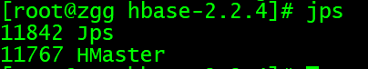
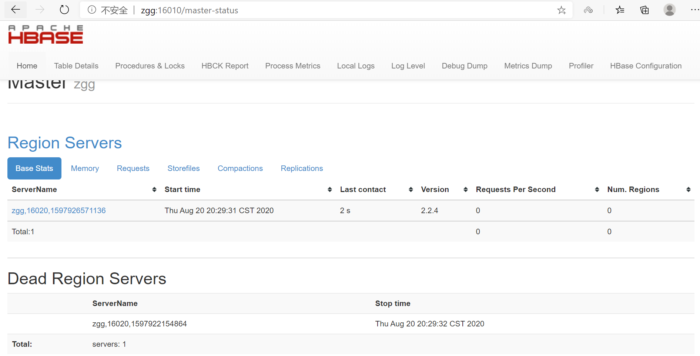
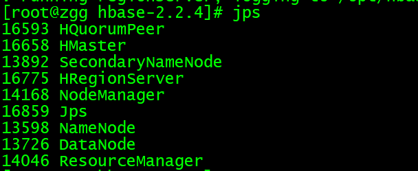
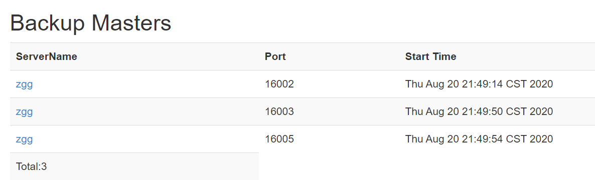
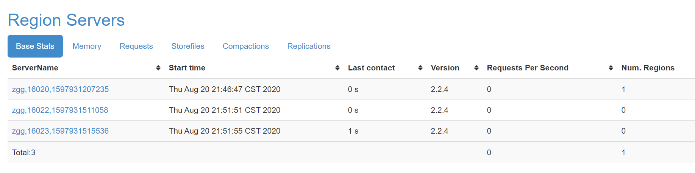
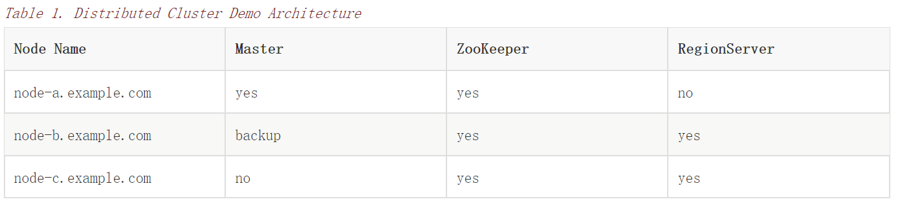

# Getting Started

[TOC]

## 1. Introduction

> [Quickstart](https://hbase.apache.org/2.2/book.html#quickstart) will get you up and running on a single-node, standalone instance of HBase.

下面运行一个节点和 standalone 模式。

## 2. Quick Start - Standalone HBase

> This section describes the setup of a single-node standalone HBase. A standalone instance has all HBase daemons — the Master, RegionServers, and ZooKeeper — running in a single JVM persisting to the local filesystem. It is our most basic deploy profile. We will show you how to create a table in HBase using the hbase shell CLI, insert rows into the table, perform put and scan operations against the table, enable or disable the table, and start and stop HBase.

这部分介绍一个节点的 HBase 的安装。

一个 standalone 实例包含了所有的 HBase 守护进程 -- Master,RegionServers,和 ZooKeeper，这些进程运行在一个 JVM 中，持久化数据到本地文件系统。

它是我们最基本的部署配置文件。我们将向您展示在 HBase 中如何使用 HBase shell CLI 创建表、向表中插入行、对表执行 put 和 scan 操作、启用或禁用表，以及启动和停止 HBase。

> Apart from downloading HBase, this procedure should take less than 10 minutes.

### 2.1. JDK Version Requirements

> HBase requires that a JDK be installed. See [Java](https://hbase.apache.org/2.2/book.html#java) for information about supported JDK versions.

先安装 JDK。

### 2.2. Get Started with HBase

Procedure: Download, Configure, and Start HBase in Standalone Mode

> 1.Choose a download site from this list of [Apache Download Mirrors](https://www.apache.org/dyn/closer.lua/hbase/). Click on the suggested top link. This will take you to a mirror of HBase Releases. Click on the folder named stable and then download the binary file that ends in .tar.gz to your local filesystem. Do not download the file ending in src.tar.gz for now.

1.下载稳定版本的 `.tar.gz` ，不要下载 `src.tar.gz`

> 2.Extract the downloaded file, and change to the newly-created directory.

2.解压压缩文件

    $ tar xzvf hbase-2.2.3-bin.tar.gz
    $ cd hbase-2.2.3/

> 3.You are required to set the JAVA_HOME environment variable before starting HBase. You can set the variable via your operating system’s usual mechanism, but HBase provides a central mechanism, conf/hbase-env.sh. Edit this file, uncomment the line starting with JAVA_HOME, and set it to the appropriate location for your operating system. The JAVA_HOME variable should be set to a directory which contains the executable file bin/java. Most modern Linux operating systems provide a mechanism, such as /usr/bin/alternatives on RHEL or CentOS, for transparently switching between versions of executables such as Java. In this case, you can set JAVA_HOME to the directory containing the symbolic link to bin/java, which is usually /usr.

3.**设置环境变量 `JAVA_HOME`**，可以在操作系统层面设置，也可以编辑 `conf/hbase-env.sh` 设置。

	JAVA_HOME=/usr

> 4.Edit conf/hbase-site.xml, which is the main HBase configuration file. At this time, you need to specify the directory on the local filesystem where HBase and ZooKeeper write data and acknowledge some risks. By default, a new directory is created under /tmp. Many servers are configured to delete the contents of /tmp upon reboot, so you should store the data elsewhere. The following configuration will store HBase’s data in the hbase directory, in the home directory of the user called testuser. Paste the <property> tags beneath the <configuration> tags, which should be empty in a new HBase install.

4.**编辑 `conf/hbase-site.xml` 文件**。如下：

```xml
<configuration>
  <!--本地文件系统上，HBase写入数据的位置，默认在/tmp -->
  <property>
    <name>hbase.rootdir</name>
    <value>file:///home/testuser/hbase</value> 
  </property>
  <!--本地文件系统上，zookeeper写入数据的位置，默认在/tmp -->
  <property>
    <name>hbase.zookeeper.property.dataDir</name>
    <value>/home/testuser/zookeeper</value>
  </property>
  <property>
    <name>hbase.unsafe.stream.capability.enforce</name>
    <value>false</value>
    <description>
      Controls whether HBase will check for stream capabilities (hflush/hsync).
      是否检查流容量
      Disable this if you intend to run on LocalFileSystem, denoted by a rootdir
      with the 'file://' scheme, but be mindful of the NOTE below.
      在本地文件系统运行，就Disable
      WARNING: Setting this to false blinds you to potential data loss and
      inconsistent system state in the event of process and/or node failures. If
      HBase is complaining of an inability to use hsync or hflush it's most
      likely not a false positive.
      将此设置为false会使您看不到潜在的数据丢失、进程和或节点发生故障时系统状态不一致
    </description>
  </property>
</configuration>
```

> You do not need to create the HBase data directory. HBase will do this for you. If you create the directory, HBase will attempt to do a migration, which is not what you want.

**设置的数据目录，系统会自动创建，不用手动创建。如果手动创建了，那么 HBase 会尝试迁移数据。**

> The hbase.rootdir in the above example points to a directory in the local filesystem. The 'file://' prefix is how we denote local filesystem. You should take the WARNING present in the configuration example to heart. In standalone mode HBase makes use of the local filesystem abstraction from the Apache Hadoop project. That abstraction doesn’t provide the durability promises that HBase needs to operate safely. This is fine for local development and testing use cases where the cost of cluster failure is well contained. It is not appropriate for production deployments; eventually you will lose data.

**`hbase.rootdir` 指向了本地文件系统中的一个目录**。 `file://` 前缀表示本地文件系统。

注意：在 standalone 模式下，HBase 使用来自 Apache Hadoop 项目的本地文件系统抽象。这个抽象没有提供 HBase 需要安全运行的持久性承诺。这对于本地开发和测试用例来说很好，因为这些用例很好地控制了集群失败的成本。但不适合生产部署，最终您将丢失数据。

> To home HBase on an existing instance of HDFS, set the hbase.rootdir to point at a directory up on your instance: e.g. hdfs://namenode.example.org:8020/hbase. For more on this variant, see the section below on Standalone HBase over HDFS.

**也可以将 HBase 数据存到 HDFS，`hbase.rootdir` 设置为 `hdfs://namenode.example.org:8020/hbase`**。

有关这个变种的更多信息，请参阅下面关于基于 HDFS 的 Standalone HBase 的部分。

> 1.The bin/start-hbase.sh script is provided as a convenient way to start HBase. Issue the command, and if all goes well, a message is logged to standard output showing that HBase started successfully. You can use the jps command to verify that you have one running process called HMaster. In standalone mode HBase runs all daemons within this single JVM, i.e. the HMaster, a single HRegionServer, and the ZooKeeper daemon. Go to http://localhost:16010 to view the HBase Web UI.

1.`bin/start-hbase.sh` 启动 HBase 。

启动成功后，会打印出一行消息。 `jps` 命令会展示运行中的线程 `HMaster`。 

standalone 模式下，所有的线程都运行在一个 JVM 中，如 HMaster, a single HRegionServer, 和 the ZooKeeper daemon。 



`http://localhost:16010 ` 可以查看 HBase Web UI。



> Java needs to be installed and available. If you get an error indicating that Java is not installed, but it is on your system, perhaps in a non-standard location, edit the conf/hbase-env.sh file and modify the JAVA_HOME setting to point to the directory that contains bin/java on your system.

注意：如果 Java 已安装，但却启动时出现了 Java 未安装的错误，可能是 JAVA_HOME 路径错误，修改 `conf/hbase-env.sh` 中的 `JAVA_HOME` 路径，指向包含 `bin/java` 的目录。

Procedure: Use HBase For the First Time

> 1.Connect to HBase.
Connect to your running instance of HBase using the hbase shell command, located in the bin/ directory of your HBase install. In this example, some usage and version information that is printed when you start HBase Shell has been omitted. The HBase Shell prompt ends with a > character.

1.连接 HBase

使用 `hbase shell` 连接运行中的 HBase 实例。

```sh
$ ./bin/hbase shell
hbase(main):001:0>
```
> 2.Display HBase Shell Help Text.
Type help and press Enter, to display some basic usage information for HBase Shell, as well as several example commands. Notice that table names, rows, columns all must be enclosed in quote characters.

2.`help` 命令可用展示 `HBase Shell` 的帮助信息。

> 3.Create a table.
Use the create command to create a new table. You must specify the table name and the ColumnFamily name.

3.`create` 命令建一个表，需要指定一个表名和列族名

```sh
hbase(main):001:0> create 'test', 'cf'
0 row(s) in 0.4170 seconds

=> Hbase::Table - test
```

> 4.List Information About your Table
Use the list command to confirm your table exists

4.`list` 命令列出表的信息，可用证明表是否存在。

```sh
hbase(main):002:0> list 'test'
TABLE
test
1 row(s) in 0.0180 seconds

=> ["test"]
```

> Now use the describe command to see details, including configuration defaults

`describe` 命令查看表的细节信息，包括默认的配置属性。

```sh
hbase(main):003:0> describe 'test'
Table test is ENABLED
test
COLUMN FAMILIES DESCRIPTION
{NAME => 'cf', VERSIONS => '1', EVICT_BLOCKS_ON_CLOSE => 'false', NEW_VERSION_BEHAVIOR => 'false', KEEP_DELETED_CELLS => 'FALSE', CACHE_DATA_ON_WRITE =>
'false', DATA_BLOCK_ENCODING => 'NONE', TTL => 'FOREVER', MIN_VERSIONS => '0', REPLICATION_SCOPE => '0', BLOOMFILTER => 'ROW', CACHE_INDEX_ON_WRITE => 'f
alse', IN_MEMORY => 'false', CACHE_BLOOMS_ON_WRITE => 'false', PREFETCH_BLOCKS_ON_OPEN => 'false', COMPRESSION => 'NONE', BLOCKCACHE => 'true', BLOCKSIZE
 => '65536'}
1 row(s)
Took 0.9998 seconds
```

> 5.Put data into your table.
To put data into your table, use the put command.

5.`put` 命令将数据放入表中。

```sh
hbase(main):003:0> put 'test', 'row1', 'cf:a', 'value1'
0 row(s) in 0.0850 seconds

hbase(main):004:0> put 'test', 'row2', 'cf:b', 'value2'
0 row(s) in 0.0110 seconds

hbase(main):005:0> put 'test', 'row3', 'cf:c', 'value3'
0 row(s) in 0.0100 seconds
```
在 row1，列 cf:a 插入 value1。

HBase 中的列是由“列族：列标识”组成。

> Here, we insert three values, one at a time. The first insert is at row1, column cf:a, with a value of value1. Columns in HBase are comprised of a column family prefix, cf in this example, followed by a colon and then a column qualifier suffix, a in this case.

> 6.Scan the table for all data at once.
One of the ways to get data from HBase is to scan. Use the scan command to scan the table for data. You can limit your scan, but for now, all data is fetched.

6.`scan` 命令：一次扫描表中所有数据。

```sh
hbase(main):006:0> scan 'test'
ROW                                      COLUMN+CELL
 row1                                    column=cf:a, timestamp=1421762485768, value=value1
 row2                                    column=cf:b, timestamp=1421762491785, value=value2
 row3                                    column=cf:c, timestamp=1421762496210, value=value3
3 row(s) in 0.0230 seconds
```

> 7.Get a single row of data.
To get a single row of data at a time, use the get command.

7.`get` 命令获取一个单行的数据

```sh
hbase(main):007:0> get 'test', 'row1'
COLUMN                                   CELL
 cf:a                                    timestamp=1421762485768, value=value1
1 row(s) in 0.0350 seconds
```
> 8.Disable a table.
If you want to delete a table or change its settings, as well as in some other situations, you need to disable the table first, using the disable command. You can re-enable it using the enable command.
Disable the table again if you tested the enable command above:

8.如果你想删除一个表或改变它的设置，那么需要先使用 `disable` 命令disable表。可用使用 `enable` 命令再次使能。

```sh
hbase(main):008:0> disable 'test'
0 row(s) in 1.1820 seconds

hbase(main):009:0> enable 'test'
0 row(s) in 0.1770 seconds

hbase(main):010:0> disable 'test'
0 row(s) in 1.1820 seconds
```

> 9.Drop the table.
To drop (delete) a table, use the drop command.

9.`drop` 命令删除表

```sh
hbase(main):011:0> drop 'test'
0 row(s) in 0.1370 seconds
Exit the HBase Shell.
```
> 10.Exit the HBase Shell.
To exit the HBase Shell and disconnect from your cluster, use the quit command. HBase is still running in the background.

`quit` 命令退出 `HBase Shell`，和集群断开连接，但 HBase 仍会运行。

Procedure: Stop HBase

> 1.In the same way that the bin/start-hbase.sh script is provided to conveniently start all HBase daemons, the bin/stop-hbase.sh script stops them.

1.`bin/stop-hbase.sh` 停止所有的进程。

```sh
$ ./bin/stop-hbase.sh
stopping hbase....................
$
```
> 2.After issuing the command, it can take several minutes for the processes to shut down. Use the jps to be sure that the HMaster and HRegionServer processes are shut down.

2.执行完上述命令后，过几分钟进程就会停止。

> The above has shown you how to start and stop a standalone instance of HBase. In the next sections we give a quick overview of other modes of hbase deploy.

下面快速浏览其他部署模式。

### 2.3. Pseudo-Distributed Local Install

> After working your way through quickstart standalone mode, you can re-configure HBase to run in pseudo-distributed mode. Pseudo-distributed mode means that HBase still runs completely on a single host, but each HBase daemon (HMaster, HRegionServer, and ZooKeeper) runs as a separate process: in standalone mode all daemons ran in one jvm process/instance. By default, unless you configure the hbase.rootdir property as described in quickstart, your data is still stored in /tmp/. In this walk-through, we store your data in HDFS instead, assuming you have HDFS available. You can skip the HDFS configuration to continue storing your data in the local filesystem.

伪分布模式下，HBase 运行在一台主机上，但每个守护进程(HMaster, HRegionServer, and ZooKeeper)作为独立的进程运行。

默认情况下，数据存储在`/tmp/`下。

> Hadoop Configuration
This procedure assumes that you have configured Hadoop and HDFS on your local system and/or a remote system, and that they are running and available. It also assumes you are using Hadoop 2. The guide on Setting up a Single Node Cluster in the Hadoop documentation is a good starting point.

保证 Hadoop 和 HDFS 可用。

> 1.Stop HBase if it is running.
If you have just finished quickstart and HBase is still running, stop it. This procedure will create a totally new directory where HBase will store its data, so any databases you created before will be lost.

1.先停止 HBase。不然之前创建的数据库会丢失。

> 2.Configure HBase.
Edit the hbase-site.xml configuration. First, add the following property which directs HBase to run in distributed mode, with one JVM instance per daemon.

2.配置 HBase

编辑 `hbase-site.xml ` 文件

```xml
<property>
  <name>hbase.cluster.distributed</name>
  <value>true</value>
</property>
```

> Next, change the hbase.rootdir from the local filesystem to the address of your HDFS instance, using the hdfs://// URI syntax. In this example, HDFS is running on the localhost at port 8020. Be sure to either remove the entry for hbase.unsafe.stream.capability.enforce or set it to true.

要么移除属性`hbase.unsafe.stream.capability.enforce`,要么设为true.

```xml
<property>
  <name>hbase.rootdir</name>
  <value>hdfs://localhost:8020/hbase</value>
</property>
```

> You do not need to create the directory in HDFS. HBase will do this for you. If you create the directory, HBase will attempt to do a migration, which is not what you want.

HBase 也会自动在 HDFS 上创建目录。

> 3.Start HBase.
Use the bin/start-hbase.sh command to start HBase. If your system is configured correctly, the jps command should show the HMaster and HRegionServer processes running.

3.启动 HBase

`bin/start-hbase.sh` 启动后，会出现 `HMaster and HRegionServer`



> 4.Check the HBase directory in HDFS.
If everything worked correctly, HBase created its directory in HDFS. In the configuration above, it is stored in /hbase/ on HDFS. You can use the hadoop fs command in Hadoop’s bin/ directory to list this directory.

4.检查 HDFS 上的 HBase 目录

```sh
$ ./bin/hadoop fs -ls /hbase
Found 7 items
drwxr-xr-x   - hbase users          0 2014-06-25 18:58 /hbase/.tmp
drwxr-xr-x   - hbase users          0 2014-06-25 21:49 /hbase/WALs
drwxr-xr-x   - hbase users          0 2014-06-25 18:48 /hbase/corrupt
drwxr-xr-x   - hbase users          0 2014-06-25 18:58 /hbase/data
-rw-r--r--   3 hbase users         42 2014-06-25 18:41 /hbase/hbase.id
-rw-r--r--   3 hbase users          7 2014-06-25 18:41 /hbase/hbase.version
drwxr-xr-x   - hbase users          0 2014-06-25 21:49 /hbase/oldWALs
Create a table and populate it with data.
```
> 5.Create a table and populate it with data.
You can use the HBase Shell to create a table, populate it with data, scan and get values from it, using the same procedure as in shell exercises.

5.使用`HBase Shell`创建表，向其填充数据、扫描并从中获取值。

> 6.Start and stop a backup HBase Master (HMaster) server.
Running multiple HMaster instances on the same hardware does not make sense in a production environment, in the same way that running a pseudo-distributed cluster does not make sense for production. This step is offered for testing and learning purposes only.

6.启动、停止一个备份 HBase Master (HMaster) server

注意：在一个生产环境下，运行多个 HMaster 是说不通的。这步仅仅是作测试和学习。

> The HMaster server controls the HBase cluster. You can start up to 9 backup HMaster servers, which makes 10 total HMasters, counting the primary. To start a backup HMaster, use the local-master-backup.sh. For each backup master you want to start, add a parameter representing the port offset for that master. Each HMaster uses two ports (16000 and 16010 by default). The port offset is added to these ports, so using an offset of 2, the backup HMaster would use ports 16002 and 16012. The following command starts 3 backup servers using ports 16002/16012, 16003/16013, and 16005/16015.

HMaster server 控制着 HBase 集群。如果你有10个 HMaster ，那么你可以启动9个备份。

使用 `local-master-backup.sh` 命令启动备份 HMaster。

对于每个你想启动的备份 master，添加一个表示那个 master 端口偏移量的参数。

**每个 HMaster 使用两个端口，默认是16000、16010**。

**端口偏移量在16000和160102的基础上加2，所以备份 HMaster 的端口为16002和16012**。

```sh
$ ./bin/local-master-backup.sh start 2 3 5
```



> To kill a backup master without killing the entire cluster, you need to find its process ID (PID). The PID is stored in a file with a name like /tmp/hbase-USER-X-master.pid. The only contents of the file is the PID. You can use the kill -9 command to kill that PID. The following command will kill the master with port offset 1, but leave the cluster running:

杀死一个备份 master ，使用 `kill -9 PID`。 

PID 在类似 `/tmp/hbase-USER-X-master.pid`的文件名中。这个文件的唯一内容就是这个PID.

```sh
$ cat /tmp/hbase-testuser-1-master.pid | xargs kill -9*
```

> 7.Start and stop additional RegionServers
The HRegionServer manages the data in its StoreFiles as directed by the HMaster. Generally, one HRegionServer runs per node in the cluster. Running multiple HRegionServers on the same system can be useful for testing in pseudo-distributed mode. The local-regionservers.sh command allows you to run multiple RegionServers. It works in a similar way to the local-master-backup.sh command, in that each parameter you provide represents the port offset for an instance. Each RegionServer requires two ports, and the default ports are 16020 and 16030. Since HBase version 1.1.0, HMaster doesn’t use region server ports, this leaves 10 ports (16020 to 16029 and 16030 to 16039) to be used for RegionServers. For supporting additional RegionServers, set environment variables HBASE_RS_BASE_PORT and HBASE_RS_INFO_BASE_PORT to appropriate values before running script local-regionservers.sh. e.g. With values 16200 and 16300 for base ports, 99 additional RegionServers can be supported, on a server. The following command starts four additional RegionServers, running on sequential ports starting at 16022/16032 (base ports 16020/16030 plus 2).

7.启动、停止额外的 RegionServers

`HRegionServer` 按照 `HMaster` 的指示管理 StoreFiles 中的数据。

一个 `HRegionServer` 运行在集群中的一个节点上。

在伪分布式模式下，同一系统中运行多个 `HRegionServer` 对测试来说是有用的。

`local-regionservers.sh` 可以运行多个 `RegionServers`，用法类似 `local-master-backup.sh` 命令，其参数表示实例的端口偏移量。

每个 `RegionServer` 有两个端口，默认是16020和16030。

从版本1.1.0开始，HMaster 不再使用 region server 端口，这就剩余10个端口(16020 to 16029 和 16030 to 16039) 供 `RegionServers`使用。

对于支持额外的 `RegionServers`，设置环境变量 `HBASE_RS_BASE_PORT` 和 `HBASE_RS_INFO_BASE_PORT`。

例如，对于16200和16300基本端口，那么在一个服务器上支持99个额外的 `RegionServers`。

```sh
$ .bin/local-regionservers.sh start 2 3 4 5
```


> To stop a RegionServer manually, use the local-regionservers.sh command with the stop parameter and the offset of the server to stop.

手动停止 RegionServer 

```sh
$ .bin/local-regionservers.sh stop 3
```
> Stop HBase.
You can stop HBase the same way as in the quickstart procedure, using the bin/stop-hbase.sh command.

使用 `bin/stop-hbase.sh` 停止 HBase

### 2.4. Advanced - Fully Distributed

> In reality, you need a fully-distributed configuration to fully test HBase and to use it in real-world scenarios. In a distributed configuration, the cluster contains multiple nodes, each of which runs one or more HBase daemon. These include primary and backup Master instances, multiple ZooKeeper nodes, and multiple RegionServer nodes.

分布式环境中，集群保护多个节点，**每个节点运行一个或多个 HBase 守护进程**。这些包含主要和备份 Master 实例，多个 ZooKeeper 节点，和多个 RegionServer 节点。

> This advanced quickstart adds two more nodes to your cluster. The architecture will be as follows:

节点规划如下：



> This quickstart assumes that each node is a virtual machine and that they are all on the same network. It builds upon the previous quickstart, Pseudo-Distributed Local Install, assuming that the system you configured in that procedure is now node-a. Stop HBase on node-a before continuing.

快速开始部分假设每个节点是一台独立的机器，都运行在相同网络下。

> Be sure that all the nodes have full access to communicate, and that no firewall rules are in place which could prevent them from talking to each other. If you see any errors like no route to host, check your firewall.

注意：所有节点都可以被访问，且能互相访问。如果出现 `no route to host` 错误，检查防火墙。

Procedure: Configure Passwordless SSH Access

> node-a needs to be able to log into node-b and node-c (and to itself) in order to start the daemons. The easiest way to accomplish this is to use the same username on all hosts, and configure password-less SSH login from node-a to each of the others.

`node-a` 需要能登录 `node-b and node-c (and to itself)`，以启动守护进程。最简单的方法就是在所有主机上使用相同的用户名，配置从 `node-a` 到其他主机的 ssh 免密登录。

> 1.On node-a, generate a key pair.
While logged in as the user who will run HBase, generate a SSH key pair, using the following command:

1.`node-a` 上生成 a key pair.

```sh
$ ssh-keygen -t rsa
```
> If the command succeeds, the location of the key pair is printed to standard output. The default name of the public key is id_rsa.pub.

执行成功后，key pair 的位置就被打印出标准输出。 public key 的默认名字是 `id_rsa.pub`

> 2.Create the directory that will hold the shared keys on the other nodes.
On node-b and node-c, log in as the HBase user and create a .ssh/ directory in the user’s home directory, if it does not already exist. If it already exists, be aware that it may already contain other keys.

2.在其他节点创建一个目录，用来放 shared keys

在 `node-b and node-c` 上，以 HBase 用户登录，在用户主目录创建 `.ssh/` 目录。如果该目录已存在，它可能包含了其他的 keys.

> 3.Copy the public key to the other nodes.
Securely copy the public key from node-a to each of the nodes, by using the scp or some other secure means. On each of the other nodes, create a new file called .ssh/authorized_keys if it does not already exist, and append the contents of the id_rsa.pub file to the end of it. Note that you also need to do this for node-a itself.

3.把 `public key` 复制到其他节点上。

使用 `scp` 或其他安全命令将 `public key` 复制到其他两个节点上。

在其他的每个节点上，会创建一个 `.ssh/authorized_keys` 文件，将 `id_rsa.pub` 追加到该文件的末尾。在 `node-a` 上也要执行这个操作。

```sh
$ cat id_rsa.pub >> ~/.ssh/authorized_keys
```

> 4.Test password-less login.
If you performed the procedure correctly, you should not be prompted for a password when you SSH from node-a to either of the other nodes using the same username.

4.测试免密登录

完成所有步骤后，就不需要输入密码了。

> 5.Since node-b will run a backup Master, repeat the procedure above, substituting node-b everywhere you see node-a. Be sure not to overwrite your existing .ssh/authorized_keys files, but concatenate the new key onto the existing file using the >> operator rather than the > operator.

因为 `node-b` 将运行一个备份 Master ，所以重复上面的过程，在看到 `node-a` 的地方替换 `node-b` 。请确保不要覆盖现有的 `.ssh/authorized_keys` 文件，使用 >> 操作符(而不是 > 操作符)将新 key 连接到现有文件。

Procedure: Prepare node-a

> node-a will run your primary master and ZooKeeper processes, but no RegionServers. Stop the RegionServer from starting on node-a.

`node-a` 将会运行主 master 和 ZooKeeper 进程，没有 RegionServers 。但停止 RegionServers 需要在 `node-a` 上。 

> 1.Edit conf/regionservers and remove the line which contains localhost. Add lines with the hostnames or IP addresses for node-b and node-c.

1.编辑 `conf/regionservers` ，删除包含 localhost 的行。添加 node-b and node-c 的主机名或ip地址。

> Even if you did want to run a RegionServer on node-a, you should refer to it by the hostname the other servers would use to communicate with it. In this case, that would be node-a.example.com. This enables you to distribute the configuration to each node of your cluster any hostname conflicts. Save the file.

> 2.Configure HBase to use node-b as a backup master.
Create a new file in conf/ called backup-masters, and add a new line to it with the hostname for node-b. In this demonstration, the hostname is node-b.example.com.

2.配置 HBase ，使用 `node-b` 作为备份 master

在 `conf/` 中，创建一个名为 `backup-masters` 的文件，文件中添加一行 `node-b` 主机名的内容。

> 3.Configure ZooKeeper
In reality, you should carefully consider your ZooKeeper configuration. You can find out more about configuring ZooKeeper in zookeeper section. This configuration will direct HBase to start and manage a ZooKeeper instance on each node of the cluster.
On node-a, edit conf/hbase-site.xml and add the following properties.

3.配置 ZooKeeper

编辑`conf/hbase-site.xml` 文件配置。

```xml
<property>
  <name>hbase.zookeeper.quorum</name>
  <value>node-a.example.com,node-b.example.com,node-c.example.com</value>
</property>
<property>
  <name>hbase.zookeeper.property.dataDir</name>
  <value>/usr/local/zookeeper</value>
</property>
```

> 4.Everywhere in your configuration that you have referred to node-a as localhost, change the reference to point to the hostname that the other nodes will use to refer to node-a. In these examples, the hostname is node-a.example.com.

Procedure: Prepare node-b and node-c

> node-b will run a backup master server and a ZooKeeper instance.

`node-b` 运行备份 master server 和 a ZooKeeper

> 1.Download and unpack HBase.
Download and unpack HBase to node-b, just as you did for the standalone and pseudo-distributed quickstarts.

1.下载、还原 HBase 到 `node-b`。执行和 单机、伪分布一样的操作。

> 2.Copy the configuration files from node-a to node-b.and node-c.
Each node of your cluster needs to have the same configuration information. Copy the contents of the conf/ directory to the conf/ directory on node-b and node-c.

2.将 `node-a` 复制配置文件到 `node-b.and node-c`

集群中的每个节点都需要有相同的配置信息。

Procedure: Start and Test Your Cluster

> 1.Be sure HBase is not running on any node.
If you forgot to stop HBase from previous testing, you will have errors. Check to see whether HBase is running on any of your nodes by using the jps command. Look for the processes HMaster, HRegionServer, and HQuorumPeer. If they exist, kill them.

1.确保 HBase 没有运行在任何节点

> 2.Start the cluster.
On node-a, issue the start-hbase.sh command. Your output will be similar to that below.

2.启动集群

`node-a` 节点上，执行 `start-hbase.sh`.

```sh
$ bin/start-hbase.sh
node-c.example.com: starting zookeeper, logging to /home/hbuser/hbase-0.98.3-hadoop2/bin/../logs/hbase-hbuser-zookeeper-node-c.example.com.out
node-a.example.com: starting zookeeper, logging to /home/hbuser/hbase-0.98.3-hadoop2/bin/../logs/hbase-hbuser-zookeeper-node-a.example.com.out
node-b.example.com: starting zookeeper, logging to /home/hbuser/hbase-0.98.3-hadoop2/bin/../logs/hbase-hbuser-zookeeper-node-b.example.com.out
starting master, logging to /home/hbuser/hbase-0.98.3-hadoop2/bin/../logs/hbase-hbuser-master-node-a.example.com.out
node-c.example.com: starting regionserver, logging to /home/hbuser/hbase-0.98.3-hadoop2/bin/../logs/hbase-hbuser-regionserver-node-c.example.com.out
node-b.example.com: starting regionserver, logging to /home/hbuser/hbase-0.98.3-hadoop2/bin/../logs/hbase-hbuser-regionserver-node-b.example.com.out
node-b.example.com: starting master, logging to /home/hbuser/hbase-0.98.3-hadoop2/bin/../logs/hbase-hbuser-master-nodeb.example.com.out
ZooKeeper starts first, followed by the master, then the RegionServers, and finally the backup masters.
```
> ZooKeeper starts first, followed by the master, then the RegionServers, and finally the backup masters.

> 3.Verify that the processes are running.
On each node of the cluster, run the jps command and verify that the correct processes are running on each server. You may see additional Java processes running on your servers as well, if they are used for other purposes.

3.验证进程正在运行

node-a jps Output

```sh
$ jps
20355 Jps
20071 HQuorumPeer
20137 HMaster
```
node-b jps Output

```sh
$ jps
15930 HRegionServer
16194 Jps
15838 HQuorumPeer
16010 HMaster
```
node-c jps Output

```sh
$ jps
13901 Jps
13639 HQuorumPeer
13737 HRegionServer
```
> ZooKeeper Process Name
The HQuorumPeer process is a ZooKeeper instance which is controlled and started by HBase. If you use ZooKeeper this way, it is limited to one instance per cluster node and is appropriate for testing only. If ZooKeeper is run outside of HBase, the process is called QuorumPeer. For more about ZooKeeper configuration, including using an external ZooKeeper instance with HBase, see zookeeper section.

注意：`HQuorumPeer`是由 HBase 控制启动的 ZooKeeper 实例。也可以使用外部 ZooKeeper，称作 `QuorumPeer`。

> 4.Browse to the Web UI.
Web UI Port Changes
In HBase newer than 0.98.x, the HTTP ports used by the HBase Web UI changed from 60010 for the Master and 60030 for each RegionServer to 16010 for the Master and 16030 for the RegionServer.

4.浏览 Web UI

注意：Web UI 端口变化了

0.98.x 及更新的版本，Master 由 60010 改为 16010 ，RegionServer 由 60030 改为 16030

> If everything is set up correctly, you should be able to connect to the UI for the Master http://node-a.example.com:16010/ or the secondary master at http://node-b.example.com:16010/ using a web browser. If you can connect via localhost but not from another host, check your firewall rules. You can see the web UI for each of the RegionServers at port 16030 of their IP addresses, or by clicking their links in the web UI for the Master.

> 5.Test what happens when nodes or services disappear.
With a three-node cluster you have configured, things will not be very resilient. You can still test the behavior of the primary Master or a RegionServer by killing the associated processes and watching the logs.

5.测试当节点或服务消失后，发生了什么。

### 2.5. Where to go next

> The next chapter, configuration, gives more information about the different HBase run modes, system requirements for running HBase, and critical configuration areas for setting up a distributed HBase cluster.