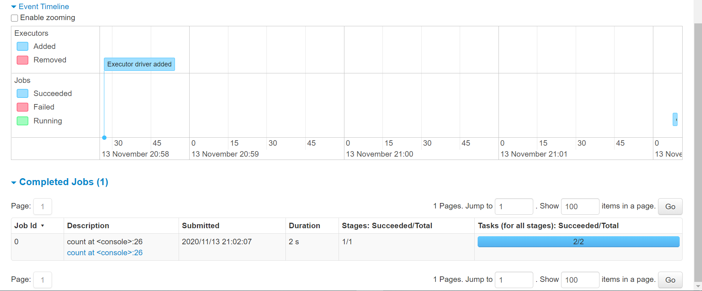
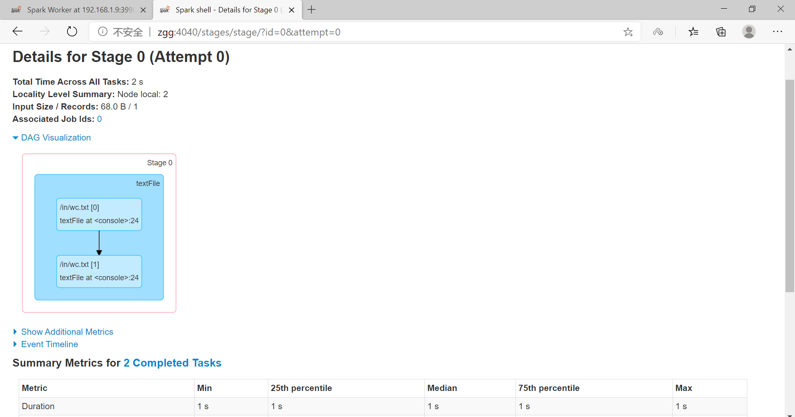

# 环境搭建：单机、伪分布、完全分布

[TOC]

## 1、单机

### 1.1、安装jdk、hadoop

### 1.2、安装scala

### 1.3、安装Spark

(1)下载、解压

(2)配置环境变量

(3)要打开 Python 版本的 Spark shell，进入你的 Spark 目录然后输入： 

	bin/pyspark

如果要打开 Scala 版本的 shell，输入：

	bin/spark-shell

(4)如果觉得shell中输出的日志信息过多，可以调整日志的级别来控制输出的信息量。 可以重新配置conf 目录下的`log4j.properties.template`文件。把下面这行修改为：

	log4j.rootCategory=INFO, console  
	log4j.rootCategory=WARN, console

(5)测试


## 2、Standalone伪分布

### 2.1、安装jdk、hadoop

jdk：1.8.0_271

hadoop：hadoop-3.2.1

### 2.2、安装scala

版本：2.12.12

(1)下载、解压

[https://www.scala-lang.org/download/2.12.12.html](https://www.scala-lang.org/download/2.12.12.html)

(2)配置环境变量

```sh
[root@zgg ~]# cat /etc/profile   
# /etc/profile
...

export SCALA_HOME=/opt/scala-2.12.12
export JAVA_HOME=/opt/jdk1.8.0_271
export HADOOP_HOME=/opt/hadoop-3.2.1

export PATH=.:$HADOOP_HOME/bin:$JAVA_HOME/bin:$SCALA_HOME/bin:$PATH

[root@zgg ~]# source /etc/profile 
```

### 2.3、安装Spark

版本：3.0.1

(1)下载、解压

[http://archive.apache.org/dist/spark/spark-3.0.1/](http://archive.apache.org/dist/spark/spark-3.0.1/)

(2)配置环境变量

```sh
[root@zgg ~]# cat /etc/profile   
# /etc/profile
...

export SCALA_HOME=/opt/scala-2.12.12
export JAVA_HOME=/opt/jdk1.8.0_271
export HADOOP_HOME=/opt/hadoop-3.2.1
export SPARK_HOME=/opt/spark-2.4.4-bin-hadoop2.7

export PATH=.:$HADOOP_HOME/bin:$JAVA_HOME/bin:$SCALA_HOME/bin:$SPARK_HOME/bin:$PATH

[root@zgg ~]# source /etc/profile 
```

(3)配置配置文件

```sh
[root@zgg conf]# ls
fairscheduler.xml.template  metrics.properties.template  spark-defaults.conf.template
log4j.properties.template   slaves.template              spark-env.sh.template
[root@zgg conf]# mv slaves.template slaves
[root@zgg conf]# ls
fairscheduler.xml.template  metrics.properties.template  spark-defaults.conf.template
log4j.properties.template   slaves                       spark-env.sh.template
[root@zgg conf]# vi slaves   # 将localhost改成自己的主机名
[root@zgg conf]# cat slaves 
...
zgg
```

```sh
[root@zgg conf]# mv spark-env.sh.template spark-env.sh
[root@zgg conf]# vi spark-env.sh 
[root@zgg conf]# cat spark-env.sh
#!/usr/bin/env bash
...
export JAVA_HOME=/opt/jdk1.8.0_271
export SCALA_HOME=/opt/scala-2.12.12
export HADOOP_HOME=/opt/hadoop-3.2.1
export HADOOP_CONF_DIR=/opt/hadoop-3.2.1/etc/hadoop
export SPARK_HOME=/opt/spark-3.0.1-bin-hadoop3.2
export SPARK_MASTER_HOST=zgg
```

(4)启动

先启动 hadoop，后启动 spark。

进入 spark 的 sbin 目录下执行 start-all.sh 启动 spark，出现了 master 和 worker 

```sh
[root@zgg spark-3.0.1-bin-hadoop3.2]# sbin/start-all.sh  
starting org.apache.spark.deploy.master.Master, logging to /opt/spark-3.0.1-bin-hadoop3.2/logs/spark-root-org.apache.spark.deploy.master.Master-1-zgg.out
zgg: starting org.apache.spark.deploy.worker.Worker, logging to /opt/spark-3.0.1-bin-hadoop3.2/logs/spark-root-org.apache.spark.deploy.worker.Worker-1-zgg.out
[root@zgg spark-3.0.1-bin-hadoop3.2]# jps
21696 NameNode
22323 ResourceManager
22467 NodeManager
23381 Worker
23431 Jps
22074 SecondaryNameNode
21836 DataNode
23310 Master
```

在浏览器输出 `zgg:8080/` ，进入 spark 的 web 控制台页面。


`bin/spark-shell` 启动 shell，然后在浏览器输出 `zgg:4040`

```sh
[root@zgg spark-3.0.1-bin-hadoop3.2]# bin/spark-shell
2020-11-13 20:45:19,703 WARN util.NativeCodeLoader: Unable to load native-hadoop library for your platform... using builtin-java classes where applicable
Setting default log level to "WARN".
To adjust logging level use sc.setLogLevel(newLevel). For SparkR, use setLogLevel(newLevel).
Spark context Web UI available at http://zgg:4040
Spark context available as 'sc' (master = local[*], app id = local-1605271529580).
Spark session available as 'spark'.
Welcome to
      ____              __
     / __/__  ___ _____/ /__
    _\ \/ _ \/ _ `/ __/  '_/
   /___/ .__/\_,_/_/ /_/\_\   version 3.0.1
      /_/
         
Using Scala version 2.12.10 (Java HotSpot(TM) 64-Bit Server VM, Java 1.8.0_271)
Type in expressions to have them evaluated.
Type :help for more information.

scala> val lines = sc.textFile("/in/wc.txt")
lines: org.apache.spark.rdd.RDD[String] = /in/wc.txt MapPartitionsRDD[1] at textFile at <console>:24

scala> lines.count()
res0: Long = 1    
```






(5)测试

```sh
[root@zgg spark-3.0.1-bin-hadoop3.2]# spark-submit --master spark://zgg:7077 --class org.apache.spark.examples.SparkPi /opt/spark-3.0.1-bin-hadoop3.2/examples/jars/spark-examples_2.12-3.0.1.jar 10
2020-11-13 20:55:43,379 WARN util.NativeCodeLoader: Unable to load native-hadoop library for your platform... using builtin-java classes where applicable
2020-11-13 20:55:43,591 INFO spark.SparkContext: Running Spark version 3.0.1
2020-11-13 20:55:43,642 INFO resource.ResourceUtils: ==============================================================
2020-11-13 20:55:43,644 INFO resource.ResourceUtils: Resources for spark.driver:

2020-11-13 20:55:43,644 INFO resource.ResourceUtils: ==============================================================
2020-11-13 20:55:43,645 INFO spark.SparkContext: Submitted application: Spark Pi
...
2020-11-13 20:55:51,544 INFO scheduler.DAGScheduler: Job 0 finished: reduce at SparkPi.scala:38, took 5.056344 s
Pi is roughly 3.1436471436471436
...
```

## 3、完全分布

### 3.1、环境配置

（1）各节点添加集群主机信息

	vi /etc/hosts

	ip1:master
	ip2:slaver1
	ip2:slaver2

（2）设置ssh免密码连接主机和从机

### 3.2、各节点安装jdk、hadoop

### 3.3、安装Spark

（1）[下载](http://spark.apache.org/downloads.html)、解压、重命名

（2）配置环境变量

	vi /etc/profile
	source /etc/profile

（3）配置文件

	vi slaves
    
    添加其他两台主机的IP地址:

    slave1
    slave2
	
	-----------------------------------------------------

	cp spark-env.sh.tempalte spark-env.sh 
	vi spark-env.sh

    export JAVA_HOME=/opt/jdk1.8.0_221
	export HADOOP_HOME=/opt/hadoop-2.7.3
	export HADOOP_CONF_DIR=/opt/hadoop-2.7.3/etc/hadoop
	export SPARK_HOME=/opt/spark-2.4.4-bin-hadoop2.7
	export SPARK_MASTER_IP=zgg
	export SPARK_WORKER_MEMORY=512M
	export SPARK_MASTER_PORT=7077

（4）配置slave

用SCP命令将 master spark 目录拷贝到 slave 上

	scp -r spark root@slave1:/
	scp -r spark root@slave2:/  
   

（5）启动Spark集群环境

在Master节点上启动Spark集群： `start-all.sh`

访问 `ip:8080` 页面，WEB UI 查看内容