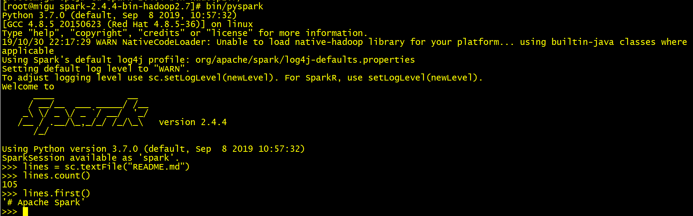
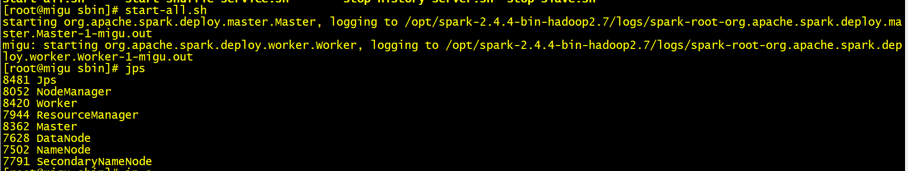
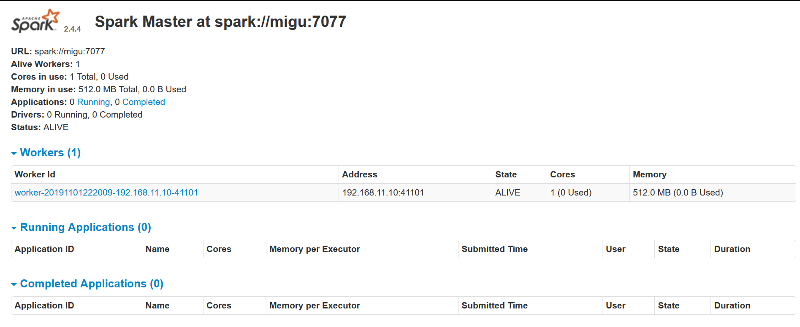
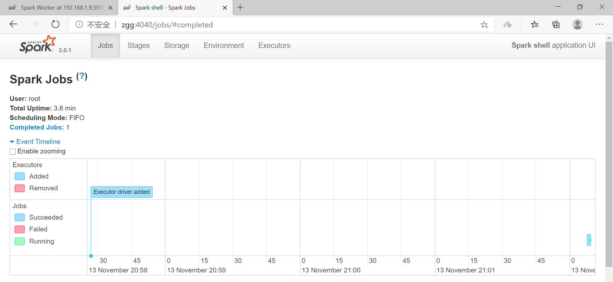

# 环境搭建：单机、伪分布、完全分布

## 1、单机安装

### 1.1、安装jdk、hadoop

### 1.2、安装Spark

（1）[下载](http://spark.apache.org/downloads.html)、解压、重命名

（2）配置环境变量

	vi /etc/profile
	source /etc/profile

（3）要打开 Python 版本的 Spark shell，进入你的 Spark 目录然后输入： 

	bin/pyspark

如果要打开 Scala 版本的 shell，输入：

	bin/spark-shell

（4）如果觉得shell中输出的日志信息过多，可以调整日志的级别来控制输出的信息量。 可以重新配置conf 目录下的log4j.properties.template文件
把下面这行修改为：

	log4j.rootCategory=INFO, console  
	log4j.rootCategory=WARN, console

（5）测试

## 2、伪分布安装

### 2.1、安装jdk、hadoop

### 2.2、安装Spark

（1）[下载](http://spark.apache.org/downloads.html)、解压、重命名

（2）配置环境变量

	vi /etc/profile
	source /etc/profile

（3）配置文件

	#将localhost改成自己的主机名
	cp slaves.template slaves
	vi slaves
		
	cp spark-env.sh.tempalte spark-env.sh 
	vi spark-env.sh 

	#添加如下内容
	export JAVA_HOME=/opt/jdk1.8.0_221
	export HADOOP_HOME=/opt/hadoop-2.7.3
	export HADOOP_CONF_DIR=/opt/hadoop-2.7.3/etc/hadoop
	export SPARK_HOME=/opt/spark-2.4.4-bin-hadoop2.7
	export SPARK_MASTER_IP=zgg
	export SPARK_WORKER_MEMORY=512M
	export SPARK_MASTER_PORT=7077

（4）启动

先启动 hadoop，后启动 spark。

进入 spark 的 sbin 目录下执行 start-all.sh 启动 spark

出现了 master 和 worker
在浏览器输出 `ip:8080/` ，进入 spark 的 web 控制台页面。

bin/spark-shell 启动 SparkContext，在浏览器输出 `ip:4040`

	master端口是7077
	master webui是8080
	spark shell webui端口是4040

## 3、完全分布

### 3.1、环境配置

（1）各节点添加集群主机信息

	vi /etc/hosts

	ip1:master
	ip2:slaver1
	ip2:slaver2

（2）设置ssh免密码连接主机和从机

### 3.2、各节点安装jdk、hadoop

### 3.3、安装Spark

（1）[下载](http://spark.apache.org/downloads.html)、解压、重命名

（2）配置环境变量

	vi /etc/profile
	source /etc/profile

（3）配置文件

	vi slaves
    
    添加其他两台主机的IP地址:

    slave1
    slave2
	
	-----------------------------------------------------

	cp spark-env.sh.tempalte spark-env.sh 
	vi spark-env.sh

    export JAVA_HOME=/opt/jdk1.8.0_221
	export HADOOP_HOME=/opt/hadoop-2.7.3
	export HADOOP_CONF_DIR=/opt/hadoop-2.7.3/etc/hadoop
	export SPARK_HOME=/opt/spark-2.4.4-bin-hadoop2.7
	export SPARK_MASTER_IP=zgg
	export SPARK_WORKER_MEMORY=512M
	export SPARK_MASTER_PORT=7077

（4）配置slave

用SCP命令将 master spark 目录拷贝到 slave 上

	scp -r spark root@slave1:/
	scp -r spark root@slave2:/  
   

（5）启动Spark集群环境

在Master节点上启动Spark集群： `start-all.sh`

访问 `ip:8080` 页面，WEB UI 查看内容