# 线性回归

[TOC]

## 1、单变量线性回归

例子：

	根据房屋交易数据集，预测1250平方英尺的房子的价格是多少。

将数据集以散点图的形式展示，再据此拟合一条直线，即构建了一个数据模型。那么就可以根据这个数据模型来预测房子的价格。

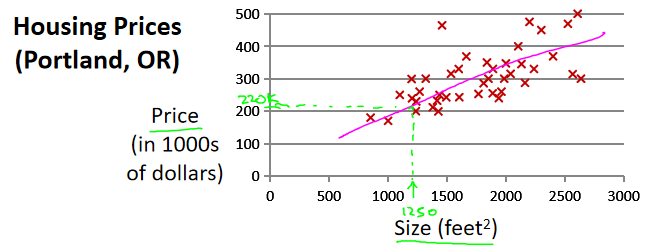

上例中的房屋交易数据集称为 **训练集** ，具体如下所示。

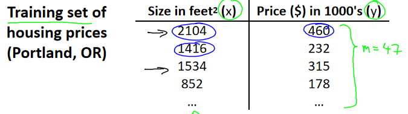

其中：

	m ：训练集中样本的数量
	x ：输入变量\特征
	y ：输出变量\目标变量

	(x,y) 表示训练集中的一个样本
	(x^i,y^i) 表示第 i 个样本

下图表示一个监督学习算法的工作方式

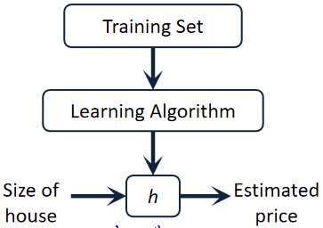

要解决房价预测问题，首先要将训练集输入给学习算法，进而学习得到一个假设h，然后将要预测的房屋的尺寸作为输入变量输入给 h，预测出该房屋的交易价格作为输出变量输出为结果。

那么，如何表示呢？【联系一元一次方程的图形表示】

因为只含有一个特征/输入变量，因此这样的问题叫作 **单变量线性回归问题**。

### 1.1、代价函数

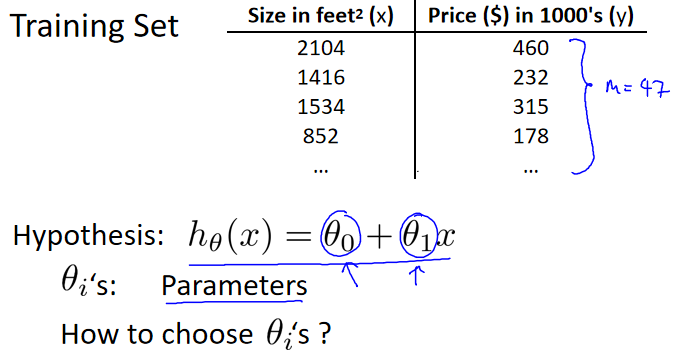

现在要做的便是为我们的模型选择合适的参数 θ0 和 θ1，在房价问题这个例子中便是直线的斜率和在 y 轴上的截距。

下面是选择的几种类型：

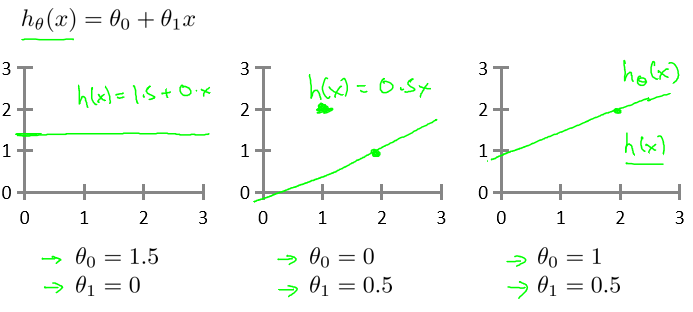

所以，选择参数后所形成的直线，要尽量拟合图中数据点。

即，**对于参数确定后的数据模型，当输入 x，数据模型的输出 h(x) 要尽可能的等于样本的 y 值。**

使用公式表示就是：【均方根误差】

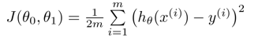

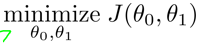

J 表示代价函数，**目标是选择参数 θ0 和 θ1 后，J 的值最小。**

### 1.2、对线性回归目标的理解

现在假设 θ0=0，那么假设函数、代价函数变成如下样子：

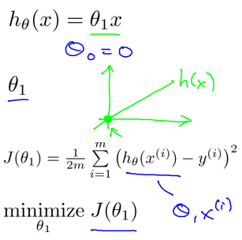

	假设函数 h 成为一条过原点的直线，关于 x 的函数。

	代价函数 J 成为一条U型曲线，关于 θ1 的函数。如下：

当 θ1=1 时：

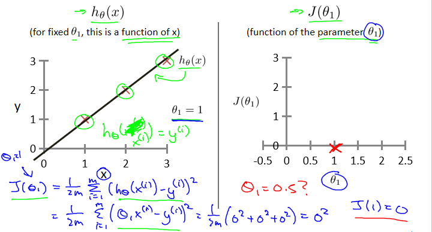

h=x， 过 (0,0)、(1,1)、(2,2)... ，那么 J=0 ，此时 h等于y

当 θ1=0.5 时：

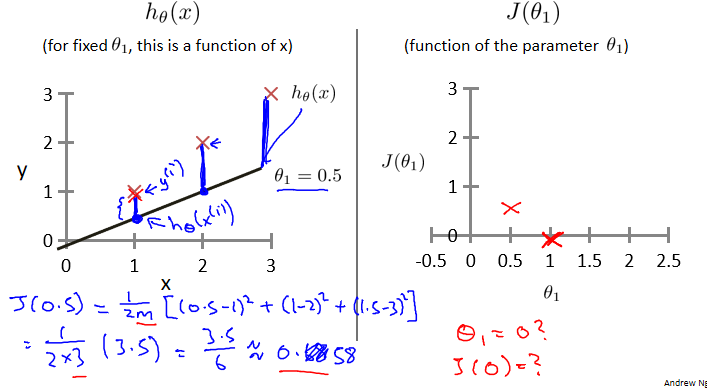

h=0.5x，J=0.65，此时 h 和 y 间有差值，如图。

当 θ1=0 时：

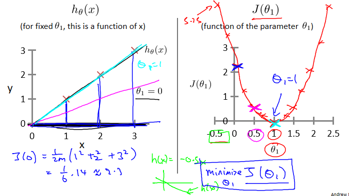

h=0，J=2.3，此时 h 和 y 间有差值，如图。

所以，由以上三张图，可知：

	右图 x 轴的 θ1 确定一个值，对应左图的一条直线。

	J 呈U型曲线，其最小值是为 θ1=1 时，此时左图中h等于y。

-------------------------------------------------------------

θ0 和 θ1 同时取值时

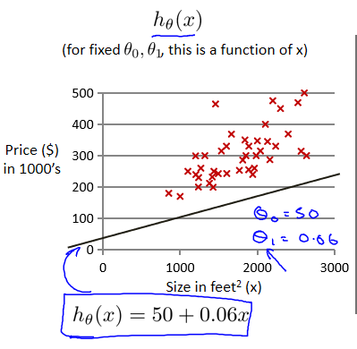

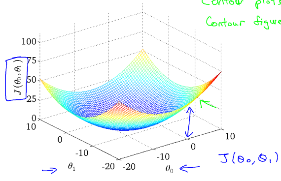

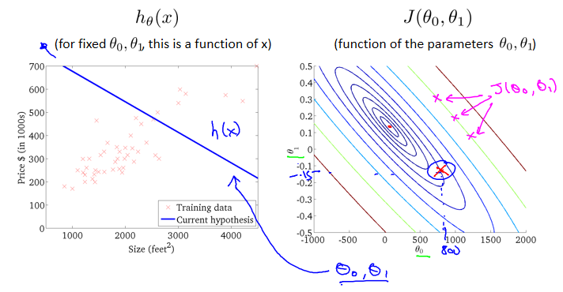

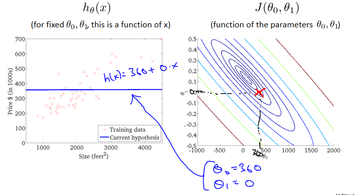

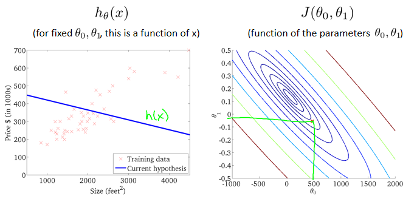

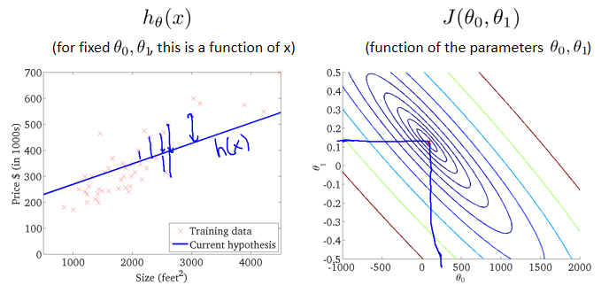

可以看出在三维空间中存在一个使得代价函数最小的点。

-------------------------------------------------------------
 
**那么，现在问题是如何确定 θ0、θ1，使代价函数最小。**

梯度下降是一个用来求函数最小值的算法，我们将使用梯度下降算法来求出代价函数J的最小值

## 2、梯度下降算法

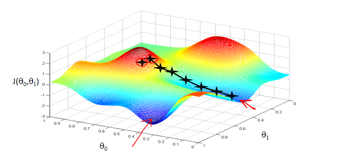

想象一下你正站立在山的这一点上，站立在你想象的公园这座红色山上，在梯度下降算
法中，我们要做的就是旋转 360 度，看看我们的周围，选择最佳的下山方向，迈着小碎步下
山，到了一个新的点后，重复上面的步骤，直到接近局部最低点的位置。

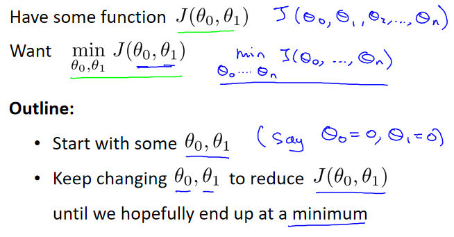

思路：先对 θ0、θ1 取一个初始值，一般都取0，然后**同时更新**这两个参数，使 J 变小，直到得到 J 一个局部最小值。

	选择不同的初始参数，可能会找到不同的局部最小值。

梯度下降公式为：

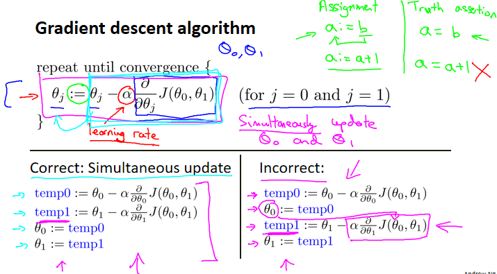

### 2.1、理解梯度下降公式

这里取 θ0=0。

**对偏导数部分**

J 的图形表示如下：

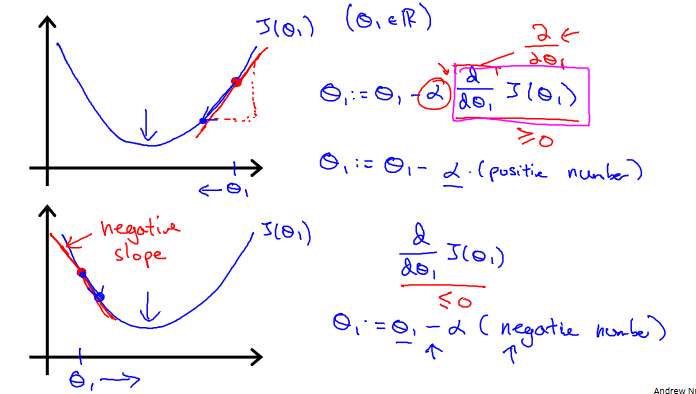

	偏导数表示在正切该点的直线的斜率。

当点在最小值的右边时，斜率为正数，即原点减去一个长度向下走。

当点在最小值的左边时，斜率为负数，即原点加上一个长度向下走。

随着迭代的进行，图中红点会一直向下移动，切线的斜率也会逐渐变小。

【偏导数部分理解成走多少步】

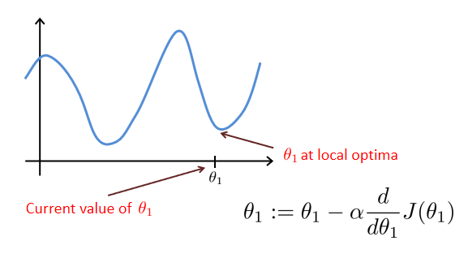

当走到最小值处，斜率为0。这意味着你已经在局部最优点，它使得 θ1不再改变，也就是新的 θ1等于原来的 θ1，因此，如果你的参数已经处于局部最低点，那么梯度下降法更新其实什么都没做，它不会改变参数的值。这也解释了为什么即使学习速率 α 保持不变时，梯度下降也可以收敛到局部最低点。

**对α**

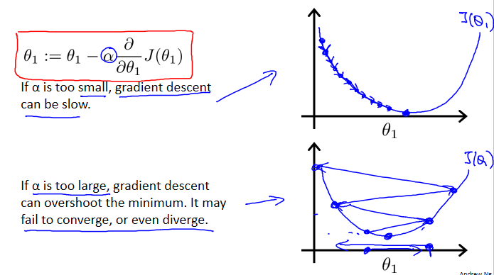

α 为学习速率，理解成下山的步子迈多大。

如果 α 太小了，即学习速率太小，这样就需要很多步才能到达最低点。

如果 α 太大，那么可能会越过最低点，甚至可能无法收敛。

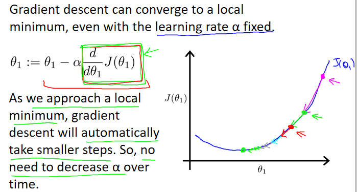

当越来越接近最小值时，步子会自动越迈越小，即 α 会越迈越小，所以不需要手动减少 α 。 

## 3、单变量线性回归的梯度下降算法

将梯度下降和代价函数结合，并将其应用于具体的拟合直线的线性回归算法里。

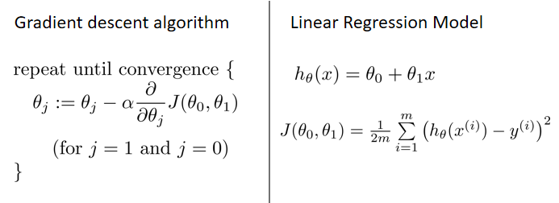

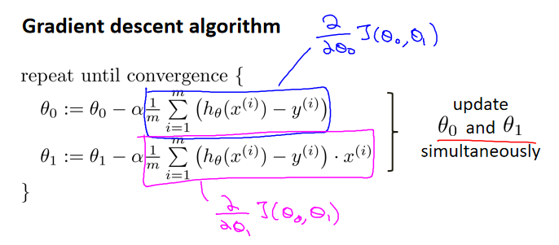

【逐渐拟合的演示见视频】

有时也称为批量梯度下降，指的是在梯度下降的每一步中，我们都用到了所有的训练样本，在梯度下降中，在计算微分求导项时，我们需要进行求和运算，所以，在一个单独的梯度下降中，我们最终都要计算这样一个东西，这个项需要对所有 m 个训练
样本求和。因此，批量梯度下降法这个名字说明了我们需要考虑所有这一"批"训练样本。

在后面的课程中，我们也会谈到这个方法，它可以在不需要多步梯度下降的情况下，也能解出代价函数 J 的最小值，这是另一种称为正规方程(normal equations)的方法。实际上在数据量较大的情况下，梯
度下降法比正规方程要更适用一些。

## 4、多变量线性回归