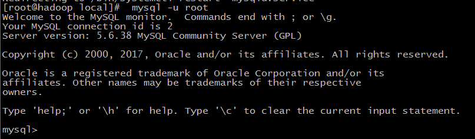
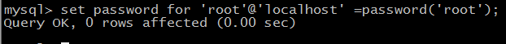
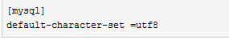
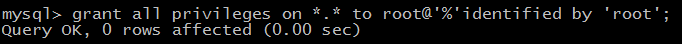

# centos下安装mysql

1、`yum install mariadb-server mariadb`

2、启动数据库 `systemctl start mariadb`

3、初次安装mysql，root账户没有密码   `mysql -u root`

4、设置密码 `set password for 'root'@'localhost' =password('root');`

5、配置 `/etc/my.cnf` 文件

最后加上编码配置

	[mysql]
	default-character-set=utf8

6、把在所有数据库的所有表的所有权限赋值给位于所有IP地址的root用户。

`grant all privileges on *.* to root@'%' identified by 'root';`

7、[删除mysql](http://www.jb51.net/article/97516.htm)
