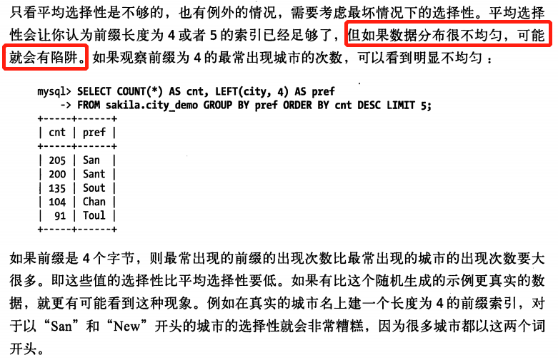
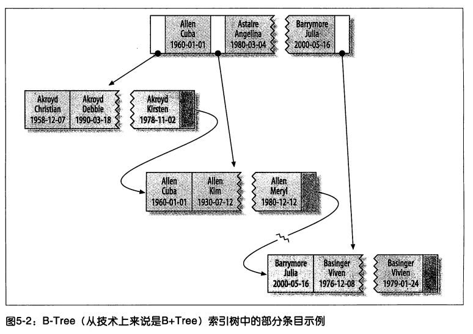

# 索引02

[TOC]

**高性能MySql第三版**

## 1、单独的列

即**索引列不能是表达式的一部分，也不能是函数的参数**。

应当简化where条件，将索引列单独放在比较符号的一侧。

```sql
MariaDB [mysql]> select * from webtest;                     
+----+--------------+---------------------------+-------+---------+
| id | name         | url                       | alexa | country |
+----+--------------+---------------------------+-------+---------+
|  1 | Google       | https://www.google.cm/    |     1 | USA     |
|  2 | 淘宝         | https://www.taobao.com/   |    13 | CN      |
|  3 | 菜鸟教程     | http://www.runoob.com/    |  4689 | CN      |
|  4 | 微博         | http://weibo.com/         |    20 | CN      |
|  5 | Facebook     | https://www.facebook.com/ |     3 | USA     |
+----+--------------+---------------------------+-------+---------+
5 rows in set (0.00 sec)

-- alexa列添加索引
MariaDB [mysql]> alter table webtest add index alexa_index(alexa);       
Query OK, 0 rows affected (0.03 sec)
Records: 0  Duplicates: 0  Warnings: 0

MariaDB [mysql]> desc webtest;
+---------+--------------+------+-----+---------+-------+
| Field   | Type         | Null | Key | Default | Extra |
+---------+--------------+------+-----+---------+-------+
| id      | int(11)      | NO   | PRI | 0       |       |
| name    | char(20)     | NO   |     |         |       |
| url     | varchar(255) | NO   |     |         |       |
| alexa   | int(11)      | NO   | MUL | 0       |       |
| country | char(10)     | NO   |     |         |       |
+---------+--------------+------+-----+---------+-------+

-- 查询方式1：索引字段表达式的一部分
MariaDB [mysql]> explain select * from webtest where alexa+1=3;
+------+-------------+---------+------+---------------+------+---------+------+------+-------------+
| id   | select_type | table   | type | possible_keys | key  | key_len | ref  | rows | Extra       |
+------+-------------+---------+------+---------------+------+---------+------+------+-------------+
|    1 | SIMPLE      | webtest | ALL  | NULL          | NULL | NULL    | NULL |    5 | Using where |
+------+-------------+---------+------+---------------+------+---------+------+------+-------------+
1 row in set (0.00 sec)

-- 查询方式2：索引字段作为函数参数
MariaDB [mysql]> explain select * from webtest where abs(alexa)=3;
+------+-------------+---------+------+---------------+------+---------+------+------+-------------+
| id   | select_type | table   | type | possible_keys | key  | key_len | ref  | rows | Extra       |
+------+-------------+---------+------+---------------+------+---------+------+------+-------------+
|    1 | SIMPLE      | webtest | ALL  | NULL          | NULL | NULL    | NULL |    5 | Using where |
+------+-------------+---------+------+---------------+------+---------+------+------+-------------+
1 row in set (0.00 sec)

-- 查询方式3：正常查询
MariaDB [mysql]> explain select * from webtest where alexa=3;     
+------+-------------+---------+------+---------------+-------------+---------+-------+------+-------+
| id   | select_type | table   | type | possible_keys | key         | key_len | ref   | rows | Extra |
+------+-------------+---------+------+---------------+-------------+---------+-------+------+-------+
|    1 | SIMPLE      | webtest | ref  | alexa_index   | alexa_index | 4       | const |    1 |       |
+------+-------------+---------+------+---------------+-------------+---------+-------+------+-------+
1 row in set (0.00 sec)
```

	可以看出：

		查询方式1和方式2的 type 字段均为 ALL，即全表查询。
		方式3为 ref，即访问索引，返回某个值的数据。

## 2、前缀索引和索引选择性

### 2.1、选择前缀长度

**索引的选择性**是：

	不重复的索引值（也称为基数）和数据表的总记录数的比值（#T），范围从1/#T到1之间。

	索引的选择性越高则查询效率越高，因为选择性高的索引可以让 mysql 在查找时过滤掉更多的行。

	唯一索引的选择性是1，这是最好的索引选择性，性能也是最好的。

索引很长的列出现的问题是：让索引变得大且慢。

解决方法：

- 通过模拟哈希索引

- 索引的开始的部分字符【前缀索引】。可以节约索引空间，提高索引效率，但会降低索引的选择性。

一般情况下某个列的前缀索引的选择性也是足够高的，足以满足查询的性能。

**对于 BLOB、TEXT 或很长的 VARCHAR 类型的列，必须使用前缀索引**，因为 mysql 不允许索引这些列的完整长度。

选择诀窍是：前缀应该**足够长**，以使得前缀索引的选择性接近与索引整个列（换句话说，前缀的“基数”应该接近于完整列的“基数”），同时**又不能太长**（以便节约空间）。

为了决定前缀合适的长度，有以下两种方法：

先准备数据，生成示例表：

```sql
MariaDB [sakila]> create table sakila.city_demo(city varchar(50) not null);        
Query OK, 0 rows affected (0.00 sec)

MariaDB [sakila]> insert into sakila.city_demo(city) select city from sakila.city; 
Query OK, 600 rows affected (0.01 sec)
Records: 600  Duplicates: 0  Warnings: 0

MariaDB [sakila]> insert into sakila.city_demo(city) select city from sakila.city_demo; 
Query OK, 600 rows affected (0.01 sec)
Records: 600  Duplicates: 0  Warnings: 0

MariaDB [sakila]> update sakila.city_demo set city=(select city from sakila.city order by rand() limit 1);
Query OK, 1197 rows affected (0.41 sec)
Rows matched: 1200  Changed: 1197  Warnings: 0
```

【由于生成表时，用了rand()函数，所以，结果可能不一样】

**方法1：计算完整列的选择性**

```sql
MariaDB [sakila]> select count(distinct city)/count(*) from sakila.city_demo;                                                       
+-------------------------------+
| count(distinct city)/count(*) |
+-------------------------------+
|                        0.4392 |
+-------------------------------+
1 row in set (0.00 sec)

MariaDB [sakila]> select count(distinct left(city,3))/count(*) as sel3, count(distinct left(city,4))/count(*) as sel4, count(distinct left(city,5))/count(*) as sel5,  count(distinct left(city,6))/count(*) as sel6,  count(distinct left(city,7))/count(*) as sel7 from sakila.city_demo;
+--------+--------+--------+--------+--------+
| sel3   | sel4   | sel5   | sel6   | sel7   |
+--------+--------+--------+--------+--------+
| 0.3500 | 0.4167 | 0.4317 | 0.4375 | 0.4383 |
+--------+--------+--------+--------+--------+
1 row in set (0.00 sec)
```

计算结果越接近完整列的选择性越好。此例中，越接近0.4392越好。

计算结果显示当前缀超6个时，变化相比就不大了。所以可以选择6。【要看具体情况】

这种方法需要考虑**最坏情况下的选择性**，因为会出现数据分布不均的情况。



**方法2：找到最常见的值的列表，然后和最常见的前缀列表进行比较**

```sql
-- 最常见的城市列表
MariaDB [sakila]> select count(*) as cnt,city from  sakila.city_demo group by city order by cnt desc limit 10;
+-----+--------------+
| cnt | city         |
+-----+--------------+
|   7 | London       |
|   7 | Masqat       |
|   6 | Sogamoso     |
|   6 | Ikerre       |
|   6 | Jos Azueta   |
|   6 | Dhaka        |
|   6 | Tarlac       |
|   6 | Soshanguve   |
|   6 | Phnom Penh   |
|   5 | Kakamigahara |
+-----+--------------+
10 rows in set (0.01 sec)

-- 最频繁出现的城市前缀，长度为3时
MariaDB [sakila]> select count(*) as cnt,left(city,3) as pref from sakila.city_demo group by pref order by cnt desc limit 10;
+-----+------+
| cnt | pref |
+-----+------+
|  20 | San  |
|  12 | al-  |
|  11 | Cha  |
|  10 | Kan  |
|  10 | Tar  |
|  10 | Man  |
|  10 | Sou  |
|   9 | Hal  |
|   9 | Tan  |
|   9 | Coa  |
+-----+------+
10 rows in set (0.00 sec)

-- 最频繁出现的城市前缀，长度为6时
MariaDB [sakila]> select count(*) as cnt,left(city,6) as pref from sakila.city_demo group by pref order by cnt desc limit 10; 
+-----+--------+
| cnt | pref   |
+-----+--------+
|   7 | London |
|   7 | Masqat |
|   6 | Phnom  |
|   6 | Sogamo |
|   6 | Dhaka  |
|   6 | Tarlac |
|   6 | Jos Az |
|   6 | Soshan |
|   6 | Ikerre |
|   5 | Cabuya |
+-----+--------+
10 rows in set (0.00 sec)
```

由上可知：**每个前缀都比原来的城市出现次数更多。所以需要增加前缀长度，直到前缀的选择性接近完整列的选择性。【如长度为6时】**


### 2.2、创建前缀索引

```sql
MariaDB [sakila]> alter table sakila.city_demo add key (city(6));
Query OK, 0 rows affected (0.04 sec)
Records: 0  Duplicates: 0  Warnings: 0

MariaDB [sakila]> explain select * from sakila.city_demo where city='Salamanca';
+------+-------------+-----------+------+---------------+------+---------+-------+------+-------------+
| id   | select_type | table     | type | possible_keys | key  | key_len | ref   | rows | Extra       |
+------+-------------+-----------+------+---------------+------+---------+-------+------+-------------+
|    1 | SIMPLE      | city_demo | ref  | city          | city | 8       | const |    4 | Using where |
+------+-------------+-----------+------+---------------+------+---------+-------+------+-------------+
1 row in set (0.00 sec)
```

### 2.3、优缺点

优点：

	使索引更小，更快。

缺点：

	mysql无法使用前缀索引做ORDER BY和GROUP BY，也无法使用前缀索引做覆盖扫描。【???】

### 2.4 适用场景

- 针对很长的十六进制唯一ID使用前缀索引

- 后缀索引也有用途（例如，找到某个域名的所有电子邮件地址）。mysql原生不支持反向索引，但是可以把字符串反转后存储，并基于此建立前缀索引。

## 3、多列索引

对多列索引，一个常见的错误就是，为每个列创建独立的单列索引，或者按照错误的顺序创建多列索引。

在多个列上建立独立的索引大部分情况下并不能提高mysql的查询性能。

但是，mysql5.0和更新版引入了一种叫"索引合并"(index_merge)的策略，一定程度上可以使用表上的多个单列索引来定位指定的的行。

表 film_actor 在字段 actor_id 和 film_id 各有一个单列索引。

```sql
MariaDB [sakila]> explain select film_id,actor_id from sakila.film_actor where actor_id=1 or film_id=1;
+------+-------------+------------+-------------+------------------------+------------------------+---------+------+------+--------------------------------------------------+
| id   | select_type | table      | type        | possible_keys          | key                    | key_len | ref  | rows | Extra                                            |
+------+-------------+------------+-------------+------------------------+------------------------+---------+------+------+--------------------------------------------------+
|    1 | SIMPLE      | film_actor | index_merge | PRIMARY,idx_fk_film_id | PRIMARY,idx_fk_film_id | 2,2     | NULL |   29 | Using union(PRIMARY,idx_fk_film_id); Using where |
+------+-------------+------------+-------------+------------------------+------------------------+---------+------+------+--------------------------------------------------+
1 row in set (0.00 sec)
```

mysql 会使用这类技术优化复杂查询，所以实际上更多时候说明了表上的索引建的很糟糕：

- 当出现服务器对多个索引做相交操作时（多个AND），通常意味着需要一个包含相关列的多列索引，而不是多个独立的单列索引;

- 当服务器需要对多个索引做联合操作时（多个OR），通常需要耗费大量的CPU和内存在算法的缓存、排序和合并上。

- 优化器不会把这些计算到"查询成本"中，优化器只关心随机页面读取，使得查询的成本被低估,导致该执行计划还不如走全表扫描。这不仅会消耗更多的CPU和内存资源，还会影响查询的并发性。但如果单独运行这样的查询则会忽略对并发性的影响。所以该不如将查询改成union的方式

```sql
MariaDB [sakila]> select film_id,actor_id from sakila.film_actor where actor_id=1 union all select film_id,actor_id from sakila.film_actor where film_id=1 and actor_id<>1;
```

如果在 explain 中看到索引合并，应该好好检查一下查询和表的结构，看是不是已经是最优的。

也可以通过参数 optimizer_switch 来关闭索引合并功能。

也可以使用 IGNORE INDEX 提示让优化器忽略调某些索引。

--------------------------------------------------------------------------

mysql 5.1 中引入了 optimizer_switch，控制优化器行为。有一些结果集，通过on和off控制开启和关闭优化器行为。使用有效期全局和会话两个级别。

```sql
MariaDB [sakila]> select @@optimizer_switch;
+---------------------------------------------------------------------------------------------------------------------------------------------------------------------------------------------------------------------------------------------------------------------------------------------------------------------------------------------------------------------------------------------------------------------------------------------------------------------------------------------------------------------------------------------------------------------------------------------------------------------+
| @@optimizer_switch                                                                                                                                                                                                                                                                                                                                                                                                                                                                                                                                                                                                  |
+---------------------------------------------------------------------------------------------------------------------------------------------------------------------------------------------------------------------------------------------------------------------------------------------------------------------------------------------------------------------------------------------------------------------------------------------------------------------------------------------------------------------------------------------------------------------------------------------------------------------+
| index_merge=on,index_merge_union=on,index_merge_sort_union=on,index_merge_intersection=on,index_merge_sort_intersection=off,engine_condition_pushdown=off,index_condition_pushdown=on,derived_merge=on,derived_with_keys=on,firstmatch=on,loosescan=on,materialization=on,in_to_exists=on,semijoin=on,partial_match_rowid_merge=on,partial_match_table_scan=on,subquery_cache=on,mrr=off,mrr_cost_based=off,mrr_sort_keys=off,outer_join_with_cache=on,semijoin_with_cache=on,join_cache_incremental=on,join_cache_hashed=on,join_cache_bka=on,optimize_join_buffer_size=off,table_elimination=on,extended_keys=off |
+---------------------------------------------------------------------------------------------------------------------------------------------------------------------------------------------------------------------------------------------------------------------------------------------------------------------------------------------------------------------------------------------------------------------------------------------------------------------------------------------------------------------------------------------------------------------------------------------------------------------+
1 row in set (0.00 sec)
```
type类型是 index_merge（索引合并排序）。业务需要或滥建索引，数据表上会建很多索引。针对这个查询，可以通过修改optimizer_switch来优化优化器行为：

	set global optimizer_seitch="index_merge=off 

这个方式也行会有一定风险，影响其他sql，在服务器端操作要谨慎。  

[原文链接](https://blog.csdn.net/aeolus_pu/article/details/9120771)

--------------------------------------------------------------------------

使用ignore index()，这个指令可以强制Mysql在查询时，不使用某索引。

	SELECT * FROM TABLE1 IGNORE INDEX (FIELD1, FIELD2) …

--------------------------------------------------------------------------

## 4、选择合适的索引顺序

**本节内容适用于B-TREE索引**

索引列的正确顺序要考虑如下两个因素：

- 使用该索引的查询语句
- 如何更好的满足排序和分组的需求

在一个多列的B-Tree索引中，**索引列的顺序意味着索引先按照最左列排序，其次是第二列，等等**。所以，索引可以按照升序或降序扫描，以满足精确符合顺序的 ORDER BY 、 GROUP BY 、 DISTINCT 等子句的查询需求。【结合查询的三星系统理解】



【看最后两个条目。`Allen Cuba 1960-01-01` 左边是字母顺序比 `Allen` 小的，这一侧 `last_name` 相同的情况下，比较`first_name`，依次往下。右边同理。】

### 4.1、如何选择合适的索引顺序

**将选择性最高的列放到索引最前列**【经验法则】

	适合不考虑排序和分组的场景，这时，索引只是优化了where条件的查找。

```sql
MariaDB [sakila]> select count(distinct staff_id)/count(*) from  payment;   
+-----------------------------------+
| count(distinct staff_id)/count(*) |
+-----------------------------------+
|                            0.0001 |
+-----------------------------------+
1 row in set (0.00 sec)

MariaDB [sakila]> select count(distinct customer_id)/count(*) from  payment;                      
+--------------------------------------+
| count(distinct customer_id)/count(*) |
+--------------------------------------+
|                               0.0373 |
+--------------------------------------+
1 row in set (0.01 sec)
```

customer_id 的选择性更高，所以将其作为第一列。


但，此时也要注意看**查询条件的具体值，即值的分布情况**。根据运行频率最高的查询调整索引列的顺序，让这种情况下索引的选择性更高。类似前面如何选择前缀长度。【选择一些值来尝试】

```sql
MariaDB [sakila]> select sum(staff_id=2),sum(customer_id=584) from  payment;
+-----------------+----------------------+
| sum(staff_id=2) | sum(customer_id=584) |
+-----------------+----------------------+
|            7992 |                   30 |
+-----------------+----------------------+
1 row in set (0.02 sec)
```
```sql
-- staff_id 选择性
MariaDB [sakila]> select count(distinct staff_id)/count(*) from  payment where staff_id=2;                                          
+-----------------------------------+
| count(distinct staff_id)/count(*) |
+-----------------------------------+
|                            0.0001 |
+-----------------------------------+
1 row in set (0.00 sec)

-- customer_id 选择性
MariaDB [sakila]> select count(distinct customer_id)/count(*) from  payment where customer_id=584;
+--------------------------------------+
| count(distinct customer_id)/count(*) |
+--------------------------------------+
|                               0.0333 |
+--------------------------------------+
1 row in set (0.00 sec)
```

根据前面的经验法则，应该将索引列 customer_id 放到最前面，因为对应条件值的 customer_id 数量更小。【数量小表示查询的快】

这种方式下【查询条件的具体值的方式】，**查询的结果非常依赖选定的具体值**。【因为你是按某个具体值调整的顺序，可能适用这个值，但不一定适用其他值】

按上述的示例做，会对其他条件值的查询不公平，服务器整体性能可能变糟，或其他某些查询的运行不如预期。

最后，尽管关于选择性和基数的经验法则值得去研究和分析，但**一定不要忘了WHERE子句中的排序、分组和范围条件等其他因素，这些因素可能对于查询的性能造成非常大的影响。**

## 5、聚簇索引