# 尚硅谷kettle教程目录及重点内容

[TOC]

## 1 Kettle 概述

### 1.1 ETL 简介

### 1.2 Kettle 简介

#### 1.2.1 Kettle 是什么

#### 1.2.2 Kettle 的两种设计

#### 1.2.3 Kettle 的核心组件

#### 1.2.4 Kettle 特点

## 2、Kettle 安装部署

### 2.1 Kettle 下载

#### 2.1.1 下载地址

#### 2.1.2 Kettle 目录说明

#### 2.1.3 Kettle 文件说明

### 2.2 Kettle 安装部署

#### 2.2.1 概述

#### 2.2.2 安装

### 2.3 Kettle 界面简介

#### 2.3.1 首页

#### 2.3.2 转换

#### 2.3.3 作业

### 2.4 Kettle 转换初次体验

csv -->  excel

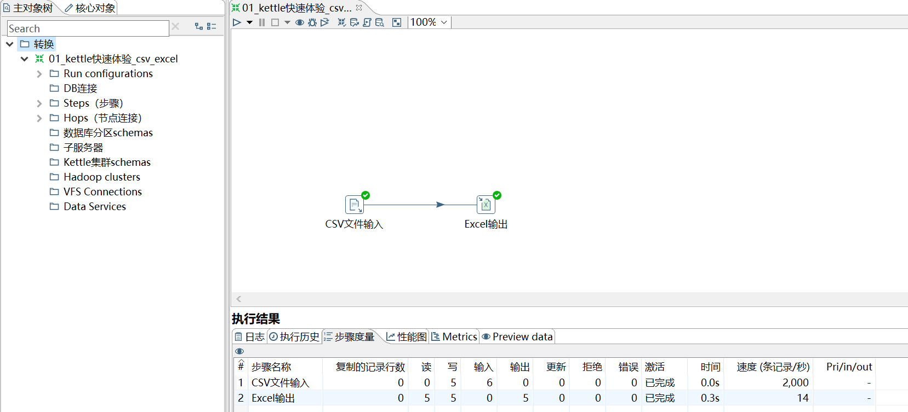

通过下图中的"字段"可以使输出 Excel 中的值是'0'类型，而不是'0.0'类型。

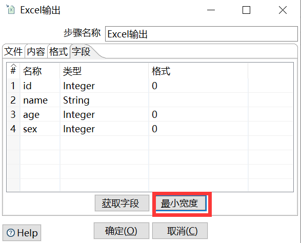

【在上图中的"文件"、"内容"、"格式"和"字段"四个 tab 页中可以设置输出 Excel 表的具体属性。如，"格式"中设置输出字体大小和类型。】

下图就是没有进行设置，产生的效果：

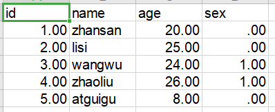

### 2.5 Kettle 核心概念

#### 2.5.1 可视化编程

#### 2.5.2 转换

转换(transaformation)负责数据的输入、转换、校验和输出等工作。

Kettle 中使用 转换 完成数据 ETL 全部工作。

转换由多个步骤 (Step) 组成，如文本文件输入，过滤输出行，执行 SQL 脚本等。

各个步骤使用跳 (Hop) 来链接。 跳定义了一个数据流通道，即数据由一个步骤流 (跳) 向下一个步骤。

在 Kettle 中数据的最小单位是数据行（row），数据流中流动其实是缓存的行集 (RowSet) 。

#### 2.5.3 步骤（Step）

步骤（控件）是转换里的基本的组成部分，快速入门的案例中就存在两个步骤，“CSV文件输入”和“Excel 输出”。

一个步骤有如下几个关键特性：

- ①步骤需要有一个名字，这个名字在同一个转换范围内唯一。
- ②每个步骤都会读、写数据行(唯一例外是“生成记录”步骤，该步骤只写数据)。
- ③步骤将数据写到与之相连的一个或多个输出跳（hop），再传送到跳的另一端的步骤。
- ④大多数的步骤都可以有多个输出跳。一个步骤的数据发送可以被设置为分发和复制，

**分发是目标步骤轮流接收记录，复制是所有的记录被同时发送到所有的目标步骤**

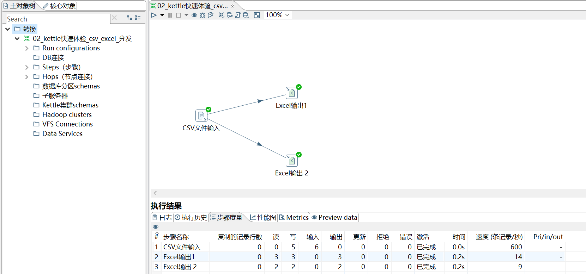

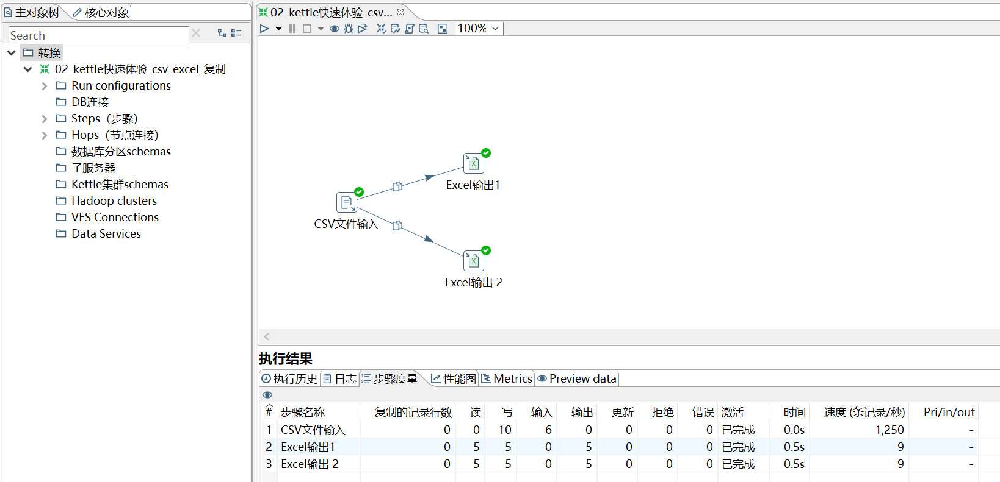

#### 2.5.4 跳（Hop）

跳就是步骤之间带箭头的连线，跳定义了步骤之间的数据通路。

**跳实际上是两个步骤之间的被称之为行集的数据行缓存**，

行集的大小可以在转换的设置里定义。当行集满了，向行集写数据的步骤将停止写入，直到行集里又有了空间。当行集空了，从行集读取数据的步骤停止读取，直到行集里又有可读的数据行。

#### 2.5.5 元数据

#### 2.5.6 数据类型

#### 2.5.7 并行

跳的这种基于行集缓存的规则允许每个步骤都是由一个独立的线程运行，这样并发程度最高。

这一规则也允许数据以最小消耗内存的数据流的方式来处理。

在数据仓库里，我们经常要处理大量数据，所以这种高并发低消耗的方式也是 ETL 工具的核心需求。

对于 kettle 的转换，不能定义一个执行顺序，因为所有步骤都以并发方式执行：当转换启动后，所有步骤都同时启动，从它们的输入跳中读取数据，并把处理过的数据写到输出跳，直到输入跳里不再有数据，就中止步骤的运行。当所有的步骤都中止了，整个转换就中止了。

**如果你想要一个任务沿着指定的顺序执行，那么就要使用下面所讲的“作业”！**

#### 2.5.8 作业

作业 (Job)，负责定义一个完成整个工作流的控制，比如将转换的结果发送邮件给相关人员。

因为转换（transformation）以并行方式执行，所以必须存在一个串行的调度工具来执行转换，这就是 Kettle 中的作业。

## Kettle 转换

### 3.1 Kettle 输入控件

输入是 ETL 里面的 E（Extract），主要做数据提取的工作。

#### 3.1.1 CSV 文件输入

需求场景

参数解释

#### 3.1.2 文本文件输入

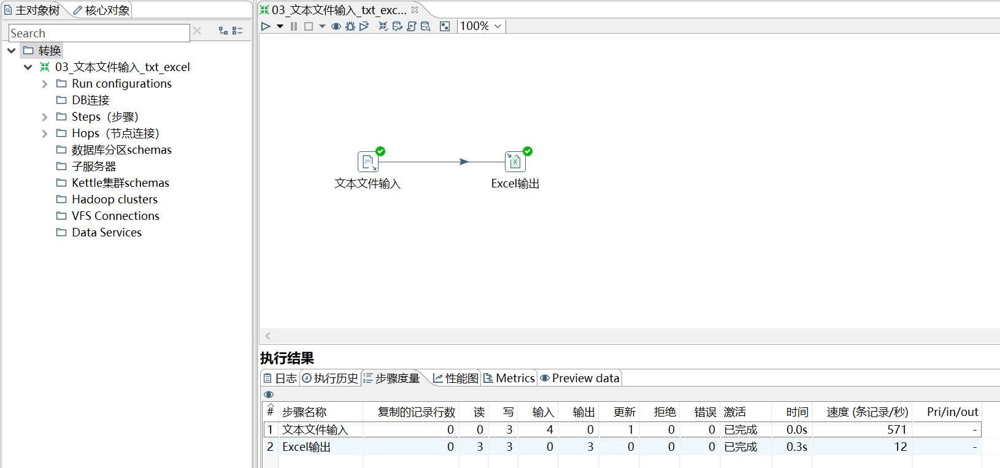

要注意：分隔符

#### 3.1.3 Excel 输入

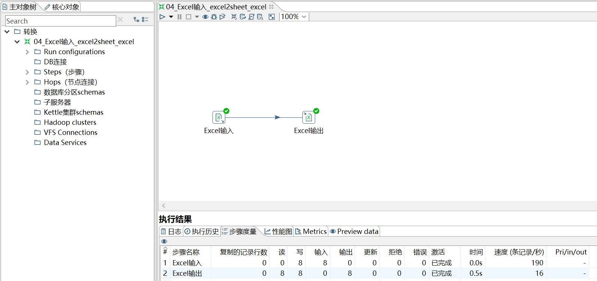

要注意：表格类型、输入字段的属性

#### 3.1.4 XML 输入

要注意：xpath匹配规则

#### 3.1.5 JSON 输入

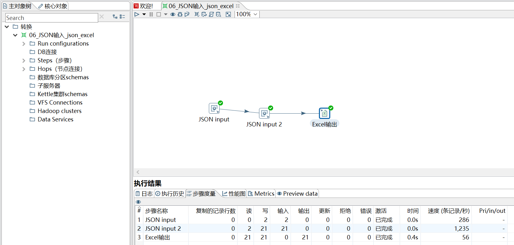

要注意：[jsonpath匹配规则](https://blog.csdn.net/lwg_1540652358/article/details/84111339)

#### 3.1.6 表输入

见 [kettle初体验：windows环境下安装和使用.md](https://github.com/ZGG2016/knowledgesystem/blob/master/23%20DataWarehouse/Kettle/kettle%E5%88%9D%E4%BD%93%E9%AA%8C%EF%BC%9Awindows%E7%8E%AF%E5%A2%83%E4%B8%8B%E5%AE%89%E8%A3%85%E5%92%8C%E4%BD%BF%E7%94%A8.md)

### 3.2 Kettle 输出控件

#### 3.2.1 Excel 输出

Kettle 中自带了两个 Excel 输出，一个 Excel 输出，另一个是 Microsoft Excel 输出。

	Excel 输出只能输出 xls 文件（适合 Excel2003）;

	Microsoft Excel 输出可以输出 xls 和 xlsx 文件（适合 Excel2007 及以后）

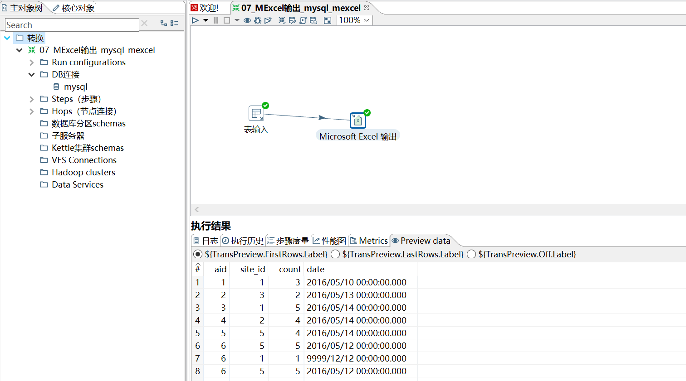

#### 3.2.2 文本文件输出

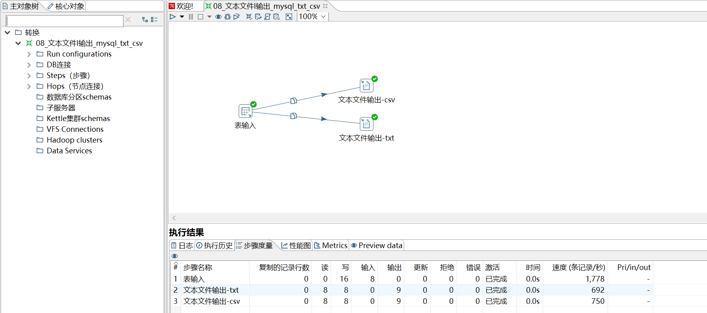

要注意：分隔符

#### 3.2.3 SQL 文件输出

SQL 文件输出一般跟表输入做连接，然后将数据库表的表结构和数据以 sql 文件的形式导出，然后做数据库备份的这么一个工作。

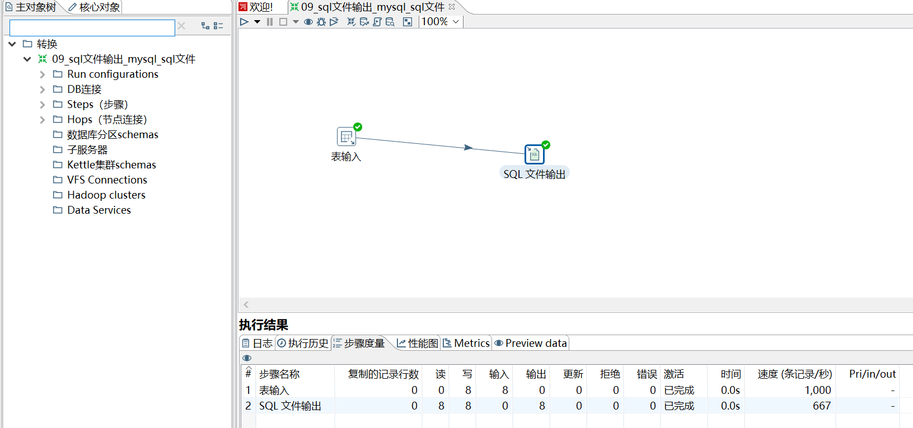

#### 3.2.4 表输出

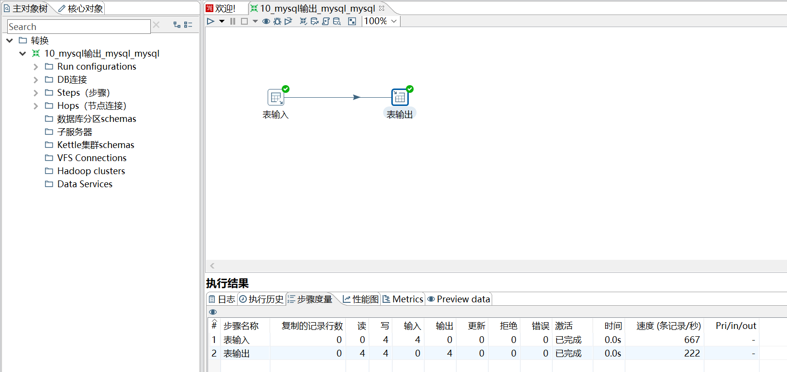

#### 3.2.5 更新&插入/更新

将数据库已经存在的记录与数据流里面的记录进行对比的控件。企业级 ETL 经常会用到这两个控件来进行数据库更新的操作。

两者区别：

- 更新是将数据库表中的数据和数据流中的数据做对比，如果不同就更新，如果数据流中的数据比数据库表中的数据多，那么就报错。

- 插入/更新的功能和更新一样，只不过优化了数据不存在就插入的功能，因此企业里更多的也是使用插入/更新

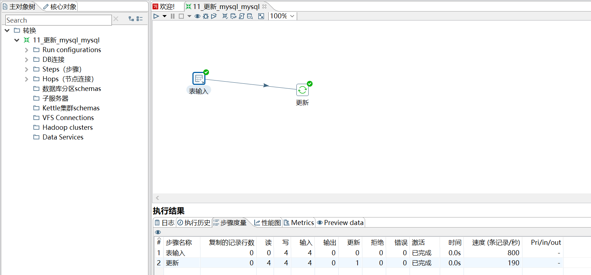

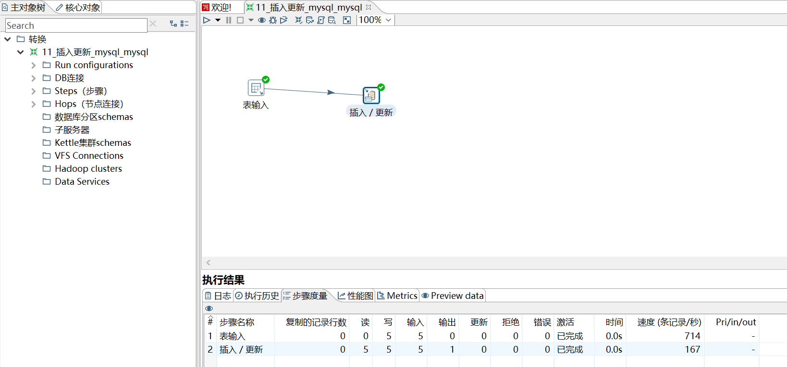

注意：哪个是表中字段，哪个是流中字段

#### 3.2.6 删除

删除控件可以删除数据库表中指定条件的数据，企业里一般用此控件做数据库表数据删除或者跟另外一个表数据做对比，然后进行去重的操作。

（按照 apps_bk 表对 apps_bk2 表数据进行去重）

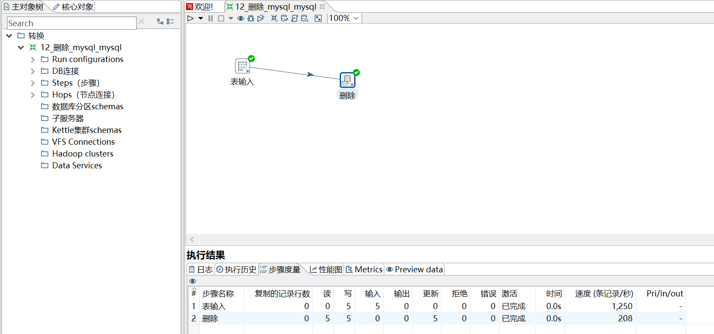

### 3.3 Kettle 转换控件

#### 3.3.1 Concat fields

#### 3.3.2 值映射

#### 3.3.3 增加常量&增加序列

#### 3.3.4 字段选择

#### 3.3.5 计算器

#### 3.3.6 字符串剪切&替换&操作

#### 3.3.7 排序记录&去除重复记录

去除重复记录是去除数据流里面相同的数据行。

但是此控件**使用之前要求必须先对数据进行排序**，对数据排序用的控件是排序记录，排序记录控件可以按照指定字段的升序或者降序对数据流进行排序。因此排序记录+去除重复记录控件常常配合组队使用。

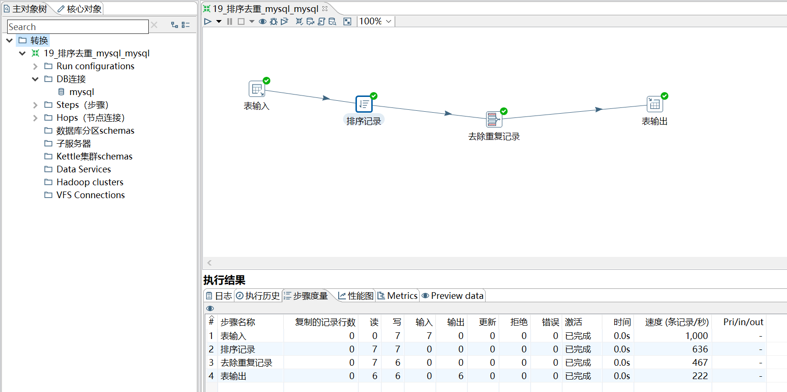

#### 3.3.8 唯一行（哈希值）

删除数据流重复的行。此控件的效果和（排序记录+去除重复记录）的效果是一样的，但是实现的原理不同。

- 排序记录+去除重复记录：对比的是每两行之间的数据；

- 唯一行（哈希值）：给每一行的数据建立哈希值，通过哈希值来比较数据是否重复

因此唯一行（哈希值）去重效率比较高，也更建议大家使用。

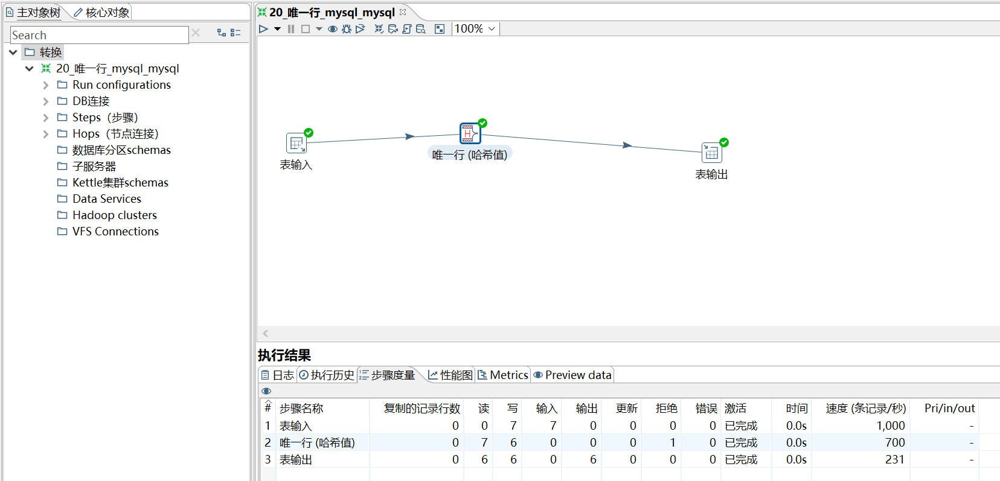

#### 3.3.9 拆分字段

把字段按照分隔符拆分成两个或多个字段。需要注意的是，字段拆分以后，原字段就会从数据流中消失。

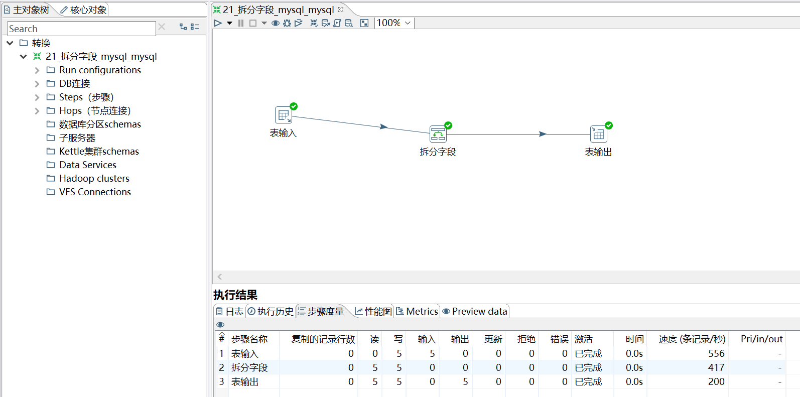

#### 3.3.10 列拆分为多行

把指定字段按指定分隔符进行拆分为多行，然后其他字段直接复制。

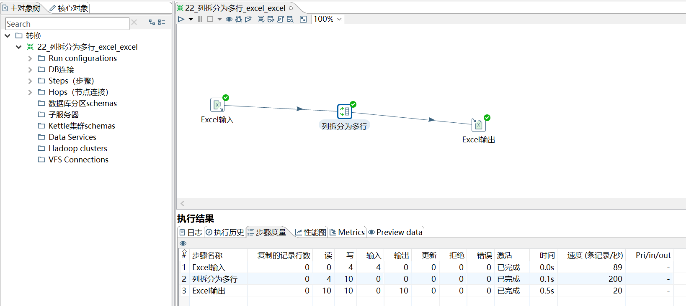

#### 3.3.11 行扁平化

把同一组的多行数据合并成为一行，可以理解为列拆分为多行的逆向操作。

但是需要注意的是行扁平化控件使用有两个条件：

- 使用之前需要对数据进行排序
- 每个分组的数据条数要保证一致，否则数据会有错乱

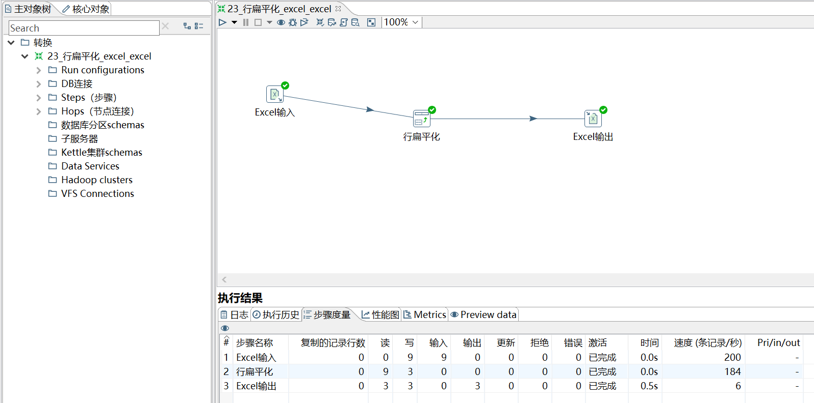

#### 3.3.12 列转行

多列转一行。

如果数据一列有相同的值，按照指定的字段，将其中一列的字段内容变成不同的列，然后把多行数据转换为一行数据的过程。

注意：列转行之前数据流必须按照分组字段进行排序，否则数据会错乱！

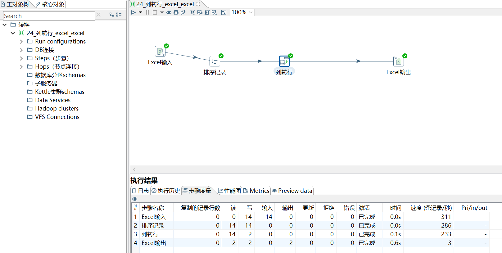

注意：转换前后的字段名称

#### 3.3.13 行转列

一行转多列。

把数据字段的字段名转换为一列，把数据行变为数据列。

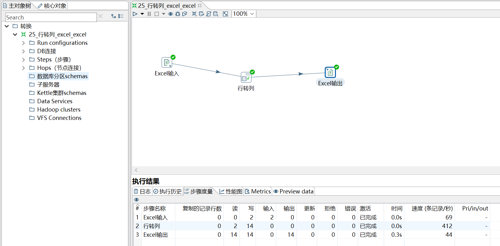

注意：转换前后的字段名称

### 3.4 Kettle 应用控件

#### 3.4.1 替换 NULL 值

#### 3.4.2 写日志

### 3.5 Kettle 流程控件

#### 3.5.1 Switch/case

#### 3.5.2 过滤记录

#### 3.5.3 空操作

#### 3.5.4 中止

### 3.6 Kettle 查询控件

#### 3.6.1 数据库查询

#### 3.6.2 流查询

### 3.7 Kettle 连接控件

#### 3.7.1 合并记录

#### 3.7.2 记录集连接

### 3.8 Kettle 统计控件

#### 3.8.1 分组

### 3.9 Kettle 映射控件

#### 3.9.1 映射

### 3.10 Kettle 脚本控件

#### 3.10.1 执行 SQL 脚本

## 4 Kettle 作业

### 4.1 作业简介

#### 4.1.1 作业项

#### 4.1.2 作业跳

### 4.2 作业初体验

## 5 Kettle 使用案例

### 5.1 转换案例

把 stu1 的数据按 id 同步到 stu2，stu2 有相同 id 则更新数据。

### 5.2 作业案例

使用作业执行上述转换，并且额外在表 stu2 中添加一条数据，整个作业运行成功的话发邮件提醒。

### 5.3 Hive-HDFS 案例

### 5.4 HDFS-Hbase 案例

## 6 Kettle 资源库

### 6.1 数据库资源库 

### 6.2 文件资源库

## 7、Kettle 调优