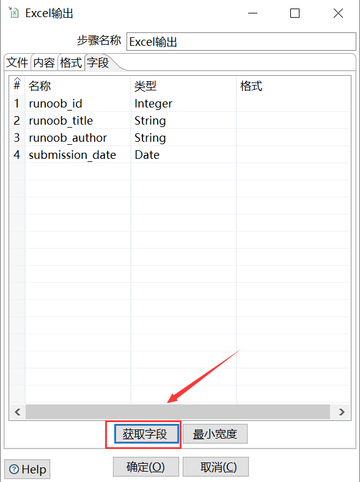
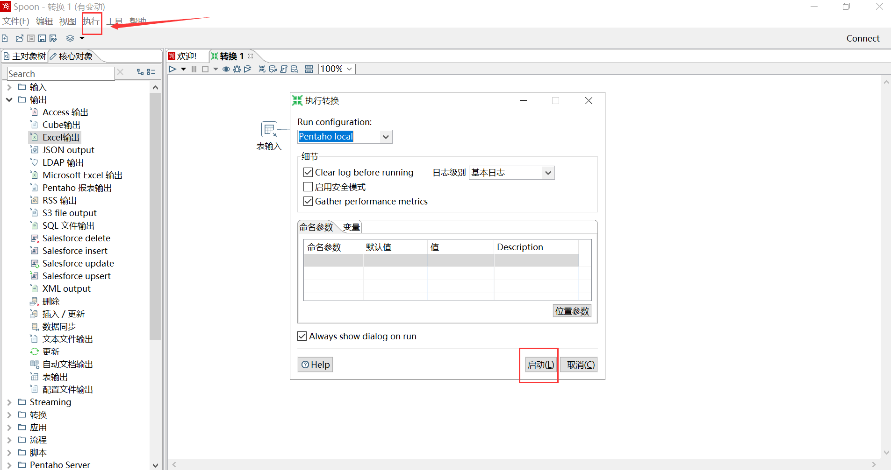
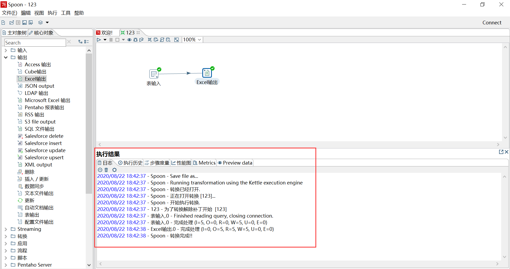

# kettle初体验：windows环境下安装和使用

## 1、安装jdk

	C:\Users\zgg>java -version
	java version "1.8.0_161"
	Java(TM) SE Runtime Environment (build 1.8.0_161-b12)
	Java HotSpot(TM) 64-Bit Server VM (build 25.161-b12, mixed mode)

## 2、安装kettle

(1)下载、解压

[https://community.hitachivantara.com/s/article/data-integration-kettle](https://community.hitachivantara.com/s/article/data-integration-kettle)

(2)下载MySQL驱动JAR包，并复制到 lib 目录下。

要注意版本

[mysql-connector-java-5.1.49-bin.jar](https://dev.mysql.com/downloads/connector/j/5.1.html)

(3)启动kettle

包含两个kettle工具启动的脚本命令，spoon.bat和spoon.sh，其中spoon.bat适用于windows系统，通过双击.bat文件来启动图形化界面，而spoon.sh适用于Linux系统，通过在终端执行下列命令来启动图形化界面。

## 3、使用kettle

需求：从user数据库[mysql]的runoob_tbl表读取数据，写到excel.

(1)连接mysql

文件 --> 新建 --> 转换 --> 主对象树 --> DB连接 --> 新建

要注意主机名称不要错了【DESKTOP-0AHQ4FT】。

出现了如下问题：

	Unable to load authentication plugin 'caching_sha2_password'. ==> 更新MySQL驱动JAR包

	Error connecting to database: (using class org.gjt.mm.mysql.Driver) Could not create connection to database server.  ==> 主机名称写错了

	Driver class 'org.gjt.mm.mysql.Driver' could not be found, make sure the 'MySQL' driver (jar file) is installed.org.gjt.mm.mysql.Driver  ==> jar包没复制到lib目录下

(2)建立输入输出

在 `核心对象` tab下，分别设置。

[参考](http://dblab.xmu.edu.cn/blog/kettle/)