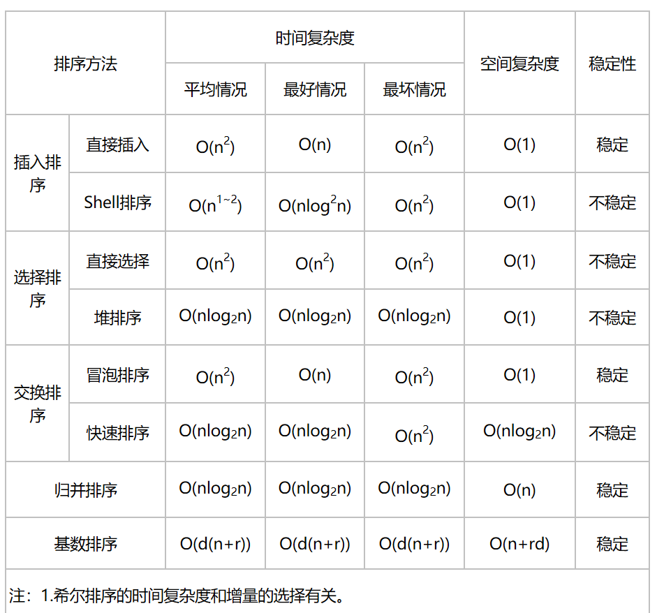

# Java 面试题

## java中方法重写与重载的区别

方法重写(Override)：

	发生在子类继承父类的情况下。
	在子类中，出现和父类中一模一样的方法声明的现象。完全相同的返回值类型、方法名、参数个数以及参数类型。

	当父类中方法的访问权限修饰符为private或final时，在子类是不能被重写的。


方法重载(Overload)：

	发生在同一个类中。
	出现的方法名相同，参数列表不同的现象。（参数列表不同指的是参数个数、参数类型或者参数的顺序不同。）
	方法重载能改变返回值类型，因为它和返回值类型无关。

## 列出常见的运行异常


编译时异常和运行时异常区别：

	编译时异常
		Java程序必须显示处理，否则程序就会发生错误，无法通过编译（编辑器中显示的错误）
	运行时异常
		可以编译通过、但在运行出现。代码不够严谨，需要修正代码的

RuntimeException:

	索引越界异常 IndexOutOfBoundsException
	当出现异常的运算条件(除数为0) ArithmeticException 
	空指针异常 NullPointerException
	类型转换异常 ClassCastException
	非法参数异常 IllegalArgumentException
	数组下标越界 ArrayIndexOutOfBoundsException 

## float f = 4.2,书写是否正确

错误，double占用8个字节的存储空间，float占用4个字节,double转float截取，可以会损失精度。

	浮点数默认是double，要么 float f = 4.2f; 要么 double f = 4.2;

	//长整型用L、l标记;浮点数单精度用F、f标记
	int i = 100000000000000; //错误，超出了int的范围
	long i = 100000000000000L; //正确
	long i = 100; //正确
	long i = 100L; //正确。最好加L

## 用过哪些java设计模式，写线程安全的单例模式

	•创建型模式（5种）：工厂方法模式，抽象工厂模式，单例模式，建造者模式，原型模式。
	•结构型模式（7种）：适配器模式，装饰器模式，代理模式，外观模式，桥接模式，组合模式，
						享元模式。
	•行为型模式（11种）：策略模式、模板方法模式、观察者模式、迭代子模式、责任链模式、
						命令模式、备忘录模式、状态模式、访问者模式、中介者模式、解释器模式。

单例设计模式：确保类在内存中只有一个对象，该实例必须自动创建，并且对外提供。

```java
// 饿汉式:类一加载就创建对象
public class Student{
	private student{}

	private static Student s = new Student();

	public static Student getStudent(){
		return s;
	}

}
```

```java
// 懒汉式:用的时候再创建对象
public class Student{
	private student{}

	private static Student s = null;

	public synchronized static Student getStudent(){

		if (s == null){
			return new Student();
		}
		return s;
		
	}

}
```

简单工厂模式：定义一个具体的工厂类负责创建一些类的实例。

```java
public class AnimalFactory {

	private AnimalFactory() {}  // 私有

	public static Animal createAnimal(String type) {  // 静态
		if ("dog".equals(type)) {
			return new Dog();
		} else if ("cat".equals(type)) {
			return new Cat();
		} else {
			return null;
		}
	}
}

```

工厂方法模式：抽象工厂类负责定义创建对象的接口，具体对象的创建工作由继承抽象工厂的具体类实现。

```java
public interface Factory {
	public abstract Animal createAnimal();
}

public class DogFactory implements Factory {

	@Override
	public Animal createAnimal() {
		return new Dog();
	}

}
```

模版方法模式:定义一个算法的骨架，而将具体的算法延迟到子类中来实现。

装饰模式:使用被装饰类的一个子类的实例，在客户端将这个子类的实例交给装饰类。是继承的替代方案。

## java 多线程

### run()和start()的区别

都是 Thread 类中的方法。

run()是子类在继承 Thread 类时需要重写，封装了要被线程执行的代码，直接调用是普通方法。
[Thread 类的run()方法是 Thread 类实现 Runable 接口重写的方法]

start()是用来启动了线程，然后再由jvm去调用该线程的run()方法。

### 线程的生命周期


### 为什么wait(),notify(),notifyAll()等方法都定义在Object类中

Object类下：

	wait()：在其他线程调用此对象的 notify() 方法或 notifyAll() 方法前，导致当前线程等待
	notify()：唤醒在此对象监视器上等待的单个线程。
	notifyAll()：唤醒在此对象监视器上等待的所有线程。线程通过调用其中一个wait方法，在对象的监视器上等待。 


 因为这些方法的调用是依赖于锁对象的，而同步代码块的锁对象是任意对象。而Object类是所有类的基类，所以，定义在这里面。

### sleep()和wait()方法的区别

sleep() 是Thread类中的方法。作用是在指定的毫秒数内让当前正在执行的线程休眠（暂停执行），该线程不丢失任何监视器的所属权(不释放锁)。 必须指时间。

wait() 是Object类中的方法，作用是使当前线程等待，直到其他线程调用此对象的 notify() 方法或 notifyAll() 方法。可以不指定等待时间(毫秒)，也可以指定等待时间;释放锁。

### 同步有几种方式，分别是什么?

两种。

(1)同步代码块：把同步关键字synchronized加在代码块上。锁对象是任意对象。

(2)同步方法：把同步关键字synchronized加在方法上。锁对象是this。

[锁对象Lock]

### 多线程有几种实现方案，分别是哪几种?

两种。

(1)继承Thread类

```java
public class MyThread extends Thread{
	
	public void run(){
	
		for(int i=0;i<200;i++){
			System.out.println(i);
		}
	}
}

public class MyThreadDemo{
	public static void main(String[] Args){
		// 创建两个线程对象
		MyThread th1 = new MyThread();
		MyThread th2 = new MyThread();

		th1.start();
		th1.start();
	}
}
```

(2)实现Runnable接口

```java
public class MyRunnable implements Runnable {

	@Override
	public void run() {
		for (int x = 0; x < 100; x++) {
			System.out.println(Thread.currentThread().getName() + ":" + x);
		}
	}

}

public class MyRunnableDemo {
	public static void main(String[] args) {
		// 创建MyRunnable类的对象
		MyRunnable my = new MyRunnable();

		Thread t1 = new Thread(my, "林青霞");
		Thread t2 = new Thread(my, "刘意");

		t1.start();
		t2.start();
	}
}
```

(3)扩展一种：实现Callable接口。这个得和线程池结合。

```java
import java.util.concurrent.Callable;

//Callable:是带泛型的接口。
//这里指定的泛型其实是call()方法的返回值类型。
public class MyCallable implements Callable {

	@Override
	public Object call() throws Exception {
		for (int x = 0; x < 100; x++) {
			System.out.println(Thread.currentThread().getName() + ":" + x);
		}
		return null;
	}
}

public class CallableDemo {
	public static void main(String[] args) {
		//创建线程池对象
		ExecutorService pool = Executors.newFixedThreadPool(2);
		
		//可以执行Runnable对象或者Callable对象代表的线程
		pool.submit(new MyCallable());
		pool.submit(new MyCallable());
		
		//结束
		pool.shutdown();
	}
}
```

### 创建线程的两种方式以及区别

(1)继承Thread类：

- 因为已经继承Thread类，所以不能继承其他父类。

- 若要两个线程之间共享变量时，需要在声明为static变量。

- 代码简单，直接通过Thread的构造方法创建线程，且访问当前线程时，直接调用this.即可获得当前线程。

(2)实现Runnable接口：

- 线程只是实现了Runnable接口，还可以继承其他类和实现其他接口；(避免由于Java单继承带来的局限性。)

- 可以多个线程之间共享同一个目标对象，非常适合多个线程处理同一份资源的情况；(适合多个相同程序的代码去处理同一个资源的情况，把线程同程序的代码，数据有效分离，较好的体现了面向对象的设计思想。)

- 代码稍微复杂一些，若要访问当前线程，必须使用Thread.currentThread()方法。

## hashmap、hashtable区别

1、hashmap 支持 null 键和 null 值，允许一个 null 键和多个 null 值。而 HashTable 不允许 null 键值，在遇到null时，会抛出 NullPointerException 异常。 hashmap 将 null 的 hashCode 值定为了 0。

2、 hashmap 采用的是数组+链表+红黑树结构（jdk1.8之后），而 hashtable 中采用的是数组+链表。

3、hashmap 中默认容量的大小是 16，每次扩充为原来的2倍，而 hashtable 中默认数组容量是 11，每次扩充为原来的2n+1。

4、hashmap 不是线程安全的，如果要保持线程安全可以选用 ConcurrentHashMap。而 hashtable 是线程安全的，hashtable 中的方法均采用了synchronized 关键字进行了方法同步。

5、hashmap 中出现 hash 冲突时，如果链表节点数小于8时是将新元素加入到链表的末尾，而 hashtable 中出现 hash 冲突时采用的是将新元素加入到链表的开头。

6、hashmap 先调用 hashCode 方法计算出来一个 hash 值，再将该值与右移16位后相异或，从而得到最终值。hashtable 通过计算 key 的 hashCode() 来得到的 hash 值就为最终 hash 值。

```java
static final int hash(Object key) {
        int h;
        return (key == null) ? 0 : (h = key.hashCode()) ^ (h >>> 16);
    }
```

7、hashmap 在求 hash 值对应的位置索引是 index = (n - 1) & hash。
hashtable 则是 index = (hash & 0x7FFFFFFF) % tab.length;

原文链接：

[HashMap和Hashtable的区别](https://blog.csdn.net/xuhuaabc/article/details/91475761?utm_medium=distribute.pc_relevant_t0.none-task-blog-BlogCommendFromMachineLearnPai2-1.channel_param&depth_1-utm_source=distribute.pc_relevant_t0.none-task-blog-BlogCommendFromMachineLearnPai2-1.channel_param)

[JDK1.8中HashMap与HashTable的区别](https://blog.csdn.net/zhouxcwork/article/details/81631399)

[0x7FFFFFFF 理解](https://blog.csdn.net/MChuajian/article/details/84313304?utm_medium=distribute.pc_relevant_t0.none-task-blog-BlogCommendFromMachineLearnPai2-1.channel_param&depth_1-utm_source=distribute.pc_relevant_t0.none-task-blog-BlogCommendFromMachineLearnPai2-1.channel_param)

## arraylist、linkedlist区别

ArrayList:

    底层数据结构是动态数组，可以扩容
    查询快：使用索引在数组中搜索和读取数据
    增删慢：因为这需要移动数组中插入位置之后的的所有元素
    线程不安全，效率高。
      若想在多线程下使用，应该使用Colletions类中的静态方法synchronizedList()对ArrayList进行调用即可。

LinkedList:

    底层数据结构是双向链表
    查询慢：因为需要遍历链表
    增删快：只需要改变指针指向即可
    线程不安全，效率高。

总结：

  - ArrayList是实现了基于动态数组的数据结构，LinkedList基于链表的数据结构。
  - 对于随机访问get和set，ArrayList觉得优于LinkedList，因为LinkedList要移动指针。
  - 对于新增和删除操作add和remove，LinedList比较占优势，因为ArrayList要移动数据。

Vector:

    底层数据结构是动态数组，查询快，增删慢。
    线程安全，效率低。

扩展阅读：

[ArrayList和LinkedList集合有什么区别?](https://blog.csdn.net/qq_33300026/article/details/79232006)

[Java 常见面试题之“Arraylist和Linkedlist的区别”](https://blog.csdn.net/weixin_42468526/article/details/81178698?utm_medium=distribute.pc_relevant_t0.none-task-blog-BlogCommendFromMachineLearnPai2-1.channel_param&depth_1-utm_source=distribute.pc_relevant_t0.none-task-blog-BlogCommendFromMachineLearnPai2-1.channel_param)

## 各类排序优缺点



冒泡排序

	优点:稳定
	缺点：慢，每次只能移动相邻两个数据

插入排序

	优点:对部分有序的数组十分高效，适合小规模数组。
	缺点：比较次数不一定，比较次数越少，插入点后的数据移动越多，特别是当数据总量庞大的时候

	稳定

选择排序

	运行时间和输入无关：一个有序地数组和一个无序地数组所需时间一样长。
	数据移动次数最少：每次交换都会改变两个数组元素地值，因此用了N次交换

	不稳定

快速排序

	优点：
        快速：用一个递增的索引n将数组元素和一个定值比较，这个短小的内循环提高了排序的速度。而希尔和归并排序在内循环中移动了数据，所以相比会慢。
             另一个速度优势就是比较的次数少，而这依赖于切分元素的划分。

    缺点：在切分不平衡时，程序会比较低效。比如 第一次从最小的元素切分，
          第二次从第二小的元素切分，...，每次只移除一个元素，导致一个大子数组切分多次。
    
    不稳定

归并排序

	优点：速度快：保证任意长度为 N 的数组排序所需时间和 NlogN 成正比。
	缺点：占空间：所需空间和 N 成正比，因为需要与待排序序列一样多的辅助空间

	稳定

堆排序

	不稳定，但速度快，占用空间少。

## 斐波那契数列  效率

写循环

```java
public int f(int n){
	if(n==0 || n==1) return 1;

	return f(n-1) + f(n-2);
}

public int fLoop(int n){
	int first = 1;
	int second = 1;
	int rlt = 0;
	int i = 3;
	while(i<=n){
		rlt = first+second;
		first = second;
		second = rlt;
		i++;
	}
	return rlt;
}

```