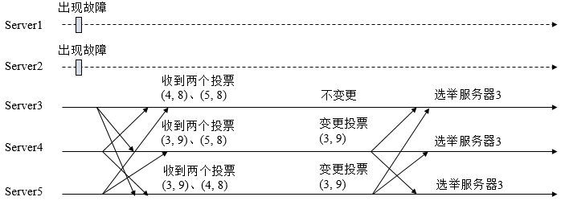

# 大数据面试题汇总--其他

[TOC]

## redis存储数据的时候需要注意什么

### 1、冷热数据分离，不要将所有数据全部都放到Redis中

Redis的数据存储全部都是在内存中的，成本昂贵。

建议根据业务只将高频热数据存储到Redis中【QPS大于5000】，

对于低频冷数据可以使用MySQL/ElasticSearch/MongoDB等基于磁盘的存储方式，不仅节省内存成本，而且数据量小在操作时速度更快、效率更高！

### 2、不同的业务数据要分开存储

不要将不相关的业务数据都放到一个Redis实例中，建议新业务申请新的单独实例。因为Redis为单线程处理，独立存储会减少不同业务相互操作的影响，提高请求响应速度；同时也避免单个实例内存数据量膨胀过大，在出现异常情况时可以更快恢复服务！

### 3、规范Key的格式

合适的key，便于查看，统计，排错。

  例如：GW:TRADE:USERID

  GW是新网关，TRADE是交易项目，USERID为业务ID。

  “平台缩写“+“:”+“项目名”+“:”+“业务含义”

  ":"-作为key分隔符，方便客户端工具作为目录分级

### 4、存储的Key一定要设置超时时间

如果应用将Redis定位为缓存Cache使用，对于存放的Key一定要设置超时时间！因为若不设置，这些Key会一直占用内存不释放，造成极大的浪费，而且随着时间的推移会导致内存占用越来越大，直到达到服务器内存上限！另外Key的超时长短要根据业务综合评估，而不是越长越好！(某些业务要求key长期有效。可以在每次写入时，都设置超时时间，让超时时间顺延。)


### 5、对于必须要存储的大文本数据一定要压缩后存储

对于大文本【超过500字节】写入到Redis时，一定要压缩后存储！大文本数据存入Redis，除了带来极大的内存占用外，在访问量高时，很容易就会将网卡流量占满，进而造成整个服务器上的所有服务不可用，并引发雪崩效应，造成各个系统瘫痪！

### 6、线上Redis禁止使用Keys正则匹配操作

Redis是单线程处理，在线上KEY数量较多时，操作效率极低【时间复杂度为O(N)】，该命令一旦执行会严重阻塞线上其它命令的正常请求，而且在高QPS情况下会直接造成Redis服务崩溃！如果有类似需求，请使用scan命令代替！

### 7、谨慎全量操作Hash、Set等集合结构

在使用HASH结构存储对象属性时，开始只有有限的十几个field，往往使用HGETALL获取所有成员，效率也很高，但是随着业务发展，会将field扩张到上百个甚至几百个，此时还使用HGETALL会出现效率急剧下降、网卡频繁打满等问题【时间复杂度O(N)】,此时建议根据业务拆分为多个Hash结构；或者如果大部分都是获取所有属性的操作,可以将所有属性序列化为一个STRING类型存储！同样在使用SMEMBERS操作SET结构类型时也是相同的情况！

### 8、根据业务场景合理使用不同的数据结构类型

目前Redis支持的数据库结构类型较多：字符串（String），哈希（Hash），列表（List），集合（Set），有序集合（Sorted Set）, Bitmap, HyperLogLog和地理空间索引（geospatial）等,需要根据业务场景选择合适的类型，常见的如：String可以用作普通的K-V、计数类；Hash可以用作对象如商品、经纪人等，包含较多属性的信息；List可以用作消息队列、粉丝/关注列表等；Set可以用于推荐；Sorted Set可以用于排行榜等！

原文链接：[Redis开发常用规范](https://blog.csdn.net/sinat_16381803/article/details/79092920)

## flume的三个组件，自定义source

source、channel、sink

- source 接收来自外部源的事件，外部源要以flume source 能识别的格式发送事件。例如，Avro 客户端或者其他 flume agent 的 sink 发送 Avro 事件，Avro flume source 接收。

- 当一个source接收到一个事件，可能会将它存到一个或多个channel中。Channel是一个活跃的存储介质，它会保存事件，直到事件被sink消费。文件channel就是一个例子，它是将事件保存到本地文件系统。

- Sink则是把channel中的事件发送到一个外部源，或者传递到下一层的source中，并将其从channel中删除。在一个agent中，Source和sink异步运行，事件分层存储。
 
自定义的消息有两种类型的 Source：PollableSource 与 EventDrivenSource。

两者的区别在于：

  PollableSource是通过线程不断去调用process方法，主动拉取消息。
  EventDrivenSource是需要触发一个调用机制，即被动等待。

```java
public class MySource extends AbstractSource implements Configurable, PollableSource {
  private String myProp;

  @Override
  public void configure(Context context) {
    String myProp = context.getString("myProp", "defaultValue");

    // Process the myProp value (e.g. validation, convert to another type, ...)

    // Store myProp for later retrieval by process() method
    this.myProp = myProp;
  }

  @Override
  public void start() {
    // Initialize the connection to the external client
  }

  @Override
  public void stop () {
    // Disconnect from external client and do any additional cleanup
    // (e.g. releasing resources or nulling-out field values) ..
  }

  @Override
  public Status process() throws EventDeliveryException {
    Status status = null;

    try {
      // This try clause includes whatever Channel/Event operations you want to do

      // Receive new data
      Event e = getSomeData();

      // Store the Event into this Source's associated Channel(s)
      getChannelProcessor().processEvent(e);

      status = Status.READY;
    } catch (Throwable t) {
      // Log exception, handle individual exceptions as needed

      status = Status.BACKOFF;

      // re-throw all Errors
      if (t instanceof Error) {
        throw (Error)t;
      }
    } finally {
      txn.close();
    }
    return status;
  }
}

```

程序编写万后，打成 jar 包，添加到 FLUME_CLASSPATH 下。再在配置文件中配置使用：

  a1.sources = r1
  a1.channels = c1
  a1.sources.r1.type = org.example.MySource
  a1.sources.r1.channels = c1

[自定义channel\sink](http://flume.apache.org/releases/content/1.9.0/FlumeDeveloperGuide.html)

## 对hbase的理解

HBase 是建立在 Hadoop 文件系统之上的分布式面向列的数据库，提供对数据的随机实时读/写访问。可以直接或通过HBase的存储HDFS数据。使用HBase在HDFS读取消费/随机访问数据。 

HBase 在表中它由行排序。一个表有多个列族，以及每一个列族可以有任意数量的列。后续列的值连续地存储在磁盘上。表中的每个单元格值都具有时间戳。

Hbase特性：

- 强读写一致，但是不是“最终一致性”的数据存储，这使得它非常适合高速的计算聚合
- 自动分片，通过Region分散在集群中，当行数增长的时候，Region也会自动的切分和再分配
自动的故障转移
- Hadoop/HDFS集成，和HDFS开箱即用，不用太麻烦的衔接
- 丰富的“简洁，高效”API，Thrift/REST API，Java API
- 块缓存，布隆过滤器，可以高效的列查询优化
- 操作管理，Hbase提供了内置的web界面来操作，还可以监控JMX指标

什么时候用Hbase？

- 首先数据库量要足够多，如果有十亿及百亿行数据，那么Hbase是一个很好的选项，如果只有几百万行甚至不到的数据量，RDBMS是一个很好的选择。因为数据量小的话，真正能工作的机器量少，剩余的机器都处于空闲的状态

- 其次，如果你不需要辅助索引，静态类型的列，事务等特性，一个已经用RDBMS的系统想要切换到Hbase，则需要重新设计系统。

- 最后，保证硬件资源足够，每个HDFS集群在少于5个节点的时候，都不能表现的很好。因为HDFS默认的复制数量是3，再加上一个NameNode。


- Zookeeper：作为分布式的协调。RegionServer也会把自己的信息写到ZooKeeper中。
- HDFS：Hbase运行的底层文件系统
- RegionServer：理解为数据节点，存储数据的。
- Master：RegionServer要实时的向Master报告信息。Master知道全局的RegionServer运行情况，可以控制RegionServer的故障转移和Region的切分。


- HMaster 是 Master Server 的实现，负责监控集群中的 RegionServer 实例，同时是所有 metadata 改变的接口，在集群中，通常运行在 NameNode 上面

- HRegionServer 是 RegionServer 的实现，服务和管理 Regions，集群中 RegionServer 运行在 DataNode

- Regions 代表 table，Region 有多个 Store(列簇)，Store 有一个 Memstore 和多个 StoreFiles(HFiles)，StoreFiles 的底层是 Block。

扩展阅读：

[入门HBase，看这一篇就够了](https://www.jianshu.com/p/b23800d9b227)
[深入理解HBase的系统架构](https://blog.csdn.net/Yaokai_AssultMaster/article/details/72877127)

## zookeeper有了解吗

ZooKeeper 是一种应用于分布式应用程序的、开源的分布式协调服务。基于 ZooKeeper 实现诸如配置管理、命名服务、Master选举、集群管理等功能。

[角色]Leader 负责响应所有对ZooKeeper状态变更的请求(读写)。它会将每个状态更新请求进行排序和编号，以便保证整个集群内部消息处理的FIFO。followers 为客户端提供读服务，参与Leader选举过程，参与写操作“过半写成功”策略。Observer服务器为客户端提供读服务，不参与Leader选举过程，不参与写操作“过半写成功”策略。用于在不影响写性能的前提下提升集群的读性能。角色的状态：
    
	LOOKING：
		当前Server未知集群中的Leader，并且正在寻找。
	LEADING：
		当前Server即为选举出来的Leader。
	FOLLOWING：
		当前Follower已与选举出来的Leader同步。
	OBSERVING
		当前Observer已与选举出来的Leader同步。

参考：[Zookeeper中的角色](https://www.cnblogs.com/DeepInThought/p/11061550.html)

[命名空间]ZooKeeper 维护一个类似文件系统的多层级的节点命名空间，但数据保存在内存中。名称是以斜杠（/）分隔的路径元素序列。 命名空间的每个节点都由路径标识。

[znodes]命名空间由 znodes 组成，znodes 类似于文件系统的文件和目录，能够增加、删除znode，在一个znode下增加、删除子znode。znode是可以存储数据的，比如存储协调数据：状态信息，配置，位置信息等，数据以原子方式读取和写入。包含持久化节点和临时节点有两种类型的znode，只要创建 znode 的 session 处于断开状态，临时节点就会被删除。

[watches]ZooKeeper 支持监听器的概念。客户端可以在一个 znode 上设置一个监听器。 当 znode 更改时，这个监听器将被触发并移除。当监听器被触发时，客户端接收到一个数据包，说明 znode 已经改变了。

[事务、顺序一致性]在ZooKeeper中，能改变ZooKeeper服务器状态的操作称为事务操作。一般包括 znode 创建与删除、数据内容更新和客户端会话创建与失效等操作。对应每一个事务请求，ZooKeeper 都会为其分配一个全局唯一的事务ID，用 ZXID 表示，通常是一个64位的数字。每一个 ZXID 对应一次更新操作，从这些 ZXID 中可以间接地识别出 ZooKeeper 处理这些事务操作请求的全局顺序。

应用场景：

[配置管理]程序分布式的部署在不同的机器上，将程序的配置信息放在zk的znode下，当有配置发生改变时，也就是znode发生变化时，可以通过改变zk中某个目录节点的内容，利用watcher通知给各个客户端，从而更改配置。

[命名服务]命名服务是指通过指定的名字来获取资源或者服务的地址，利用zk创建一个全局的路径，即是唯一的路径，这个路径就可以作为一个名字，指向集群中的机器，提供的服务的地址，或者一个远程的对象等等。参考：[zookeeper面试题](https://segmentfault.com/a/1190000014479433#articleHeader22)

[Master选举]、[集群管理]、[分布式锁]、[分布式通知和协调]、[同步流程]、[数据复制]、[队列管理]

## Zookeeper的leader选举机制

### 1、基础概念

#### 1.1、服务器四种状态

  - LOOKING：竞选状态。
  - FOLLOWING：随从状态，同步leader状态，参与投票。
  - LEADING：领导者状态。
  - OBSERVING：观察状态,同步leader状态，不参与投票。

#### 1.2、选举消息内容

每个投票中包含了两个最基本的信息，所推举服务器的serverid和zxid，投票（Vote）在Zookeeper中包含字段如下：

  serverid：服务器id。
  zxid：服务器的事务id。
  electionEpoch：逻辑时钟，用来判断多个投票是否在同一轮选举周期中，该值在服务端是一 
                 个自增序列，每次进入新一轮的投票后，都会对该值进行加1操作。
  peerEpoch：被推举的Leader的epoch。
  state：当前服务器的状态。

### 2、Leader选举机制

Leader选举是保证分布式数据一致性的关键所在。当Zookeeper集群中的一台服务器出现以下两种情况之一时，需要进入Leader选举。

  (1)服务器初始化启动。

  (2)服务器运行期间无法和Leader保持连接。


#### 2.1、服务器启动时期的Leader选举

若进行Leader选举，则至少需要两台机器，这里选取3台机器组成的服务器集群为例。选举过程如下：

  (1)每个Server发出一个投票。由于是初始情况，Server1和Server2都会将自己作为Leader服务器来进行投票，每次投票会包含所推举的服务器的myid和ZXID，使用(myid, ZXID)来表示，此时Server1的投票为(1, 0)，Server2的投票为(2, 0)，然后各自将这个投票发给集群中其他机器。

  (2)接受来自各个服务器的投票。集群的每个服务器收到投票后，首先判断该投票的有效性，如检查是否是本轮投票、是否来自LOOKING状态的服务器。

  (3)处理投票。针对每一个投票，服务器都需要将别人的投票和自己的投票进行PK，PK规则如下：

    · 优先检查ZXID。ZXID比较大的服务器优先作为Leader。
    · 如果ZXID相同，那么就比较myid。myid较大的服务器作为Leader服务器。

  对于Server1而言，它的投票是(1, 0)，接收Server2的投票为(2, 0)，首先会比较两者的ZXID，均为0，再比较myid，此时Server2的myid最大，于是更新自己的投票为(2, 0)，然后重新投票，对于Server2而言，其无须更新自己的投票，只是再次向集群中所有机器发出上一次投票信息即可。

  (4)统计投票。每次投票后，服务器都会统计投票信息，判断是否已经有过半机器接受到相同的投票信息，对于Server1、Server2而言，都统计出集群中已经有两台机器接受了(2, 0)的投票信息，此时便认为已经选出了Leader。

  (5)改变服务器状态。一旦确定了Leader，每个服务器就会更新自己的状态，如果是Follower，那么就变更为FOLLOWING，如果是Leader，就变更为LEADING。


#### 2.2、服务器运行时期的Leader选举

在Zookeeper运行期间，一旦Leader服务器挂了，那么整个集群将暂停对外服务，进入新一轮Leader选举。假设正在运行的有Server1、Server2、Server3三台服务器，当前Leader是Server2，若某一时刻Leader挂了，此时便开始Leader选举。选举过程如下

  (1)变更状态。Leader挂后，余下的非Observer服务器都会讲自己的服务器状态变更为LOOKING，然后开始进入Leader选举过程。

  (2)每个Server会发出一个投票。在运行期间，每个服务器上的ZXID可能不同，此时假定Server1的ZXID为123，Server3的ZXID为122；在第一轮投票中，Server1和Server3都会投自己，产生投票(1, 123)，(3, 122)，然后各自将投票发送给集群中所有机器。

  (3)接收来自各个服务器的投票。与启动时过程相同。

  (4)处理投票。与启动时过程相同，此时，Server1将会成为Leader。

  (5)统计投票。与启动时过程相同。

  (6)改变服务器的状态。与启动时过程相同。

### 3、Leader选举算法分析

在3.4.0后的Zookeeper的版本只保留了TCP版本的FastLeaderElection选举算法。当一台机器进入Leader选举时，当前集群可能会处于以下两种状态

- 集群中已经存在Leader。

- 集群中不存在Leader。

对于集群中已经存在Leader而言，此种情况一般都是某台机器启动得较晚，在其启动之前，集群已经在正常工作，对这种情况，该机器试图去选举Leader时，会被告知当前服务器的Leader信息，对于该机器而言，仅仅需要和Leader机器建立起连接，并进行状态同步即可。

在集群中不存在Leader情况下则会相对复杂，其步骤如下：

  (1)第一次投票。无论哪种导致进行Leader选举，集群的所有机器都处于试图选举出一个Leader的状态，即LOOKING状态，LOOKING机器会向所有其他机器发送消息，该消息称为投票。投票中包含了SID（服务器的唯一标识）和ZXID（事务ID），(SID, ZXID)形式来标识一次投票信息。假定Zookeeper由5台机器组成，SID分别为1、2、3、4、5，ZXID分别为9、9、9、8、8，并且此时SID为2的机器是Leader机器，某一时刻，1、2所在机器出现故障，因此集群开始进行Leader选举。在第一次投票时，每台机器都会将自己作为投票对象，于是SID为3、4、5的机器投票情况分别为(3, 9)，(4, 8)， (5, 8)。

  (2)变更投票。每台机器发出投票后，也会收到其他机器的投票，每台机器会根据一定规则来处理收到的其他机器的投票，并以此来决定是否需要变更自己的投票，这个规则也是整个Leader选举算法的核心所在，其中术语描述如下

    · vote_sid：接收到的投票中所推举Leader服务器的SID。

    · vote_zxid：接收到的投票中所推举Leader服务器的ZXID。

    · self_sid：当前服务器自己的SID。

    · self_zxid：当前服务器自己的ZXID。

  每次对收到的投票的处理，都是对(vote_sid, vote_zxid)和(self_sid, self_zxid)对比的过程。

    规则一：如果vote_zxid大于self_zxid，就认可当前收到的投票，并再次将该投票发送出去。

    规则二：如果vote_zxid小于self_zxid，那么坚持自己的投票，不做任何变更。

    规则三：如果vote_zxid等于self_zxid，那么就对比两者的SID，如果vote_sid大于self_sid，那么就认可当前收到的投票，并再次将该投票发送出去。

    规则四：如果vote_zxid等于self_zxid，并且vote_sid小于self_sid，那么坚持自己的投票，不做任何变更。

  结合上面规则，给出下面的集群变更过程。



  (3)确定Leader。经过第二轮投票后，集群中的每台机器都会再次接收到其他机器的投票，然后开始统计投票，如果一台机器收到了超过半数的相同投票，那么这个投票对应的SID机器即为Leader。此时Server3将成为Leader。

由上面规则可知，通常那台服务器上的数据越新（ZXID会越大），其成为Leader的可能性越大，也就越能够保证数据的恢复。如果ZXID相同，则SID越大机会越大。

### 4、FastLeaderElection选举算法

(1)自增选举轮次。 Zookeeper规定所有有效的投票都必须在同一轮次中，在开始新一轮投票时，会首先对logicalclock进行自增操作。

(2)初始化选票。 每台服务器都会将自己推举为Leader。

(3)发送初始化选票。 服务器就会发起第一次投票。

(4)接收外部投票。 

(5)判断选举轮次。处理外部投票，会根据选举轮次来进行不同的处理。

- 外部投票的选举轮次大于内部投票。若服务器自身的选举轮次落后于该外部投票对应服务器的选举轮次，那么就会立即更新自己的选举轮次(logicalclock)，并且清空所有已经收到的投票，然后使用初始化的投票来进行PK以确定是否变更内部投票。最终再将内部投票发送出去。

- 外部投票的选举轮次小于内部投票。若服务器接收的外选票的选举轮次落后于自身的选举轮次，那么Zookeeper就会直接忽略该外部投票，不做任何处理，并返回步骤4。

- 外部投票的选举轮次等于内部投票。此时可以开始进行选票PK。

(6)选票PK。 在进行选票PK时，符合任意一个条件就需要变更投票。

- 若外部投票中推举的Leader服务器的选举轮次大于内部投票，那么需要变更投票。

- 若选举轮次一致，那么就对比两者的ZXID，若外部投票的ZXID大，那么需要变更投票。

- 若两者的ZXID一致，那么就对比两者的SID，若外部投票的SID大，那么就需要变更投票。

(7)变更投票。 经过PK后，若确定了外部投票优于内部投票，那么就变更投票，即使用外部投票的选票信息来覆盖内部投票，变更完成后，再次将这个变更后的内部投票发送出去。

(8)选票归档。 无论是否变更了投票，都会将刚刚收到的那份外部投票放入选票集合recvset中进行归档。recvset用于记录当前服务器在本轮次的Leader选举中收到的所有外部投票（按照服务队的SID区别，如{(1, vote1), (2, vote2)...}）。

(9)统计投票。 完成选票归档后，就可以开始统计投票，统计投票是为了统计集群中是否已经有过半的服务器认可了当前的内部投票，如果确定已经有过半服务器认可了该投票，则终止投票。否则返回步骤4。

(10)更新服务器状态。 若已经确定可以终止投票，那么就开始更新服务器状态，服务器首选判断当前被过半服务器认可的投票所对应的Leader服务器是否是自己，若是自己，则将自己的服务器状态更新为LEADING，若不是，则根据具体情况来确定自己是FOLLOWING或是OBSERVING。

以上10个步骤就是FastLeaderElection的核心，其中步骤4-9会经过几轮循环，直到有Leader选举产生。

原文链接：[Zookeeper的Leader选举](https://www.cnblogs.com/leesf456/p/6107600.html)


## 推荐的相似性度量及其应用场景

#### 欧式距离(Euclidean Distance)

二维平面上两点a(x1,y1)与b(x2,y2)之间的欧式距离


$$ d = \sqrt{(x_{1}-x_{2})^{2}+(y_{1}-y_{2})^{2}} $$

三维空间两点a(x1,y1,z1)与b(x2,y2,z2)间的欧氏距离


$$ d = \sqrt{(x_{1}-x_{2})^{2}+(y_{1}-y_{2})^{2}+(z_{1}-z_{2})^{2}} $$

两个n维向量a(x11,x12,...,x1n)和b(x21,x22,...,x2n)间的欧氏距离


$$ d = \sqrt{\sum_{k=1}^{n}(x_{1k}-x_{2k})^2} $$

#### 曼哈顿距离(Manhattan Distance)

二维平面两点a(x1,y1)与b(x2,y2)间的曼哈顿距离


$$ d = \left | x_{1} -  x_{2}\right | + \left | y_{1} -  y_{2}\right | $$

两个n维向量a(x11,x12,...,x1n)与b(x21,x22,...,x2n)间的曼哈顿距离


$$ d = \sum_{k=1}^{n}\left | x_{1k} - x_{2k} \right | $$

下图中红线代表曼哈顿距离，绿色代表欧氏距离


#### 余弦距离(Cosine)

几何中夹角余弦可以来衡量两个向量方向的差异，机器学习中借用这一概念来 **衡量样本向量** 之间的差异。

在二维空间中向量A()与向量B()的夹角余弦公式：


$$ cos\theta = \frac{x_{1}x_{2}+y_{1}y_{2}}{\sqrt{(x_{1}+x_{2})^{2}}\sqrt{(y_{1}+y_{2})^{2}}} $$

两个n维样本点a(x11,x12,...,x1n)和b(x21,x22,...,x2n)


$$ cos\theta = \frac{a\cdot b}{\left | a \right |\left | b \right |} $$

即


$$ cos\theta = \frac{\sum_{k=1}^{n}x_{1k}x_{2k}}{\sqrt{\sum_{k=1}^{n}x_{1k}^{2}}\sqrt{\sum_{k=1}^{n}x_{2k}^{2}}} $$

夹角余弦的取值范围为[-1,1]。夹角余弦越大，表示两个向量的夹角越小，夹角余弦越小表示两个向量的夹角越大。

[马氏距离、汉明距离、闵可夫斯基距离、切比雪夫距离、杰卡德距离、相关系数、相关距离](https://www.cnblogs.com/heaad/archive/2011/03/08/1977733.html)
