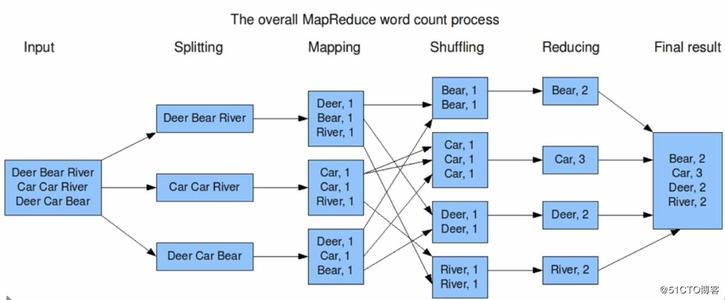
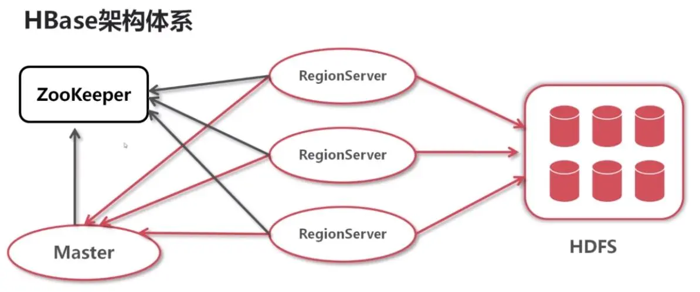
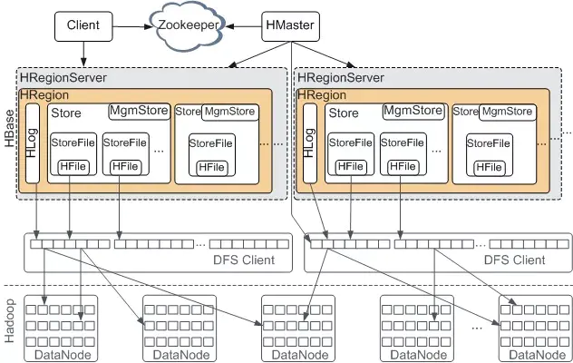

# 大数据面试题整理01--hadoop

[TOC]

## mapreduce的底层原理


    (1)输入文件会被划分成多个inputsplit，每一个InputSplit都会分配一个Map任务，Map任务的输出存放在环形内存缓冲区[默认大小100MB（io.sort.mb属性）]，一旦达到阀值0.8(io.sort.spill.percent)，一个后台线程就把内容写到(spill)本地磁盘中的指定目录（mapred.local.dir）下的新建的一个溢出写文件。

    (2)写磁盘前，要排序、分区。如果有Combiner，对中间过程的输出进行本地的聚集。等最后记录写完，将全部溢出文件合并为一个分区且排序的文件(归并排序)。

    (3)进入Reduce阶段。Reducer通过Http方式得到Map输出文件的分区、存到内存或磁盘、进行归并排序、执行Reduce方法。

[详细描述见 mapreduce过程详解.md]

## mapreduce的调度策略

主要有两种调度策略：

（1）容器调度器[Capacity Scheduler]

系统默认。Capacity Scheduler 允许多个组织共享整个集群，每个组织可以获得集群的一部分计算能力。通过为每个组织分配专门的队列，然后再为每个队列分配一定的集群资源，这样整个集群就可以通过设置多个队列的方式给多个组织提供服务了。除此之外，队列内部又可以垂直划分(子队列)，这样一个组织内部的多个成员就可以共享这个队列资源了，在一个队列内部，资源的调度是采用的是先进先出FIFO策略(例如，作业A和作业B被先后提交。那么在执行作业B的任务前，作业A中的所有map任务都应该已经执行完)。

（2）公平调度器[Fair Scheduler]

Fair Scheduler允许应用程序公平共享集群资源的调度器。当只有一个应用程序运行时，该应用程序可以使用整个集群资源，当其他应用程序提交之后，释放一部分资源给新提交的应用程序，所以每个应用程序最终会得到大致相同的资源量。

支持队列和层级队列。Fairscheduler 为队列分配了最小共享份额，这对确保了特定用户、组、产品应用始终获得足够的资源。当队列包含应用程序时，它至少能获得最小共享份额，但是当队列占用的资源有空余时，那么空余的资源会分配给其他运行中的应用程序。这既保证了队列的容量，又可以 在这些队列不包含应用程序时高效的利用资源。

FairScheduler默认让所有应用程序都运行，但也能通过配置文件限制每个用户、队列的运行的应用程序数量。

再详细的话，可以具体讲yarn的执行流程。

## hdfs文件系统

[hdfs架构]

HDFS 是分布式文件系统，采用主从架构。一个 HDFS 集群是由一个 Namenode 和一定数目的 Datanodes 组成。

    Namenode 是一个中心服务器，负责管理文件系统的名字空间(namespace)以及接收客户端对文件的访问请求。
    （操作文件系统的名字空间，比如打开、关闭、重命名文件或目录。它也负责确定 blocks 到具体 Datanode 节点的映射）

    Datanode 一般是一个节点一个，负责管理它所在节点上的存储，执行客户端的读写请求。

一个文件其实被分成一个或多个 blocks，一个block默认128mb，以 blocks 的形式存储在 Datanode 上。在 Namenode 的统一调度下进行 blocks 的创建、删除和复制。

## hdfs工作机制

[读写过程]


	1、向namenode通信请求上传文件，namenode检查目标文件是否已存在，父目录是否存在
	2、namenode返回是否可以上传
	3、client会先对文件进行切分，比如一个blok块128m，文件有300m就会被切分成3个块，一个128M、一个128M、一个44M请求第一个 block该传输到哪些datanode服务器上
	4、namenode返回datanode的服务器
	5、client请求一台datanode上传数据（本质上是一个RPC调用，建立pipeline），第一个datanode收到请求会继续调用第二个datanode，然后第二个调用第三个datanode，将整个pipeline建立完成，逐级返回客户端
	6、client开始往A上传第一个block（先从磁盘读取数据放到一个本地内存缓存），以packet为单位（一个packet为64kb），当然在写入的时候datanode会进行数据校验，它并不是通过一个packet进行一次校验而是以chunk为单位进行校验（512byte），第一台datanode收到一个packet就会传给第二台，第二台传给第三台；第一台每传一个packet会放入一个应答队列等待应答
	7、当一个block传输完成之后，client再次请求namenode上传第二个block的服务器。


	1、跟namenode通信查询元数据（block所在的datanode节点），找到文件块所在的datanode服务器
	2、挑选一台datanode（就近原则，然后随机）服务器，请求建立socket流
	3、datanode开始发送数据（从磁盘里面读取数据放入流，以packet为单位来做校验）
	4、客户端以packet为单位接收，先在本地缓存，然后写入目标文件，后面的block块就相当于是append到前面的block块最后合成最终需要的文件。

来源：[HDFS读写文件流程](https://blog.csdn.net/qq_20641565/article/details/53328279)

注：hdfs文件系统 和 hdfs工作机制 两个问题涉及范围比较大。可以统一从以下几个方面进行详细回答：

    1、架构：构成(NN、DN、block)；副本(存放、选择、安全模式、副本管道)、元数据管理(Editlog、FsImage、checkpoint、Blockreport)、健壮性(心跳检测、集群平衡、数据完整性、元数据磁盘错误)
    2、读写机制
    3、优缺点

参考：[Hadoop集群（第8期）HDFS初探之旅](https://www.cnblogs.com/xia520pi/archive/2012/05/28/2520813.html)


## nn、dn的块的大小，secondrynamenode的作用

128mb

NameNode包含了如下两个文件：

    - FsImage - 存储整个文件系统的名字空间，包括数据块到文件的映射、文件系统的属性等。

    - Editlog - 对于任何对文件系统元数据产生修改的操作，都会记录在 Editlog 中。

当 Namenode 启动时，将所有 Editlog 中的事务作用在内存中的 FsImage 上，从而得到一个文件系统的最新快照。但是在产品集群中NameNode是很少重启的，这也意味着当 NameNode 运行了很长时间后，Editlog 文件会变得很大。在这种情况下就会出现下面一些问题：

    - Editlog 文件会变的很大，怎么去管理这个文件是一个挑战。

    - NameNode 的重启会花费很长时间，因为在 Editlog 中有很多改动，要合并到 FsImage 文件上。

    - 如果 NameNode 挂掉了，那我们就丢失了很多改动，因为此时的 FsImage 文件非常旧。

所以，SecondaryNameNode 就是来帮助解决上述问题的，它的职责是合并 NameNode 的 Editlog 到 FsImage 文件中。


上图我们看到了Secondary NameNode是怎样工作的。

    - 首先，它定时到NameNode去获取 Editlog，并更新到Secondary NameNode自己的fsimage上。

    - 一旦它有了新的 fsimage 文件，它将其拷贝回 NameNode 中。

    - NameNode 在下次重启时会使用这个新的fsimage文件，从而减少重启的时间。

Secondary NameNode所做的不过是在文件系统中设置一个检查点来辅助NameNode更好的工作。它不是要取代掉NameNode也不是NameNode的备份。所以Secondary NameNode称为检查点节点。

NameNode是什么时候将改动写到 Editlog 中的？

    这个步骤，实际上是由DataNode的写操作触发的，当我们往DataNode写文件时，DataNode会跟NameNode通信，告诉NameNode什么文件的第几个block放在它那里，NameNode这个时候会将这些元数据信息写到 Editlog 文件中。


参考：
[[翻译]Secondary NameNode:它究竟有什么作用？](https://www.jianshu.com/p/5d292a9a8c86)
[hadoop-4 namenode和secondary namenode机制](https://blog.csdn.net/a3125504x/article/details/106265047)

##  hadoop如何保证健壮性

### 磁盘数据错误，心跳检测和重新复制

每个 Datanode 节点周期性地向 Namenode 发送心跳信号。网络割裂可能导致一部分 Datanode 跟 Namenode 失去联系。Namenode 通过心跳信号的缺失来检测这一情况，并将这些近期不再发送心跳信号 Datanode 标记为宕机，不会再将新的 IO 请求发给它们。任何存储在宕机 Datanode 上的数据将不再有效。**Datanode 的宕机可能会引起一些数据块的副本系数低于指定值，Namenode 不断地检测这些需要复制的数据块，一旦发现就启动复制操作**。在下列情况下，可能需要重新复制：**某个 Datanode 节点失效，某个副本遭到损坏，Datanode 上的硬盘错误，或者文件的副本系数增大**。

保守地说，标记 datanode 为宕机的时间很长(默认超过10分钟)，以避免由于 datanode 的状态变化而导致频繁复制。对于性能敏感的工作负载，用户可以通过设置缩短 datanode 为宕机的时间，并避免将数据读取 和/或 写入宕机的节点。

### 集群均衡

HDFS 的架构支持 **数据均衡策略**。如果某个 Datanode 节点上的空闲空间低于特定的临界点，按照均衡策略系统就会自动地将数据从这个 Datanode 移动到其他空闲的 Datanode。当对某个文件的请求突然增加，那么就自动创建该文件新的副本，并且同时重新平衡集群中的其他数据。这些均衡策略目前还没有实现。

### 数据完整性

从某个 Datanode 获取的 block 有可能是损坏的，原因可能是 Datanode 的存储设备错误、网络错误或者软件bug。HDFS 客户端软件实现了对 HDFS 文件内容的 **校验和(checksum)检查。当客户端创建一个新的 HDFS 文件，会计算这个文件每个数据块的校验和，并将校验和作为一个单独的隐藏文件保存在同一个HDFS名字空间下。当客户端获取文件内容后，它会检验从 Datanode 获取的数据 跟相应的校验和文件中的校验和 是否匹配，如果不匹配，客户端可以选择从其他Datanode获取该数据块的副本。**

### 元数据磁盘错误

FsImage 和 Editlog 是 HDFS 的核心数据结构。如果这些文件损坏了，整个 HDFS 实例都将失效。因而，**Namenode 可以配置成支持维护多个 FsImage 和 Editlog 的副本。任何对 FsImage 或者 Editlog 的修改，都将同步到它们的副本上**。当 Namenode 重启的时候，它会选取最近的完整的 FsImage 和 Editlog 来使用。

提高抗故障弹性另一个的措施就是 **通过设置多个 NameNodes 实现高可用性，要么基于 NFS 实现共享存储，要么使用一个分布式的 Edit log(Journal)。后者是推荐的方法**。

### 快照

快照支持某一特定时刻的数据的备份。利用快照，可以让 HDFS 在数据损坏时恢复到过去一个已知正确的时间点。

## hdfs为什么不适合存小文件

(1)小文件过多，会过多占用namenode的内存，并浪费block。

	A. 文件的元数据，都是存储在namenode上的，HDFS的每个命名空间对象占用150byte。那么：

	有100个1M的文件存储进入HDFS系统，那么数据块的个数就是100个，元数据的大小就是100*150byte，消耗了15000byte的内存，但是只存储了100M的数据。

	有1个100M的文件存储进入HDFS系统，那么数据块的个数就是1个，元数据的大小就是150byte，消耗量150byte的内存，存储量100M的数据。

	===============================================================================
	B. dataNode会向NameNode发送两种类型的报告：
		增量报告是当dataNode接收到block或者删除block时，会向nameNode报告。
		全量报告是周期性的，NN处理100万的block报告需要1s左右，这1s左右NN会被锁住，其它的请求会被阻塞。

(2)文件过小，寻道时间大于数据读写时间，这不符合HDFS的设计:

	HDFS为了使数据的传输速度和硬盘的传输速度接近，则设计将寻道时间（Seek）相对最小化，将block的大小设置的比较大，这样读写数据块的时间将远大于寻道时间，接近于硬盘的传输速度。

参考：[hdfs为什么不适合存小文件](https://www.cnblogs.com/qingyunzong/p/8535995.html)

## mapreduce输入相关

InputFormat 为 MapReduce Job 描述输入的细节规范。

具体来说：
- 检查 Job 输入的有效性。
- 把输入文件切分成多个逻辑InputSplit实例，并分别分发每个InputSplit给一个 Mapper。
- 提供RecordReader，RecordReader从逻辑InputSplit中获得输入记录，交由Mapper处理。

两个方法：
- createRecordReader 创建一个记录阅读器
- getSplits  返回输入文件的逻辑分片集合

TextInputFormat 是默认的InputFormat。（Keys 是行在文件的位置，Values是文本的一行。）

其中，InputSplit 表示一个独立Mapper要处理的数据。

其上限是文件系统的block的大小，下限通过 mapreduce.input.fileinputformat.split.minsize 设置

FileSplit 是默认的 InputSplit。 [进行分片的地方]

其中，RecordReader 将数据划分为键值对形式交予Mapper处理。

一般的，RecordReader 把由 InputSplit 提供的字节样式的输入文件，转化成由Mapper处理的记录样式的文件。
[RecordReader接收的数据不是键值对形式的]

## mapreduce分区

分区(Partitioner) 作用就是控制将中间过程的key（也就是这条记录）应该发送给m个reduce任务中的哪一个来进行reduce操作。

Key（或者一个key子集）通常使用 Hash 函数产生分区。

分区的数目与一个作业的 Reducer 任务的数目是一样的。

HashPartitioner是默认的 Partitioner。自定义分区需要实现Partitioner接口，重写getPartition方法。

## mapReduce有几种排序及排序发生的阶段

三种

	1、中间结果在写入磁盘前，会根据分区号和key进行一次快速排序。
		结果：数据按照partition为单位聚集在一起，同一partition内的按照key有序。
	2、在溢写到磁盘之后会归并排序；将多个小文件合并成大文件的。
		所以合并之后的大文件还是分区、有序的。
	3、reduce端在取数据的同时，会按照相同的分区，再将取过来的数据进行归并排序，
		大文件的内容按照key有序进行排序。
	4、如果需要将中间键分组规则与reduce前的键的分组等价规则不同，可以实现按值的二次排序。
		首先按照第一字段排序，然后再对第一字段相同的行按照第二字段排序

## mapreduce二次排序 

1、将原key和value作为一个新的key，实现WritableComparable接口
   重写compareTo、hashcode、equals、write和readFields方法
   
2、定制分区器，据Mapper产出的新key来决定数据进到哪个Reducer。
   继承Partitioner类，重写getPartition方法。
   
3、分组比较器，控制哪些键要分组到一个`Reduce.reduce()`方法中调用。
   继承WritableComparator类，重写compare方法。
   
4、在main函数中添加`job.setGroupingComparatorClass`、`job.setPartitionerClass`

## mapreduce中压缩技术的使用

MapReduce 可以对map的输出和job的输出进行压缩，这样能够减少储存文件
所需要的磁盘空间、加速数据在网络和磁盘上的传输。

压缩算法主要有gzip、bzip2、snappy、LZO、lz4，其中只有bzip2和LZO支持切分。
[如何选择压缩算法?]

可以在`mapred-default.xml` 文件设置，也可以在应用程序中设置。
但都需要先启动(设为true)，然后再指定压缩算法。

压缩map输出:
```java
Configuration conf = new Configuration();
conf.setBoolean("mapred.compress.map.output", true);
conf.setClass("mapred.map.output.compression.codec", GzipCodec.class, CompressionCodec.class);
```

压缩job输出:
```java
FileOutputFormat.setCompressOutput(Job, true);
FileOutputFormat.setOutputCompressorClass(Job, GzipCodec.class)
```

## mapper阶段会调用几次map函数,map类中重写哪些方法，继承什么类

	每行数据调一个map；（流式读取数据）
	setup、map、cleanup;
	继承mapper类

## 借助wordcount实例，写出mapreduce的执行流程



## storm都从哪输入

**kafka**

（1）在pom文件中添加依赖
（2）
```
final TopologyBuilder tp = new TopologyBuilder();
tp.setSpout("kafka_spout", new KafkaSpout<>(KafkaSpoutConfig.builder("127.0.0.1:" + port, "topic").build()), 1);
tp.setBolt("bolt", new myBolt()).shuffleGrouping("kafka_spout");
```
（3）也可以通过通配符匹配topic.
（4）一个 KafkaSpout 流入多个 bolt
```
final TopologyBuilder tp = new TopologyBuilder();
//默认情况下，spout 消费但未被match到的topic的message的"topic"、"key"和"value"将发送到"STREAM_1"
ByTopicRecordTranslator<String, String> byTopic = new ByTopicRecordTranslator<>(
    (r) -> new Values(r.topic(), r.key(), r.value()),
    new Fields("topic", "key", "value"), "STREAM_1");
//topic_2 所有的消息的 "key" and "value" 将发送到 "STREAM_2"中
byTopic.forTopic("topic_2", (r) -> new Values(r.key(), r.value()), new Fields("key", "value"), "STREAM_2");

tp.setSpout("kafka_spout", new KafkaSpout<>(KafkaSpoutConfig.builder("127.0.0.1:" + port, "topic_1", "topic_2", "topic_3").build()), 1);
tp.setBolt("bolt", new myBolt()).shuffleGrouping("kafka_spout", "STREAM_1");
tp.setBolt("another", new myOtherBolt()).shuffleGrouping("kafka_spout", "STREAM_2");
...
```
**JMS**

JMS Spout 连接到 JMS Destination(主题或队列)，并根据收到的 JMS Messages 的内容发送给 Storm "Tuple" 对象。

JMS Bolt **连接到 JMS Destination，并根据接收的 Storm "Tuple" 对象发布 JMS 消息**。
```
// JMS Queue Provider
        JmsProvider jmsQueueProvider = new SpringJmsProvider(
                "jms-activemq.xml", "jmsConnectionFactory",
                "notificationQueue");

        // JMS Producer
        JmsTupleProducer producer = new JsonTupleProducer();

        // JMS Queue Spout
        JmsSpout queueSpout = new JmsSpout();
        queueSpout.setJmsProvider(jmsQueueProvider);
        queueSpout.setJmsTupleProducer(producer);
        queueSpout.setJmsAcknowledgeMode(Session.CLIENT_ACKNOWLEDGE);


        // JMS Topic provider
        JmsProvider jmsTopicProvider = new SpringJmsProvider(
                "jms-activemq.xml", "jmsConnectionFactory",
                "notificationTopic");

        // bolt that subscribes to the intermediate bolt, and publishes to a JMS Topic
        JmsBolt jmsBolt = new JmsBolt();
        jmsBolt.setJmsProvider(jmsTopicProvider);

        // anonymous message producer just calls toString() on the tuple to create a jms message
        jmsBolt.setJmsMessageProducer(new JmsMessageProducer() {
            @Override
            public Message toMessage(Session session, ITuple input) throws JMSException {
                System.out.println("Sending JMS Message:" + input.toString());
                TextMessage tm = session.createTextMessage(input.toString());
                return tm;
            }
        });

        builder.setBolt(JMS_TOPIC_BOLT, jmsBolt).shuffleGrouping(INTERMEDIATE_BOLT);

        // JMS Topic spout
        JmsSpout topicSpout = new JmsSpout();
        topicSpout.setJmsProvider(jmsTopicProvider);
        topicSpout.setJmsTupleProducer(producer);
        topicSpout.setJmsAcknowledgeMode(Session.CLIENT_ACKNOWLEDGE);
        topicSpout.setDistributed(false);

        builder.setSpout(JMS_TOPIC_SPOUT, topicSpout);

        builder.setBolt(ANOTHER_BOLT, new GenericBolt("ANOTHER_BOLT", true, true), 1).shuffleGrouping(
                JMS_TOPIC_SPOUT);
```

[MQTT](http://storm.apache.org/releases/2.1.0/storm-mqtt.html)

[Kinesis](http://storm.apache.org/releases/2.1.0/storm-kinesis.html)

[Kestrel](http://storm.apache.org/releases/2.1.0/Kestrel-and-Storm.html)

## storm的节点

    nimbus:分布代码，分配任务，监控集群。
    supervisor:接收任务，分配给worker进程处理，管理worker进程
    zookeeper:负责Nimbus节点和Supervisor节点之间的协调工作，存放集群元数据(心跳信息、配置信息)，
    			      nimbus将分配给supervisor的任务写入zookeeper。

## storm构成一个图的节点，可以上游的bolt输出到下游的两个bolt中吗

可以。

    在topology提交时，在 grouping 中指定接收哪个流。
    在发送消息时，指定哪些数据通过哪个流(流ID)传输。
    接受消息时，需要判断数据流。

## spark和storm的区别  

spark是一个基于内存的大数据引擎，执行实时计算的库是spark streaming。Storm是分布式实时大数据计算系统。所以Storm侧重于计算的实时性，Spark侧重计算庞大数据（类似于Hadoop的MR）。

Spark流模块(Spark Streaming)与Storm类似，但有区别：

    1.Storm纯实时，数据流以元组为基本单元，每个Tuple类似于数据库中的一行记录[元组详解](https://www.cnblogs.com/zlslch/p/5989281.html)；SparkStreaming准实时，对一个时间段内的数据收集起来，作为一个RDD，再做处理。
    2.Storm响应时间毫秒级；Spark Streaming响应时间秒级
    3.Storm可以动态调整并行度；SparkStreaming不行
    storm rebalance topology-name [-w wait-time-secs] [-n new-num-workers] [-e component=parallelism]
    4.可靠性：SparkStreaming仅处理一次，Storm至少处理一次

Storm应用场景：

    1、对于需要纯实时，不能忍受1秒以上延迟的场景
    2、要求可靠的事务机制和可靠性机制，即数据的处理完全精准
    3、如果还需要针对高峰低峰时间段，动态调整实时计算程序的并行度，以最大限度利用集群资源

Spark Streaming应用场景：

    1、Spark Streaming可以和Spark Core、Spark SQL无缝整合，如果一个项目除了实时计算之外，还包括了离线批处理、交互式查询等业务功能，考虑使用Spark Streaming。

Flink也是分布式流计算系统，其核心是流处理，批量处理是流处理的一个特殊应用。当输入数据流是无界时，Flink被视作流处理，当输入数据流是有界时，Flink被视作批量处理。数据仅处理一次。

参考：[Storm与Spark区别](https://www.cnblogs.com/moxiaotao/p/9939047.html)
[流式计算的三种框架：Storm、Spark和Flink](https://segmentfault.com/a/1190000020465688?utm_source=tag-newest)

## storm的ack-fail机制

ack-fail 机制为 storm 提供了可靠性保证。当一个元组从 spout 发出时，会为其赋予一个唯一的 msg id 。 发出的 tuple 经过后续的 bolt 处理，会形成一个元组树。bolt 每收到一个 tuple 都会向上游确认。

如果元组树上的原始 tuple 被每个 bolt 都确认应答了，则 spout 调用的 ack 方法来标记此消息被完全处理了。如果任何一个 bolt 处理 tuple 超时或出错，storm 会调用在 Spout 的 fail 方法。

当衍生的 tuple 从 bolt 发出时，会锚定读入的 tuple ，当消息被处理成功就会 调用 ack 方法。当处理失败，则会调用 fail 方法，再由 spout 重新发送 tuple 。

（锚定：建立读入 tuple 和衍生 tuple 间的联系）

## storm的分组策略，及各自含义

当 Bolt A 的一个任务向 Bolt B 发送元组时，应该发到 Bolt B 的哪个任务呢？

**stream groupings 就是用来告诉 Storm 如何在任务间发送元组**

### 1、Shuffle Grouping 

随机分组，随机派发 stream 里面的 tuple，保证每个 bolt task 接收到的 tuple 数目大致相同。

轮询，平均分配 

### 2、 Fields Grouping（相同fields去分发到同一个Bolt）

按字段分组，比如，按 "user-id" 这个字段来分组，那么具有同样 "user-id" 的 tuple 会被分到相同的 Bolt 里的一个 task， 而不同的 "user-id" 则可能会被分配到不同的 task。 

### 3、 All Grouping

广播发送，对于每一个 tuple，所有的 bolts 都会收到 

### 4、 Global Grouping

全局分组，所有的 tuple 将会发送给拥有最小 task_id 的 bolt 任务处理。

### 5、 None Grouping

不分组，不关注并行处理负载均衡策略时使用该方式，目前等同于shuffle grouping，另外 storm 将会把 bolt 任务和他的上游提供数据的任务安排在同一个线程下。

### 6、 Direct Grouping

指向型分组， tuple 的发送者指定由消息接收者的哪个 task 处理这个消息。只有被声明为 Direct Stream 的消息流可以声明这种分组方法。而且这种消息 tuple 必须使用 emitDirect 方法来发射。消息处理者可以通过 TopologyContext 来获取处理它的消息的task的id (OutputCollector.emit方法也会返回task的id)  

### 7、Local or shuffle grouping

本地或随机分组。如果目标 bolt 有一个或者多个 task 与源 bolt 的 task 在同一个工作进程中，tuple 将会被随机发送给这些同进程中的 tasks。否则，和普通的 Shuffle Grouping 行为一致

### 8、Partial Key grouping

The stream is partitioned by the fields specified in the grouping, like the Fields grouping, but are load balanced between two downstream bolts, which provides better utilization of resources **when the incoming data is skewed.** [This paper](https://melmeric.files.wordpress.com/2014/11/the-power-of-both-choices-practical-load-balancing-for-distributed-stream-processing-engines.pdf) provides a good explanation of how it works and the advantages it provides.

当数据倾斜的时候

### 9、customGrouping

自定义，相当于mapreduce那里自己去实现一个partition一样。

```java
// 一个自定义分组，总是把数据分到第一个Task：

public class MyFirstStreamGrouping implements CustomStreamGrouping {
    private static Logger log = LoggerFactory.getLogger(MyFirstStreamGrouping.class);

    private List<Integer> tasks;

    @Override
    public void prepare(WorkerTopologyContext context, GlobalStreamId stream,
        List<Integer> targetTasks) {
        this.tasks = targetTasks;
        log.info(tasks.toString());
    }   
    @Override
    public List<Integer> chooseTasks(int taskId, List<Object> values) {
        log.info(values.toString());
        return Arrays.asList(tasks.get(0));
    }
}
```
原文链接：

[【Storm篇】--Storm分组策略](https://www.cnblogs.com/LHWorldBlog/p/8352994.html) 、 [Twitter Storm Stream Grouping编写自定义分组实现](https://my.oschina.net/zhzhenqin/blog/223304)

## storm中spout和bolt间的通信协议


## zookeeper有了解吗

ZooKeeper 是一种应用于分布式应用程序的、开源的分布式协调服务。基于 ZooKeeper 实现诸如配置管理、命名服务、Master选举、集群管理等功能。

[角色]Leader 负责响应所有对ZooKeeper状态变更的请求(读写)。它会将每个状态更新请求进行排序和编号，以便保证整个集群内部消息处理的FIFO。followers 为客户端提供读服务，参与Leader选举过程，参与写操作“过半写成功”策略。Observer服务器为客户端提供读服务，不参与Leader选举过程，不参与写操作“过半写成功”策略。用于在不影响写性能的前提下提升集群的读性能。角色的状态：
    
	LOOKING：
		当前Server未知集群中的Leader，并且正在寻找。
	LEADING：
		当前Server即为选举出来的Leader。
	FOLLOWING：
		当前Follower已与选举出来的Leader同步。
	OBSERVING
		当前Observer已与选举出来的Leader同步。

参考：[Zookeeper中的角色](https://www.cnblogs.com/DeepInThought/p/11061550.html)

[命名空间]ZooKeeper 维护一个类似文件系统的多层级的节点命名空间，但数据保存在内存中。名称是以斜杠（/）分隔的路径元素序列。 命名空间的每个节点都由路径标识。

[znodes]命名空间由 znodes 组成，znodes 类似于文件系统的文件和目录，能够增加、删除znode，在一个znode下增加、删除子znode。znode是可以存储数据的，比如存储协调数据：状态信息，配置，位置信息等，数据以原子方式读取和写入。包含持久化节点和临时节点有两种类型的znode，只要创建 znode 的 session 处于断开状态，临时节点就会被删除。

[watches]ZooKeeper 支持监听器的概念。客户端可以在一个 znode 上设置一个监听器。 当 znode 更改时，这个监听器将被触发并移除。当监听器被触发时，客户端接收到一个数据包，说明 znode 已经改变了。

[事务、顺序一致性]在ZooKeeper中，能改变ZooKeeper服务器状态的操作称为事务操作。一般包括 znode 创建与删除、数据内容更新和客户端会话创建与失效等操作。对应每一个事务请求，ZooKeeper 都会为其分配一个全局唯一的事务ID，用 ZXID 表示，通常是一个64位的数字。每一个 ZXID 对应一次更新操作，从这些 ZXID 中可以间接地识别出 ZooKeeper 处理这些事务操作请求的全局顺序。

应用场景：

[配置管理]程序分布式的部署在不同的机器上，将程序的配置信息放在zk的znode下，当有配置发生改变时，也就是znode发生变化时，可以通过改变zk中某个目录节点的内容，利用watcher通知给各个客户端，从而更改配置。

[命名服务]命名服务是指通过指定的名字来获取资源或者服务的地址，利用zk创建一个全局的路径，即是唯一的路径，这个路径就可以作为一个名字，指向集群中的机器，提供的服务的地址，或者一个远程的对象等等。参考：[zookeeper面试题](https://segmentfault.com/a/1190000014479433#articleHeader22)

[Master选举]、[集群管理]、[分布式锁]、[分布式通知和协调]、[同步流程]、[数据复制]、[队列管理]


## 数据仓库的架构分层

#### 为什么要分层：

(1) 随着企业业务的增加，企业数据量也随之增加，如果不有序、有结构的进行分类组织和存储，会给增加企业的管理成本。

(2) 分层可以给我们带来如下的好处：

	清晰数据结构：每一个数据分层都有它的作用域和职责，在使用表的时候能更方便地定位和理解

	减少重复开发：规范数据分层，开发一些通用的中间层数据，能够减少极大的重复计算

	统一数据口径：通过数据分层，提供统一的数据出口，统一对外输出的数据口径

	复杂问题简单化：将一个复杂的任务分解成多个步骤来完成，每一层解决特定的问题

#### 分层


(1)DB 是现有的数据来源，可以为mysql、SQLserver、文件日志等，为数据仓库提供数据来源的一般存在于现有的多个业务系统之中。

(2)ETL的是 Extract-Transform-Load 的缩写，用来描述将数据从来源迁移到目标的几个过程：

    Extract，数据抽取，把数据从数据源读出来。
    Transform，数据转换，把原始数据转换成期望的格式和维度。如果用在数据仓库的场景，Transform也包含数据清洗，清洗掉噪音数据。
    Load 数据加载，把处理后的数据加载到目标处，比如数据仓库。

(3)ODS(Operational Data Store) 操作性数据，直接从业务系统抽取过来的。（明细数据）

(4)DW (Data Warehouse)数据仓库，包括DWD、MID和DM(Data Mart)。DWD是清洗维度补充。MID进行轻度汇总和。DM按照部门或主题（特定用户群、特定主题）生成。

(5)APP（Application），面向用户应用和分析需求，包括前端报表、分析图表、KPI、仪表盘、OLAP、专题等分析，面向最终结果用户。

参考：[数据仓库--通用的数据仓库分层方法](https://www.cnblogs.com/itboys/p/10592871.html)
[干货：解码OneData，阿里的数仓之路](https://developer.aliyun.com/article/67011)

## 数据集出现数据缺失，怎么办 ##

(1)对于某属性的缺失量过大

	- 直接删除该属性；
	- 扩展该属性为更多属性，比如性别，有男、女、缺失三种情况，则映射成3个变量：是否男、是否女、是否缺失。好处是完整保留了原始数据的全部信息、不用考虑缺失值、不用考虑线性不可分之类的问题。缺点是计算量大大提升。

(2)对于某属性的缺失量不大

	填充：
		平均值、中值、分位数、众数、随机值、上下数据、插值法；(效果一般，因为等于人为增加了噪声。)
		算法拟合(有一个根本缺陷，如果其他变量和缺失变量无关，则预测的结果无意义。如果预测结果相当准确，则又说明这个变量是没必要加入建模的。)

参考：[机器学习中如何处理缺失数据](https://www.zhihu.com/question/26639110)

## 推荐的相似性度量及其应用场景

#### 欧式距离(Euclidean Distance)

二维平面上两点a(x1,y1)与b(x2,y2)之间的欧式距离


$$ d = \sqrt{(x_{1}-x_{2})^{2}+(y_{1}-y_{2})^{2}} $$

三维空间两点a(x1,y1,z1)与b(x2,y2,z2)间的欧氏距离


$$ d = \sqrt{(x_{1}-x_{2})^{2}+(y_{1}-y_{2})^{2}+(z_{1}-z_{2})^{2}} $$

两个n维向量a(x11,x12,...,x1n)和b(x21,x22,...,x2n)间的欧氏距离


$$ d = \sqrt{\sum_{k=1}^{n}(x_{1k}-x_{2k})^2} $$

#### 曼哈顿距离(Manhattan Distance)

二维平面两点a(x1,y1)与b(x2,y2)间的曼哈顿距离


$$ d = \left | x_{1} -  x_{2}\right | + \left | y_{1} -  y_{2}\right | $$

两个n维向量a(x11,x12,...,x1n)与b(x21,x22,...,x2n)间的曼哈顿距离


$$ d = \sum_{k=1}^{n}\left | x_{1k} - x_{2k} \right | $$

下图中红线代表曼哈顿距离，绿色代表欧氏距离


#### 余弦距离(Cosine)

几何中夹角余弦可以来衡量两个向量方向的差异，机器学习中借用这一概念来 **衡量样本向量** 之间的差异。

在二维空间中向量A()与向量B()的夹角余弦公式：


$$ cos\theta = \frac{x_{1}x_{2}+y_{1}y_{2}}{\sqrt{(x_{1}+x_{2})^{2}}\sqrt{(y_{1}+y_{2})^{2}}} $$

两个n维样本点a(x11,x12,...,x1n)和b(x21,x22,...,x2n)


$$ cos\theta = \frac{a\cdot b}{\left | a \right |\left | b \right |} $$

即


$$ cos\theta = \frac{\sum_{k=1}^{n}x_{1k}x_{2k}}{\sqrt{\sum_{k=1}^{n}x_{1k}^{2}}\sqrt{\sum_{k=1}^{n}x_{2k}^{2}}} $$

夹角余弦的取值范围为[-1,1]。夹角余弦越大，表示两个向量的夹角越小，夹角余弦越小表示两个向量的夹角越大。

[马氏距离、汉明距离、闵可夫斯基距离、切比雪夫距离、杰卡德距离、相关系数、相关距离](https://www.cnblogs.com/heaad/archive/2011/03/08/1977733.html)


## hive优缺点

优点：

- 高可靠、高容错

    HIVE Sever采用:主备模式。有主有从。当主机挂掉，备机马上启动。即【高可用】单点故障。
    双MetaStore
 
- 采用了 hive sql 语法，底层执行 mapreduce 任务，容易上手，适合于批量处理海量数据

- 支持 UDF\UDAF\UDTF 来扩展用户程序。

    UDF：user defined functions 
    UDAF： user defined aggregates 
    UDTF：user defined table functions

- 自定义存储格式

    in the file_format to specify the name of a corresponding InputFormat and OutputFormat class as a string literal.

    For example, 'org.apache.hadoop.hive.contrib.fileformat.base64.Base64TextInputFormat'. 

- 多接口
    
    Hive Client：JDBC、ODBC、Thrift
    HiveServer2：Beeline

缺点：

    正是由于底层执行 mapreduce 任务，所以延迟性高。
    不适合联机事务处理


扩展阅读：

[Hive安装配置 metastore的三种配置方式详解](https://blog.csdn.net/u014414323/article/details/80862258?utm_medium=distribute.pc_relevant.none-task-blog-BlogCommendFromMachineLearnPai2-1.channel_param&depth_1-utm_source=distribute.pc_relevant.none-task-blog-BlogCommendFromMachineLearnPai2-1.channel_param)
[Hive多Metastore](https://www.cnblogs.com/feiyuanxing/p/10043626.html)
[UDF\UDAF\UDTF创建](https://www.jianshu.com/p/61ddcd25e6d1)
[Hive 自定义数据格式](https://www.cnblogs.com/sowhat1412/p/12734268.html)

## hive和传统数据库的区别

(1)存储

    hive的数据存储在hdfs上，所以具有很好的扩展性，适合于海量数据的存储。
    数据库存储在本地文件系统。相比hive，扩展有限。

(2)执行引擎

    hive默认的执行引擎是mapreduce，但可以是spark。
    数据库有自己的执行引擎，如InnoDB、MyIsam

(3)延迟性

    当hive使用mapreduce时，会具有一定的延迟。相对的，数据库的延迟较低。

    当然，这个低是有条件的，即数据规模较小，当数据规模大到超过数据库的处理能力的时候，Hive的并行计算显然能体现出优势。  

(4)数据更新

    由于 Hive是针对数据仓库应用设计的，而数据仓库的内容是读多写少的。
    因此，Hive中不支持对数据的改写和添加，所有的数据都是在加载的时候中确定好的。
    而数据库中的数据通常是需要经常进行修改的，因此可以使用 INSERT INTO ...  VALUES添加数据，使用 UPDATE ... SET修改数据。

(5)查询语言

     Hive是类 SQL的查询语言 HQL。熟悉 SQL开发的开发者可以很方便的使用 Hive进行开发。

(6)数据格式

    Hive 中没有定义专门的数据格式，数据格式可以由用户指定。支持关系型数据中大多数基本数据类型。
    数据库中，不同的数据库有不同的存储引擎，定义了自己的数据格式。所有数据都会按照一定的组织存储，因此，数据库加载数据的过程会比较耗时。

(7)索引

    Hive要访问数据中满足条件的特定值时，需要暴力扫描整个数据，因此访问延迟较高。由于 MapReduce的引入，Hive可以并行访问数据，因此即使没有索引，对于大数据量的访问，Hive仍然可以体现出优势。

    数据库中，通常会针对一个或者几个列建立索引，因此对于少量的特定条件的数据的访问，数据库可以有很高的效率，较低的延迟。由于数据的访问延迟较高，决定了 Hive不适合在线数据查询。

原文链接：[Hive与传统数据库对比](https://blog.csdn.net/nisjlvhudy/article/details/47175705)

扩展阅读：[MySQL执行引擎对比与SQL优化](https://blog.csdn.net/qq_38258310/article/details/94468604)

## hive往表中导入数据的方式

1、load data [local] inpath "path/file.txt" overwrite into table 表名

    (1)从本地导入
            load data local inpath "path/file.txt" into table 表名;
    (2)从hdfs导入
            load data inpath "path/file.txt" into table 表名;

2、使用hadoop fs -put ... 导入到hive表的路径上

3、insert into(overwrite) table 表名 select_statement1 FROM from_statement

从Hive表导出数据方式

1、insert overwrite [local] directory "path"  select * from tablename;

    (1)insert overwrite local directory "path/" select * from db_hive_demo.emp ;
    (2)insert overwrite  directory 'hdfs://hadoop102:8020/user/hive/warehouse/emp2/emp2'  select * from emp where empno >7800;

2、Bash shell覆盖追加导出

    例如：$ bin/hive -e "select * from staff;"  > /home/z/backup.log

3、Sqoop把hive数据导出到外部

原文链接：[往HIVE表中导入导出数据的几种方式详解](https://blog.csdn.net/qq_26442553/article/details/79478839)

## hive分区

在 Hive Select 查询中一般会扫描整个表内容，会消耗很多时间做没必要的工作。
但有时候只需要扫描表中关心的一部分数据，因此建表时引入了分区概念。

分区表指的是在创建表时指定分区的空间。
   
一个表可以拥有一个或者多个分区，每个分区以文件夹的形式单独存在表文件夹的目录下。分区的键对应的一个唯一值定义表的一个分区。

Partition columns are virtual columns, they are not part of the data itself but are derived on load.

创建分区：

    单分区建表语句：create table day_table (id int, content string) partitioned by (dt string); 按天分区，在表结构中存在id，content，dt三列。
    
    双分区建表语句：create table day_hour_table (id int, content string) partitioned by (dt string, hour string);

数据加载：

    LOAD DATA [LOCAL] INPATH 'filepath' [OVERWRITE] INTO TABLE tablename [PARTITION (partcol1=val1, partcol2=val2 ...)]
    
    例：
        LOAD DATA INPATH '/user/pv.txt' INTO TABLE day_hour_table PARTITION(dt='2008-08- 08', hour='08');
        
        LOAD DATA local INPATH '/user/hua/*' INTO TABLE day_hour partition(dt='2010-07- 07');

添加分区：
            
    ALTER TABLE table_name ADD partition_spec [ LOCATION 'location1' ] partition_spec [ LOCATION 'location2' ] ... partition_spec: : PARTITION (partition_col = partition_col_value, partition_col = partiton_col_value, ...)
            
    用户可以用 ALTER TABLE ADD PARTITION 来向一个表中增加分区。

    当分区名是字符串时加引号。例：
        
    ALTER TABLE day_table ADD PARTITION (dt='2008-08-08', hour='08') location '/path/pv1.txt' PARTITION (dt='2008-08-08', hour='09') location '/path/pv2.txt';

删除分区语法：

    ALTER TABLE table_name DROP partition_spec, partition_spec,...
    
    用户可以用 ALTER TABLE DROP PARTITION 来删除分区。

    分区的元数据和数据将被一并删除。例：

    ALTER TABLE day_hour_table DROP PARTITION (dt='2008-08-08', hour='09');

修复分区

    就是重新同步hdfs上的分区信息。
    msck repair table table_name;

查询分区：

    show partitions table_name;

扩展阅读：

[Hive分区partition详解](https://blog.csdn.net/qq_36743482/article/details/78418343)
[Hive分区](https://blog.csdn.net/yidu_fanchen/article/details/77683558)
[hive分区（partition）](https://www.cnblogs.com/ilvutm/p/7152499.html)

## hive分桶

将表或分区组织成桶有以下几个目的：

(1)抽样更高效，因为在处理大规模的数据集时，在开发、测试阶段将所有的数据全部处理一遍可能不太现实，这时抽样就必不可少。

        抽样：
                SELECT * FROM table_name TABLESAMPLE(nPERCENT)；
                就是针对n%进行取样

        有了桶之后呢？
                SELECT * FROM film TABLESAMPLE(BUCKET x OUTOF y)
                    x：表示从哪一个桶开始抽样
                    y：抽样因素，必须是桶数的因子或者倍数,假设桶数是100那么y可以是200,10,20,25,5。
                       假设桶数是100，y=25时抽取(100/25) = 4个bucket数据;当y=200的时候(100/200) = 0.5个bucket的数据

(2)更好的查询处理效率。

        大表在JOIN的时候，效率低下。如果对两个表先分别按id分桶，那么相同id都会归入一个桶。
        那么此时再进行JOIN的时候是按照桶来JOIN的，那么大大减少了JOIN的数量。

创建分桶： 

在建立桶之前，需要设置hive.enforce.bucketing属性为true，使得hive能识别桶。

```sql
CREATE TABLE IF NOT EXISTS t_movie(id INT,name STRING,director STRING,country STRING,year STRING,month STRING
            )ROWFORMAT DELIMITED FIELDS TERMINATED BY ',';
            PARTITIONEDBY (area STRING)
            CLUSTERED BY (country) INTO 4 BUCKETS
            ROWFORMAT DELIMITED FIELDS TERMINATED BY ','
            STORED AS ORC;
```
导入数据：

```sql
INSERT INTO TABLE t_movie PARTITION(area='China') SELECT * FROM t_movie WHERE country = 'China';
```

## 对hbase的理解

HBase 是建立在 Hadoop 文件系统之上的分布式面向列的数据库，提供对数据的随机实时读/写访问。可以直接或通过HBase的存储HDFS数据。使用HBase在HDFS读取消费/随机访问数据。 

HBase 在表中它由行排序。一个表有多个列族，以及每一个列族可以有任意数量的列。后续列的值连续地存储在磁盘上。表中的每个单元格值都具有时间戳。

Hbase特性：

- 强读写一致，但是不是“最终一致性”的数据存储，这使得它非常适合高速的计算聚合
- 自动分片，通过Region分散在集群中，当行数增长的时候，Region也会自动的切分和再分配
自动的故障转移
- Hadoop/HDFS集成，和HDFS开箱即用，不用太麻烦的衔接
- 丰富的“简洁，高效”API，Thrift/REST API，Java API
- 块缓存，布隆过滤器，可以高效的列查询优化
- 操作管理，Hbase提供了内置的web界面来操作，还可以监控JMX指标

什么时候用Hbase？

- 首先数据库量要足够多，如果有十亿及百亿行数据，那么Hbase是一个很好的选项，如果只有几百万行甚至不到的数据量，RDBMS是一个很好的选择。因为数据量小的话，真正能工作的机器量少，剩余的机器都处于空闲的状态

- 其次，如果你不需要辅助索引，静态类型的列，事务等特性，一个已经用RDBMS的系统想要切换到Hbase，则需要重新设计系统。

- 最后，保证硬件资源足够，每个HDFS集群在少于5个节点的时候，都不能表现的很好。因为HDFS默认的复制数量是3，再加上一个NameNode。



- Zookeeper：作为分布式的协调。RegionServer也会把自己的信息写到ZooKeeper中。
- HDFS：Hbase运行的底层文件系统
- RegionServer：理解为数据节点，存储数据的。
- Master：RegionServer要实时的向Master报告信息。Master知道全局的RegionServer运行情况，可以控制RegionServer的故障转移和Region的切分。



- HMaster 是 Master Server 的实现，负责监控集群中的 RegionServer 实例，同时是所有 metadata 改变的接口，在集群中，通常运行在 NameNode 上面

- HRegionServer 是 RegionServer 的实现，服务和管理 Regions，集群中 RegionServer 运行在 DataNode

- Regions 代表 table，Region 有多个 Store(列簇)，Store 有一个 Memstore 和多个 StoreFiles(HFiles)，StoreFiles 的底层是 Block。

扩展阅读：

[入门HBase，看这一篇就够了](https://www.jianshu.com/p/b23800d9b227)
[深入理解HBase的系统架构](https://blog.csdn.net/Yaokai_AssultMaster/article/details/72877127)