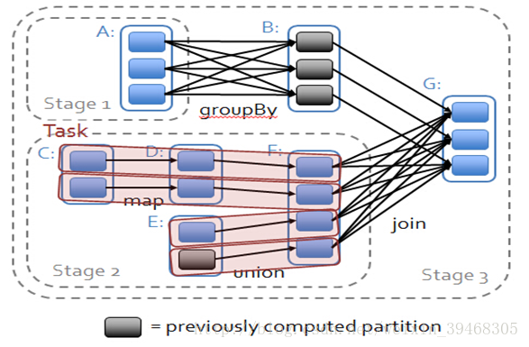
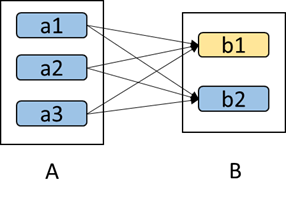
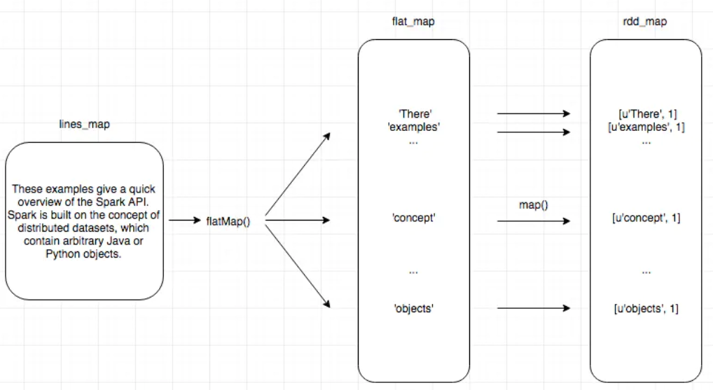

# 大数据面试题整理02

## spark数据分区

Spark 中的 RDD 就是一个分区了的数据集合，所以可以执行并行操作。

默认情况下，Spark 为一个 block （HDFS 中块大小默认是 128MB） 创建一个分区。然而，也可以在创建 RDD 时，传入一个并行度参数，来手动设置分区，但不能比 block 的数量还少。如：

```scala
// numSlices 设置分区数
// 代码中的一些地方使用术语片 slice(分区的同义词)来维护向后兼容性。
def parallelize[T](list: java.util.List[T], numSlices: Int): JavaRDD[T] = {
    implicit val ctag: ClassTag[T] = fakeClassTag
    sc.parallelize(list.asScala, numSlices)
  }

// minPartitions 设置分区数
def textFile(path: String, minPartitions: Int): JavaRDD[String] =
    sc.textFile(path, minPartitions)

  /**
   * Default min number of partitions for Hadoop RDDs when not given by user
   * Notice that we use math.min so the "defaultMinPartitions" cannot be higher than 2.
   * The reasons for this are discussed in https://github.com/mesos/spark/pull/718
   */
  def defaultMinPartitions: Int = math.min(defaultParallelism, 2)
```

分区数量并不是越多越好，分区后数据就分布在多个 worker 结点上，可以执行并行任务就越多，但太多的分区数在涉及 shuffle 操作时，会降低 Spark 任务运行效率。Spark 的一个任务操作一个分区 。一般来说，每个 CPU 划分2-4个分区。 

可以使用 persist() 方法或 cache() 方法持久化 RDD 。数据将会在第一次 action 操作时进行计算，并缓存在节点的内存中。Spark 的缓存具有容错机制，如果一个缓存的 RDD 的某个分区丢失了，Spark 将自动地按照原来的计算过程，自动重新计算。

spark.default.parallelise 设置默认分区数。

coalesce 和 repartition 可以在程序中调整分区数。

通过函数调用RDD.getNumPartitions 、 rdd.partitions.size 获取分区数量

实现自定义的分区器，需要继承org.apache.spark.Partitioner类并实现下面三个方法：

    1、numPartitions:Int:返回创建出来的分区数
    2、getPartition():int:返回给定键的分区编号（0到numPartitions-1），确保永远返回的是一个非负数;
    3、equals():java判断相等的标准方法，这个方法的是吸纳非常重要，Spark需要用这个方法来检查你的分区器对象是否和其他分区器实例相同，这样spark才可以判断两个RDD的分区方式是否相同。

Spark 以实现了 HashPartitioner、RangePartitioner。

```scala
class HashPartitioner(partitions: Int) extends Partitioner {
  require(partitions >= 0, s"Number of partitions ($partitions) cannot be negative.")

  def numPartitions: Int = partitions

  def getPartition(key: Any): Int = key match {
    case null => 0
    case _ => Utils.nonNegativeMod(key.hashCode, numPartitions)
  }

  override def equals(other: Any): Boolean = other match {
    case h: HashPartitioner =>
      h.numPartitions == numPartitions
    case _ =>
      false
  }

  override def hashCode: Int = numPartitions
}
```

## coalesce 和 repartition 区别

coalesce(numPartitions) 减少 RDD 中分区数为 numPartitions。对于一个大的数据集执行过滤后再操作更有效。

```scala
def coalesce(numPartitions: Int, shuffle: Boolean = false,....
```
repartition(numPartitions)  Reshuffle RDD 中的数据以创建更多或更少的分区，并将每个分区中的数据尽量保持均匀。该操作总是通过网络来 shuffles 所有的数据。

```scala
def repartition(numPartitions: Int): JavaRDD[T] = rdd.repartition(numPartitions)
   
def repartition(numPartitions: Int)(implicit ord: Ordering[T] = null): RDD[T] = withScope {
    coalesce(numPartitions, shuffle = true)
}
```

repartition 是 coalesce 中 shuffle 为 true 的情况。

## spark的宽依赖和窄依赖

Dependency 抽象类下有两个子类：

    NarrowDependency 抽象类:子RDD的每个分区依赖于父RDD的少量的分区。窄依赖允许管道执行。

    ShuffleDependency 类：Represents a dependency on the output of a shuffle stage. 展示一个 shuffle stage 输出的依赖关系
    (涉及shuffle，所以可能会涉及多个父RDD)

NarrowDependency 抽象类下有两个子类：

    OneToOneDependency 类：展示 子RDD分区 和 父RDD分区 的一对一的依赖关系

    RangeDependency 类：展示 子RDD分区 和 父RDD的一定范围内分区 的一对一的依赖关系 


窄依赖：每个父RDD的分区最多被子RDD的一个分区使用。（1对1或者n对1）。如map、filter、union等操作。

宽依赖：父RDD的一个分区被子RDD的多个分区使用，或者说一个子RDD分区的形成会依赖于父RDD的多个分区。(n对n)。如 groupByKey、reduceByKey、sortByKey等产生shuffle的操作。

**[扩展](https://www.2cto.com/net/201802/720002.html)：**



Stage是什么：

在Spark中，一段程序实际上构造了一个由相互依赖的多个RDD组成的有向无环图（DAG）。

spark会根据RDD之间的依赖关系将DAG图划分为不同的阶段Stage：

对于窄依赖，由于partition依赖关系的确定性，partition的转换处理就可以在同一个线程里完成，窄依赖就被spark划分到同一个stage中，如图RDD C、D、E、F它们都在Stage2中，

而对于宽依赖，只能等父RDD shuffle处理完成后，下一个stage才能开始接下来的计算，因此宽依赖要单独划分一个Stage,如上图的RDD A。

**区分两种依赖的作用**

划分 Stage。Stage 之间做 shuffle，Stage 之内做 pipeline（流水线）。方便stage内优化。

相比宽依赖，窄依赖对优化很有利：

（1）数据的容错性：

假如某个节点出故障了：

窄依赖：只要重算和子RDD分区对应的父RDD分区即可；

宽依赖：极端情况下，所有的父RDD分区都要进行重新计算。
如下图所示，b1分区丢失，则需要重新计算a1,a2和a3，这就产生了冗余计算(a1,a2,a3中对应b2的数据)。



（2）传输

宽依赖往往对应着shuffle操作，需要在运行过程中将同一个父RDD的分区传入到不同的子RDD分区中，中间可能涉及多个节点之间的数据传输；而窄依赖的每个父RDD的分区只会传入到一个子RDD分区中，通常可以在一个节点内完成转换。

## spark如何处理数据倾斜

### 1、使用Hive ETL预处理数据

场景：

    导致数据倾斜的是Hive表。如果该Hive表中的数据本身很不均匀
    （比如某个key对应了100万数据，其他key才对应了10条数据），
    而且业务场景需要频繁使用Spark对Hive表执行某个分析操作。

思路：

    先评估是否可以通过Hive来进行数据预处理（即通过Hive ETL预先对数据按照key进行聚合，
    或者是预先和其他表进行join），然后在Spark作业中针对的数据源就不是原来的Hive表了，
    而是预处理后的Hive表。
    那么在Spark作业中也就不需要使用原先的shuffle类算子执行这类操作了。

优点：

    实现起来简单便捷，效果还非常好，完全规避掉了数据倾斜，Spark作业的性能会大幅度提升。

缺点：

    治标不治本，Hive ETL中还是会发生数据倾斜。

### 2、提高shuffle操作的并行度

场景：

    必须要对数据倾斜迎难而上

思路：

    在对RDD执行shuffle算子时，给shuffle算子传入并行度参数，该参数设置了这个shuffle算子
    执行时shuffle read task的数量。

    对于Spark SQL中的shuffle类语句，比如groupby、join等，需要设置spark.sql.shuffle.partitions，该参数代表了shuffle read task的并行度，该值默认是200，对于很多场景来说都有点过小。

    增加shuffle read task的数量，可以让原本分配给一个task的多个key分配给多个task，从而让每个task处理比原来更少的数据。

优点：

    实现起来比较简单，可以有效缓解和减轻数据倾斜的影响。

缺点：

    只是缓解了数据倾斜而已，没有彻底根除问题，


### 3、两阶段聚合（局部聚合+全局聚合）

场景：

    对RDD执行reduceByKey等聚合类shuffle算子或者在Spark SQL中使用group by语句进行分组聚合时，比较适用这种方案。

思路：

    进行两阶段聚合。
    第一次是局部聚合，先给每个key都打上一个随机数，比如10以内的随机数，此时原先一样的key就变成不一样的了，比如(hello, 1) (hello, 1) (hello, 1) (hello, 1)，就会变成(1_hello, 1) (1_hello, 1) (2_hello, 1) (2_hello, 1)。接着对打上随机数后的数据，执行reduceByKey等聚合操作，进行局部聚合，那么局部聚合结果，就会变成了(1_hello, 2) (2_hello, 2)。

    然后将各个key的前缀给去掉，就会变成(hello,2)(hello,2)，再次进行全局聚合操作，就可以得到最终结果了，比如(hello, 4)。

优点：

    对于聚合类的shuffle操作导致的数据倾斜，效果是非常不错的。通常都可以解决掉数据倾斜，或者至少是大幅度缓解数据倾斜，将Spark作业的性能提升数倍以上。

缺点：

    仅仅适用于聚合类的shuffle操作，适用范围相对较窄。如果是join类的shuffle操作，还得用其他的解决方案。

### 4、将reduce join转为map join

场景：

    在对RDD使用join类操作，或者是在Spark SQL中使用join语句时，而且join操作中的一个RDD或表的数据量比较小（比如几百M或者一两G），比较适用此方案。

思路：

    不使用join算子进行连接操作，而使用Broadcast变量与map类算子实现join操作，进而完全规避掉shuffle类的操作，彻底避免数据倾斜的发生和出现。

    将较小RDD中的数据直接通过collect算子拉取到Driver端的内存中来，然后对其创建一个Broadcast变量；
    接着对另外一个RDD执行map类算子，在算子函数内，从Broadcast变量中获取较小RDD的全量数据，与当前RDD的每一条数据按照连接key进行比对，如果连接key相同的话，那么就将两个RDD的数据用你需要的方式连接起来。

优点：

    对join操作导致的数据倾斜，效果非常好，因为根本就不会发生shuffle，也就根本不会发生数据倾斜。

缺点：

    适用场景较少，因为这个方案只适用于一个大表和一个小表的情况。毕竟我们需要将小表进行广播，此时会比较消耗内存资源，

### 5、采样倾斜key并分拆join操作

场景：

    两个RDD/Hive表进行join的时候，如果数据量都比较大，无法采用“解决方案五”，
    那么此时可以看一下两个RDD/Hive表中的key分布情况。
    如果出现数据倾斜，是因为其中某一个RDD/Hive表中的少数几个key的数据量过大，
    而另一个RDD/Hive表中的所有key都分布比较均匀，那么采用这个解决方案是比较合适的。

思路：

    - 对包含少数几个数据量过大的key的那个RDD，通过sample算子采样出一份样本来，然后统计一下每个key的数量，计算出来数据量最大的是哪几个key。
    - 然后将这几个key对应的数据从原来的RDD中拆分出来，形成一个单独的RDD，并给每个key都打上n以内的随机数作为前缀，而不会导致倾斜的大部分key形成另外一个RDD。
    - 接着将需要join的另一个RDD，也过滤出来那几个倾斜key对应的数据并形成一个单独的RDD，将每条数据膨胀成n条数据，这n条数据都按顺序附加一个0~n的前缀，不会导致倾斜的大部分key也形成另外一个RDD。
    - 再将附加了随机前缀的独立RDD与另一个膨胀n倍的独立RDD进行join，此时就可以将原先相同的key打散成n份，分散到多个task中去进行join了。
    而另外两个普通的RDD就照常join即可。
    - 最后将两次join的结果使用union算子合并起来即可，就是最终的join结果。

优点：

    对于join导致的数据倾斜，如果只是某几个key导致了倾斜，采用该方式可以用最有效的方式打散key进行join。而且只需要针对少数倾斜key对应的数据进行扩容n倍，不需要对全量数据进行扩容。避免了占用过多内存。

缺点：

    如果导致倾斜的key特别多的话，比如成千上万个key都导致数据倾斜，那么这种方式也不适合。

### 6、使用随机前缀和扩容RDD进行join

场景：

    如果在进行join操作时，RDD中有大量的key导致数据倾斜，那么进行分拆key也没什么意义，此时就只能使用最后一种方案来解决问题了。

思路：

    - 首先查看RDD/Hive表中的数据分布情况，找到那个造成数据倾斜的RDD/Hive表，比如有多个key都对应了超过1万条数据。
    - 然后将该RDD的每条数据都打上一个n以内的随机前缀。
    - 同时对另外一个正常的RDD进行扩容，将每条数据都扩容成n条数据，扩容出来的每条数据都依次打上一个0~n的前缀。
    - 最后将两个处理后的RDD进行join即可。


来源：[spark数据倾斜处理](https://blog.csdn.net/qq_38534715/article/details/78707759)

[解决Spark数据倾斜](http://www.jasongj.com/spark/skew/)

## 用spark写wordcount

```python
import sys
from operator import add

conf = SparkConf().setMaster("local").setAppName("wordcount")
sc = SparkContext(conf = conf)

# data = sc.parallelize(["a,b","b,c"])
data = sc.textFile(sys.argv[1])

rdd = data.flapMap(lambda x:x.split(",")).map(lambda x:(x,1)).reduceByKey(add)

rlt = rdd.collect()
for (word,count) in rlt:
    print(word,count)

sc.stop()
```



如下三条语句都是等价的：

    >>> textFile = sc.textFile("hdfs://localhost:9000/user/hadoop/word.txt")
    >>> textFile = sc.textFile("/user/hadoop/word.txt")
    >>> textFile = sc.textFile("word.txt")

```python
import sys
from operator import add

from pyspark.sql import SparkSession


if __name__ == "__main__":
    if len(sys.argv) != 2:
        print("Usage: wordcount <file>", file=sys.stderr)
        sys.exit(-1)

    spark = SparkSession\
        .builder\
        .appName("PythonWordCount")\
        .getOrCreate()

    lines = spark.read.text(sys.argv[1]).rdd.map(lambda r: r[0])
    counts = lines.flatMap(lambda x: x.split(' ')) \
                  .map(lambda x: (x, 1)) \
                  .reduceByKey(add)
    output = counts.collect()
    for (word, count) in output:
        print("%s: %i" % (word, count))

    spark.stop()

```

## flatMap 和 map 的区别

map: 将函数作用于每个元素，返回一个新的RDD

flatMap: 与 map 类似，将函数作用于每个元素，但是每一个输入项可以被映射成 0 个或多个输出项（所以 func 应该返回一个序列 而不是一个单独项）。

```python
>>> data = sc.parallelize(["a,b","b,c"])
>>> rdd1 = data.map(lambda x:x.split(','))
>>> rdd1.collect()
[['a', 'b'], ['b', 'c']]                                                        
>>> rdd2 = data.flatMap(lambda x:x.split(','))
>>> rdd2.collect()
['a', 'b', 'b', 'c']

```

## spark如何将数据缓存到内存中

RDD 通过 persist() 或 cache() 将计算结果缓存，但是并不是被调用时立即缓存，而是触发后面的 action 时，才会被缓存在计算节点的内存中。

unpersist() 取消缓存

[存储级别](https://github.com/ZGG2016/knowledgesystem/blob/master/07%20Spark/%E5%AE%98%E7%BD%91%E9%98%85%E8%AF%BB/%E5%AE%98%E7%BD%91%EF%BC%9ARDD%20Programming%20Guide.md)

```scala
/**
  * Persist this RDD with the default storage level (`MEMORY_ONLY`).
  */
  def cache(): JavaRDD[T] = wrapRDD(rdd.cache())

/**
  * Persist this RDD with the default storage level (`MEMORY_ONLY`).
  */
  def cache(): this.type = persist()
```

```scala
/**
  * Set this RDD's storage level to persist its values across operations after the first time
  * it is computed. This can only be used to assign a new storage level if the RDD does not
  * have a storage level set yet..
  */
  def persist(newLevel: StorageLevel): JavaRDD[T] = wrapRDD(rdd.persist(newLevel))

/**
  * Set this RDD's storage level to persist its values across operations after the first time
  * it is computed. This can only be used to assign a new storage level if the RDD does not
  * have a storage level set yet. Local checkpointing is an exception.
  */
  def persist(newLevel: StorageLevel): this.type = {
    if (isLocallyCheckpointed) {
      // This means the user previously called localCheckpoint(), which should have already
      // marked this RDD for persisting. Here we should override the old storage level with
      // one that is explicitly requested by the user (after adapting it to use disk).
      persist(LocalRDDCheckpointData.transformStorageLevel(newLevel), allowOverride = true)
    } else {
      persist(newLevel, allowOverride = false)
    }
  }

/**
  * Persist this RDD with the default storage level (`MEMORY_ONLY`).
  */
	def persist(): this.type = persist(StorageLevel.MEMORY_ONLY)
```

## rdd是什么

rdd 是一个弹性分布式数据集，是容错的、分区的、可以执行并行操作的元素集合。

有两种方法可以创建 rdd：

	- 在驱动程序中 sc.parallelize(["a,b","b,c"])
	- 在外部存储系统中引用一个数据集，例如，一个共享文件系统、HDFS、HBase、或者提供 Hadoop InputFormat 的任何数据源。 sc.textFile("/in/data.txt")

支持两种类型的操作： 

	transformations（转换）和 actions（动作）。
	transformations 是根据已存在的数据集创建一个新的数据集。
	actions 是将在数据集上执行计算后，将值返回给驱动程序。

	所有的 transformations 都是懒加载的

	默认情况下，对于一个已转换的 RDD，每次你在这个 RDD 运行一个 action 时，它都会被重新计算。

	但是，可以使用 persist/cache 方法将 RDD 持久化到内存中，也可以到磁盘。

分区的

	RDD 中的元素根据 key 来分区，保存到多个结点上。

	一个任务操作一个分区，依次来提高并行度。一般来说，每个 CPU 划分 2-4 个分区。 

	正常情况下，Spark 会根据集群情况，自动设置分区数量。然而，你也可以给算子传递一个参数来手动设置，或者在配置文件里设置。

容错的

	对 RDD 操作有 transformations（转换）和 actions（动作）。转换操作会返回一个新的 RDD，这样就会建立一种血统关系。

	在丢失某个分区时，就可以根据血统来重新计算。

## reduceByKey和groupByKey的区别

【用个实例演示】

groupByKey 仅仅是根据key分组。如果要执行聚合，需要先用groupByKey生成RDD，然后才能对此RDD通过map进行自定义函数操作。

reduceByKey 传入一个func，聚合相同key的value。能够在本地先进行聚合操作。

算子|含义
---|:---
groupByKey([numPartitions]) | 当一个(K,V)对数据集调用的时候，返回一个(K, Iterable)对数据集。Note: 如果分组是为了在每一个 key 上执行聚合操作（如sum、average)，使用 reduceByKey 或 aggregateByKey 来计算性能会更好。默认情况下，输出结果的并行度取决于父 RDD 的分区数，但可以传递一个可选的 numPartitions 参数来设置不同的任务数。
reduceByKey(func, [numPartitions]) | 当一个(K,V)对数据集调用的时候，返回一个(K, V)对数据集，其中每个 K 的 V 是经过 func 聚合后的结果。它必须是 type (V,V) => V 的类型。像 groupByKey 一样，reduce 任务数可以通过第二个可选的参数配置。
aggregateByKey(zeroValue)(seqOp, combOp, [numPartitions]) | 当一个(K,V)对数据集调用的时候，返回一个(K, U)对数据集，其中每个 K 的 U 是使用 combine functions and a neutral "zero" value 聚合后的结果。聚合值类型可以和输入值类型不同，同时避免不必要的分配。像 groupByKey 一样，reduce 任务数可以通过参数配置。

如果仅仅是分组处理，那么以下函数应该优先于 groupByKey ：

	（1）combineByKey 组合数据，但是组合之后的数据类型与输入时值的类型不一样。
	（2）foldByKey合并每一个 key 的所有值，在级联函数和“零值”中使用。

## map、mapPartitions的区别

【用个实例演示】

map 的输入函数是应用于RDD中每个元素

mapPartitions 的输入函数是应用于每个分区。mapPartitions性能高但会内容OOM异常

举例：假设一个rdd有10个元素，分成3个分区。如果使用map方法，map中的输入函数会被调用10次；而使用mapPartitions方法的话，其输入函数会只会被调用3次，每个分区调用1次。

算子|含义
---|:---
map(func) | 返回一个新的分布式数据集，它由一个函数 func 作用在数据源中的每个元素生成。
mapPartitions(func) | 与 map 类似，但是独立的运行在 RDD 的每个分区(block)上。所以在一个类型为 T 的 RDD 上运行时，func 必须是 Iterator => Iterator 类型。

## hadoop和spark的区别各自的应用场景

hadoop 用来针对海量数据执行分布式批计算的框架，包含了 hdfs 、 mapreduce 和 yarn 三个组件。

	hdfs：是一个分布式文件系统，是高度容错性的，适合部署在廉价的机器上，
	提供了高吞吐量的数据访问，非常适合大规模数据集上的应用。

	mapreduce：是一种并行计算大规模数据集的计算框架。由 Map 任务和 Reduce 任务组成。

	yarn：是一种资源管理器，负责集群资源的管理。

spark 也是一个用于大规模数据处理的统一分析引擎。

	spark 的数据可以存储在 hdfs 上,也支持 yarn。 

	spark 的计算是基于 RDD 的，执行的也是批计算，但是计算的中间结果默认存储在内存中，所以会比 mapreduce 计算速度更快。

	它包含了分布式查询、流计算、机器学习、图计算和对 R 的支持。所以扩展性要比hadoop好

Spark不适合的场景，如：

	- 有高实时性要求的流式计算业务，例如实时性要求毫秒级。
	- 由于RDD设计上的只读特点，所以Spark对于待分析数据频繁变动的情景很难做

## spark shuffle

## 解释kafka的lead和follower

## kafka 数据倾斜

## kafka分区

## Kafka用途

## flume的三个组件，自定义source

## Flume和kafka的区别

## redis存储数据的时候需要注意什么